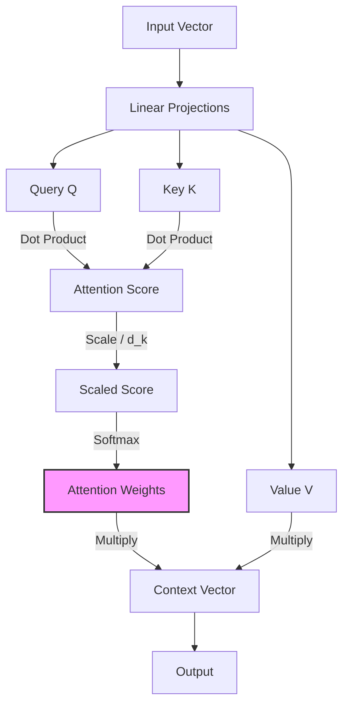
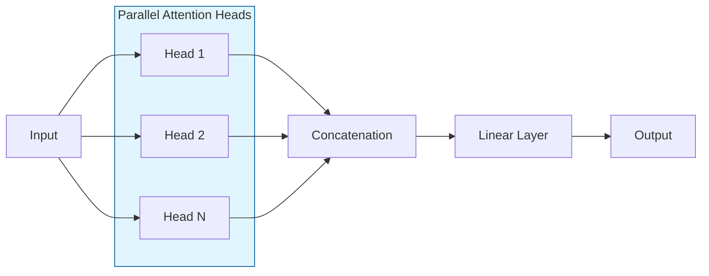

## 1. 定義
- Attention 是一種讓模型「選擇性關注」輸入不同部分的技術。
- 核心概念：不是平均處理所有輸入，而是根據相關性分配權重。
---
## 2. 運作流程
1. 將輸入轉換成三個向量：
   - **Query (Q)**：查詢
   - **Key (K)**：索引
   - **Value (V)**：內容
2. 計算 Q 與 K 的相似度 → 得到注意力分數。
3. 使用 softmax 正規化分數。
4. 用分數加權 V → 得到輸出。

公式：$$Attention(Q, K, V) = softmax(QKᵀ / √dₖ) V$$

---
## 3. 為什麼重要
- **解決長序列問題**：比 RNN 更能處理長文本。
- **提升解釋性**：能觀察模型關注的詞或特徵。
- **廣泛應用**：
  - NLP：翻譯、摘要、問答、聊天機器人
  - CV：影像描述、物件偵測
  - 語音：語音辨識、語音合成

---

## 4. 常見變體
| 名稱 | 特點 |
|------|------|
| Self-Attention | 每個詞對整個序列的其他詞計算注意力 |
| Multi-Head Attention (MHA) | 多組 Q/K/V 並行計算，捕捉不同層次的關係 |
| Soft Attention | 使用 softmax 分布，常見於 NLP |
| Cross-Attention | 不同序列間的注意力（例如編碼器與解碼器互動） |

---

## 5. 簡單比喻
- Attention 就像讀書時，你不會平均注意每個字，而是特別專注在「關鍵詞」或「重點句子」。
- 模型的注意力機制就是在模擬這種「選擇性專注」。

---

## 6. 圖解與架構 (Visuals)

### 6.1 Attention 運作流程

### 6.2 Multi-Head Attention (MHA) 架構
