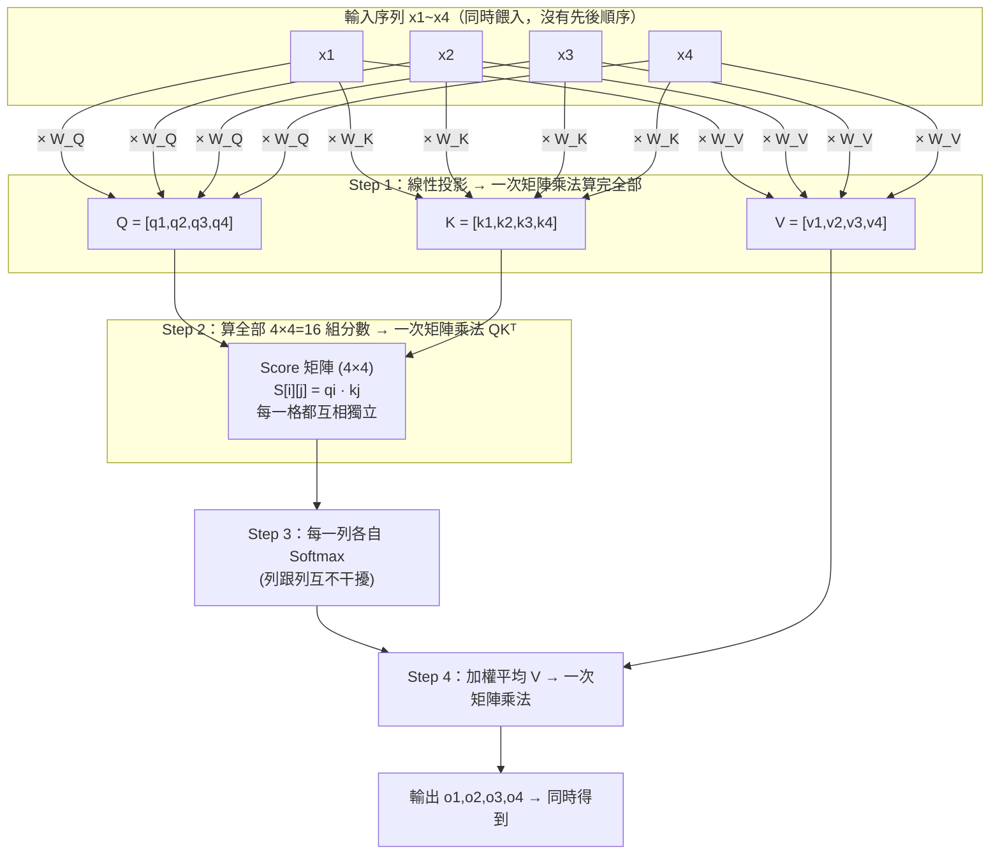
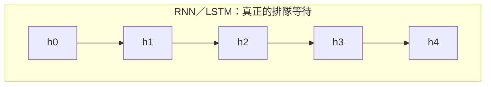
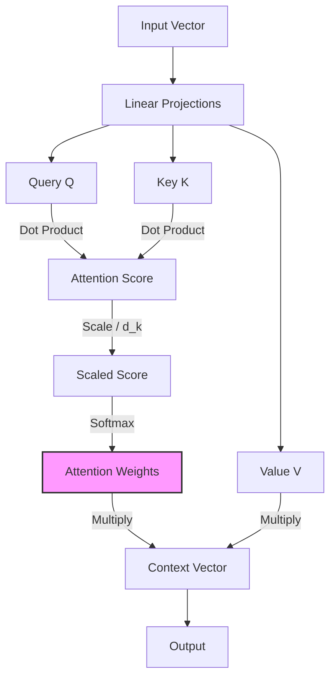
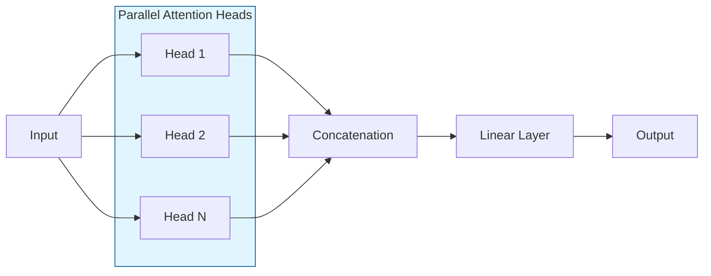

## 1. 定義
- Attention 是一種讓模型「選擇性關注」輸入不同部分的技術。
- 核心概念：不是平均處理所有輸入，而是根據相關性分配權重。
---
## 2. 運作流程
1. 將輸入轉換成三個向量：
   - **Query (Q)**：查詢
   - **Key (K)**：索引
   - **Value (V)**：內容
2. 計算 Q 與 K 的相似度 → 得到注意力分數。
3. 使用 softmax 正規化分數。
4. 用分數加權 V → 得到輸出。

公式：$$Attention(Q, K, V) = softmax(QKᵀ / √dₖ) V$$

---
## 3. 為什麼重要
- **解決長序列問題**：比 RNN 更能處理長文本。
- **提升解釋性**：能觀察模型關注的詞或特徵。
- **廣泛應用**：
  - NLP：翻譯、摘要、問答、聊天機器人
  - CV：影像描述、物件偵測
  - 語音：語音辨識、語音合成

---
## 3.1 為什麼 QKV 能達到平行處理

**對照 RNN 才看得出關鍵差異：**

RNN 的公式是 $h_t = f(h_{t-1}, x_t)$——注意 $h_{t-1}$ 是**算出來的那個具體數值**被當成輸入餵進去，不是抽象上「有關聯」，是數學上真的需要。電腦要算 $h_5$，手上必須先真的握有 $h_4$ 這個向量。這是一條長度 $N$ 的鏈：GPU 就算有幾千個平行運算核心，第 5 步也只能乾等第 4 步做完，沒辦法提前開工。**平行硬體在這裡完全使不上力，因為問題本身有先後依賴的因果關係。**

Attention 完全不同：算 $S[1][2] = q_1 \cdot k_2$ 這一格，只需要 $q_1$ 跟 $k_2$——而 $q_1$ 只依賴 $x_1$、$k_2$ 只依賴 $x_2$，兩者互不需要對方，也不需要任何「前一步」的結果。

| | RNN | Self-Attention |
|---|---|---|
| 第 $t$ 步需要什麼 | 前一步**算出來的值** $h_{t-1}$（真依賴） | 只需要自己的 $x_t$（跟其他位置無關） |
| 序列長度 $N$ 時「必須排隊」的步驟數 | $O(N)$——一步都省不了 | $O(1)$——所有位置同時算 |
| GPU 能不能幫上忙 | 不能（鏈式依賴，核心再多也要排隊） | 能（每個獨立小任務分給不同核心同時做） |

> [!info] **常見誤解澄清**
> 這不是說 attention「運算量比較少」——$O(N^2)$ 的分數矩陣，運算總量通常比 RNN 的 $O(N)$ 還大。平行處理的重點不是「算得少」，而是「這些運算彼此獨立，可以同時攤開來做」，GPU 犧牲單步速度換取巨量平行度，正好對上 attention 的運算結構，卻幫不了 RNN 那種前後因果鏈。

> [!info] **一個限制**：這個「全平行」只在訓練時、或雙向 Encoder 時完全成立。自迴歸生成（見 [[AI/Transformer|Transformer 筆記的 Masked Self-Attention]]）時，單步內部的 attention 運算仍是平行的，但「產生第 $t+1$ 個 token」仍得等「第 $t$ 個已經生成」——單步內平行、跨步驟間序列。

---

## 4. 常見變體
| 名稱 | 特點 |
|------|------|
| Self-Attention | 每個詞對整個序列的其他詞計算注意力 |
| Multi-Head Attention (MHA) | 多組 Q/K/V 並行計算，捕捉不同層次的關係 |
| Soft Attention | 使用 softmax 分布，常見於 NLP |
| Cross-Attention | 不同序列間的注意力（例如編碼器與解碼器互動） |

---

## 5. 簡單比喻
- Attention 就像讀書時，你不會平均注意每個字，而是特別專注在「關鍵詞」或「重點句子」。
- 模型的注意力機制就是在模擬這種「選擇性專注」。

---

## 6. 圖解與架構 (Visuals)

### 6.1 Attention 運作流程

### 6.2 Multi-Head Attention (MHA) 架構

---
**相關筆記**：[[AI/Transformer|Transformer 架構全解（Attention 只是其中一塊積木）]] · [[AI/Machine-Learning|機器學習總覽]]