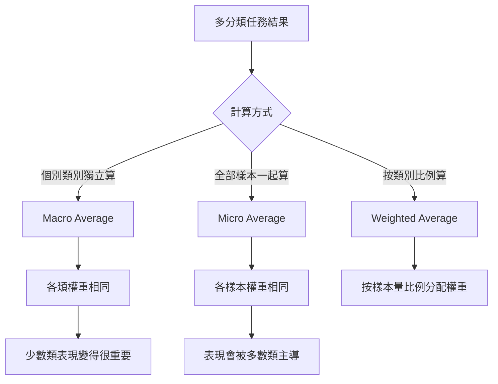

# 分類任務評估指標：Micro, Macro 與 Weighted 分數

在多分類任務中，當各類別的資料數量不平衡時，單一的準確度（Accuracy）無法反映真實表現。我們需要透過不同的平均方式來計算精確率（Precision）、召喚率（Recall）與 F1 分數。

## 核心邏輯視覺化

## 具體案例分析

假設有一個 3 分類任務（A, B, C），測試集共有 100 個樣本：
- 類別 A：90 個樣本（模型對了 80 個）
- 類別 B：5 個樣本（模型對了 2 個）
- 類別 C：5 個樣本（模型對了 0 個）

### 1. Macro Average (總體平均)
計算步驟：
1. 分別計算 A, B, C 的 F1-Score。
   - A 類 F1 很高（接近 0.9）
   - B 類 F1 很低（約 0.4）
   - C 類 F1 為 0
2. 將三者相加除以 3。
   - (0.9 + 0.4 + 0) / 3 = 0.43

**核心直覺：** 即使類別 A 表現完美，只要類別 C 慘敗，Macro F1 就會被大幅拉低。這就是為什麼 HW3 使用此指標，因為它強迫你不能放棄那 1/16 的少數類別。

### 2. Micro Average (個體平均)
計算步驟：
1. 加總所有正確預測數：80 + 2 + 0 = 82
2. 除以總樣本數：82 / 100 = 0.82

**核心直覺：** 模型在類別 A 的成功掩蓋了在 B 與 C 的徹底失敗。在 Micro 平均看來，這個模型表現得「還不錯」（0.82），但這會讓我們忽略模型其實根本抓不到少數類別的問題。

## 指令總結與對比表格

| 指標類型 | 處理邏輯 | 對不平衡資料的敏感度 | 適用場景 |
| :--- | :--- | :--- | :--- |
| **Macro** | 類別層級的平均 (Calculate by Class) | **極高** (最嚴格) | 希望模型在每一類都表現平均時（如 HW3） |
| **Micro** | 樣本層級的平均 (Calculate by Sample) | **低** | 整體正確率最重要時 |
| **Weighted** | 依樣本量加權的類別平均 | 中 | 容許模型偏向多數類，但仍想參考各類表現 |

## 實踐意義
在 HW3 的 15:1 情況下：
- 如果你只管多數類別，你的 **Accuracy** 與 **Micro F1** 會很高（可能超過 0.9）。
- 但你的 **Macro F1** 會非常難看（可能低於 0.3）。
- **Kaggle 排名看的是 Macro F1**，所以你必須透過資料增強（Augmentation）或調整模型損失函數（Loss Function）來提升少數類的召喚率。
