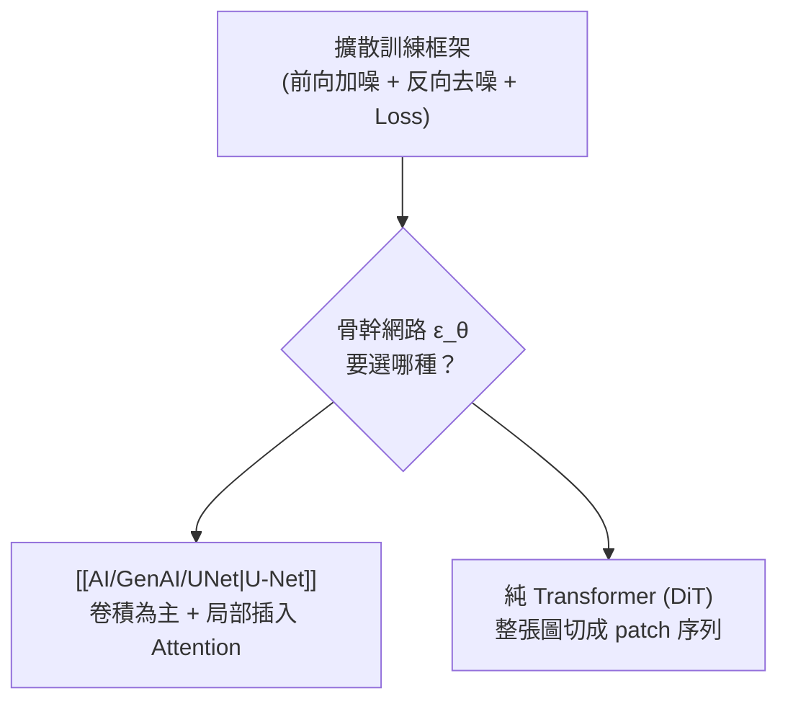

# 擴散模型總覽 (Diffusion Model Overview)

> [!abstract] **一句話（先不談數學）**
> 擴散模型的訓練：把一張清晰圖片，一步步加雜訊直到變成純雜訊；再訓練一個網路學「怎麼把雜訊去掉一點點」。生成時：從純雜訊出發，重複套用這個「去掉一點點雜訊」的網路，一步步「憑空」浮現出一張清晰圖片。[[AI/GenAI/DDPM|DDPM 筆記]]與[[AI/GenAI/Markov-Chain-DDPM|馬可夫鏈數學推導]]已經把嚴謹公式講得很完整，這篇是它們的**總覽/樞紐頁**——回答「這一大家族還有哪些成員」「骨幹網路怎麼選」。

## 1. 核心比喻

> 想像一滴墨水滴進一杯水，慢慢擴散到均勻分佈——這是不可逆的物理過程（[[Fundamentals/Optimization-Theory|熵增]]）。擴散模型的瘋狂之處在於：**訓練一個網路，學會把這杯「均勻擴散的水」逆轉回「一滴墨水」的樣子**。前向擴散（加雜訊）簡單、免訓練；反向擴散（去雜訊、也就是"逆熵"）難、需要神經網路來近似。

## 2. 家族總覽

| 變體 | 核心想法 | 相對 DDPM 的差異 |
|---|---|---|
| **[[AI/GenAI/DDPM\|DDPM]]**（2020） | 本家族的奠基之作 | 定義了前向/反向馬可夫鏈與 $L_{simple}$ 損失，但取樣要跑滿 $T=1000$ 步，很慢 |
| **DDIM** | 把反向過程重新表述成**非馬可夫**的確定性軌跡 | 訓練方式不變，但取樣可以「跳步」，用 20–50 步就能生成，快 20–50 倍 |
| **Score-based / SDE** | 用[[AI/GenAI/Langevin-Dynamics\|朗之萬動力學]]描述連續時間下的擴散，DDPM 是它的離散特例 | 提供統一的數學框架，串起 DDPM 與 score matching 兩派系 |
| **Latent Diffusion（如 Stable Diffusion）** | 先用 VAE 把圖片壓縮到低維度**潛空間**，擴散過程在潛空間裡做，而非原始像素 | 大幅降低運算量——在 64×64 的潛空間跑擴散，比在 512×512 像素空間跑快非常多 |
| **Classifier(-Free) Guidance** | 生成時額外把「條件」（文字 prompt）的梯度方向加強，讓輸出更貼合條件 | 這是文生圖模型「聽得懂 prompt」的關鍵技巧，不是訓練架構的改變，是取樣時的技巧 |

## 3. 骨幹網路怎麼選：U-Net vs. Transformer (DiT)

擴散模型的核心是一個「輸入帶雜訊資料、輸出雜訊估計」的網路 $\epsilon_\theta$——**這個網路本體要用什麼架構，是完全獨立於「擴散」這個訓練框架的選擇**。

| | [[AI/GenAI/UNet\|U-Net]] 骨幹 | Transformer 骨幹 (DiT, 2022) |
|---|---|---|
| 核心運算 | 卷積（局部）+ 少數 Attention 層（全局） | 全程 [[AI/Transformer\|Self-Attention]]（全局） |
| 圖片怎麼進網路 | 直接吃像素網格，逐層 downsample/upsample | 先切成固定大小的 patch，攤平成一串 token（跟 ViT 手法相同） |
| 時間步 $t$ 怎麼注入 | FiLM (scale-shift) 注入卷積層 | 當成一個額外 token，或用 adaLN（adaptive LayerNorm）條件化每個 Transformer block |
| Scaling 特性 | 卷積的歸納偏誤（局部性、平移不變性）在小資料量時有優勢 | 資料/算力越大，Transformer 的無歸納偏誤反而是優勢（同 LLM 的 scaling law 現象） |

> [!success] **這就是 [[AI/GenAI/DDPM\|DDPM]] 與 [[AI/Transformer\|Transformer]] 的關係**
> 兩者原本是不同世界的技術（DDPM 是「訓練框架」，Transformer 是「網路架構」），但完全可以組合：DiT（Diffusion Transformer）證明了把 U-Net 整個換成 Transformer，擴散模型依然能訓練、甚至 scaling 特性更好——這正是 Stable Diffusion 3、Sora 這類最新模型採用的方向。也就是說：**Transformer 已經從「NLP 專屬架構」進化成「任何需要處理序列/集合資料的通用骨幹」**，這跟 [[ICCAD_code/6_ML_Generative_BTree|本庫拿 Transformer 去生成 B*-tree 拓樸]]是同一個「Transformer 當萬用骨幹」的故事線。

## 4. 為什麼擴散模型能生成如此高品質的內容

- **漸進式生成 vs. 一步到位**：GAN 要求 Generator 一次就生出以假亂真的圖片，訓練極不穩定（模式崩潰、對抗訓練難收斂）；擴散模型把「生成」拆成成百上千個「只需去掉一點點雜訊」的簡單子任務，每一步都很容易學，累積起來卻能做出高品質結果。
- **訓練目標穩定**：[[AI/GenAI/DDPM|$L_{simple}$]] 只是單純的 MSE 迴歸（預測雜訊），沒有 GAN 的對抗式 minimax 賽局，訓練穩定很多。
- **代價是取樣慢**：這是擴散模型最大的痛點——需要疊代很多步才能生成一張圖，DDIM／蒸餾技術都是為了解決這個代價。

---
**相關筆記**：[[AI/GenAI/DDPM|DDPM 完整數學推導]] · [[AI/GenAI/Markov-Chain-DDPM|馬可夫鏈與 DDPM 的數學交織]] · [[AI/GenAI/UNet|U-Net 架構]] · [[AI/GenAI/Langevin-Dynamics|朗之萬動力學]] · [[AI/GenAI/Variational-Inference|變分推斷]] · [[AI/Transformer|Transformer 架構全解]] · [[AI/GenAI/GenAI-Overview|生成式 AI 總覽]]
