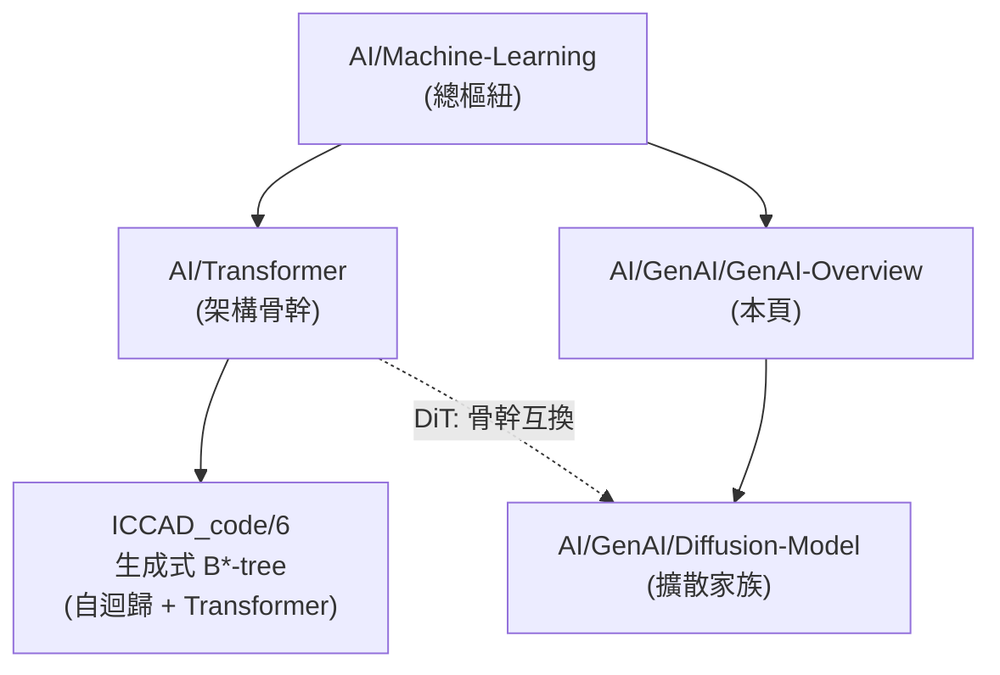

# 生成式 AI 總覽 (Generative AI Overview)

> [!abstract] **一句話**
> 生成式 AI 指「能夠產生新內容（圖片、文字、拓樸結構……）而非只做分類/回歸」的模型家族。這是 `AI/GenAI/` 資料夾的樞紐頁 (MOC)，串起本庫所有生成式模型相關筆記。

## 1. 兩大生成範式

| 範式 | 核心想法 | 本庫筆記 |
|---|---|---|
| **自迴歸生成 (Autoregressive)** | 一步步生成，每步以前面已生成的內容為條件 | [[ICCAD_code/6_ML_Generative_BTree\|生成式 B*-tree 模型]]（逐步生成拓樸）、GPT 系列（逐字生成文字，見 [[AI/Transformer\|Transformer 的 Decoder-only 家族]]） |
| **擴散生成 (Diffusion)** | 反覆「去掉一點點雜訊」，從純雜訊逐漸浮現出內容 | [[AI/GenAI/Diffusion-Model\|Diffusion Model 總覽]]、[[AI/GenAI/DDPM\|DDPM]] |

兩者的共通點：都把「一步生成到位」的困難任務，拆解成「一連串簡單子步驟」——這是生成式模型近年成功的核心洞見，不管走哪條路徑都適用。

## 2. 本資料夾筆記導航

- [[AI/GenAI/Diffusion-Model|Diffusion Model 總覽]]：DDPM/DDIM/Latent Diffusion 家族地圖，U-Net vs Transformer 骨幹之爭。
- [[AI/GenAI/DDPM|DDPM 完整數學推導]]：前向/反向過程、ELBO、$L_{simple}$ 損失簡化。
- [[AI/GenAI/Markov-Chain-DDPM|馬可夫鏈與 DDPM 的數學交織]]：DDPM 背後的馬可夫鏈嚴謹證明。
- [[AI/GenAI/UNet|U-Net 架構]]：擴散模型的雜訊預測網路骨幹。
- [[AI/GenAI/Variational-Inference|變分推斷]]：ELBO 從哪裡來的數學基礎。
- [[AI/GenAI/Langevin-Dynamics|朗之萬動力學]]：Score-based 擴散模型的物理/數學根源。
- [[AI/GenAI/HW3/HW3-Hallucination-Detection|LLM 幻覺偵測作業]]：GenAI 課程實作作業（LLM 微調應用）。

## 3. 與本庫其他 AI 筆記的關係

[[ICCAD_code/6_ML_Generative_BTree|本專案自己的生成式模型]]雖然不是影像擴散模型，但屬於同一個「生成式 AI」大傘下的**自迴歸**分支——這正是為什麼理解 Diffusion（另一分支）能幫助建立對「生成式模型」這整個類別的完整心智圖：兩者解決的是同一類問題（如何讓模型產生結構化的新內容），只是選了不同的分解方式。

---
**相關筆記**：[[AI/Machine-Learning|機器學習總覽]] · [[AI/Transformer|Transformer 架構全解]] · [[index|🌐 全域索引]]
