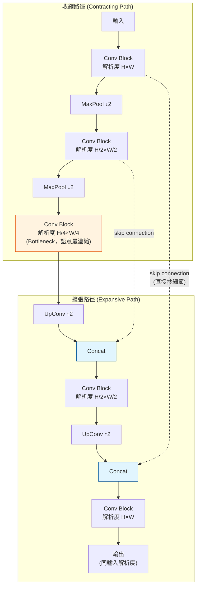

# U-Net 架構 (U-Net Architecture)

> [!abstract] **一句話**
> U-Net（Ronneberger et al., 2015）原本是為生醫影像分割設計的架構——輸入一張圖，輸出「每個像素屬於哪一類」的同解析度圖。它的「編碼器downsample、解碼器upsample、兩邊用 skip connection 直接相連」的形狀長得像字母 U，因而得名。這個形狀後來意外成為 [[AI/GenAI/Diffusion-Model|Diffusion Model]] 裡雜訊預測網路 $\epsilon_\theta$ 的標準骨幹。

## 1. 為什麼需要這種形狀

分割任務（以及後面會看到的雜訊預測任務）有一個共同特性：**輸入輸出解析度必須相同**，但同時又需要「看到全局脈絡」才能正確判斷局部細節（例如：要知道一個像素是不是「貓的耳朵」，得先看到整隻貓的輪廓）。

單純的卷積網路只會不斷 downsample 到很小的解析度去榨取語意，此時空間細節（邊緣、紋理）早就在 pooling 過程中丟失了；U-Net 的解法是**把丟失的細節，透過 skip connection 直接從編碼器同一層級「抄」到解碼器對應層級**。

## 2. 架構圖

- **收縮路徑（Encoder）**：重複「卷積 + downsample」，解析度越變越小，通道數越變越多——空間細節被壓縮，語意/全局資訊被萃取出來。
- **Bottleneck**：整個網路解析度最小、感受野 (receptive field) 最大的地方，看得到「全局」。
- **擴張路徑（Decoder）**：重複「upsample + 卷積」把解析度還原回去。
- **Skip Connection（關鍵）**：解碼器每一層都把**編碼器對應解析度的特徵圖直接拼接 (concat)** 進來，補回被 pooling 犧牲掉的高解析度細節。沒有這條線，解碼器只能從模糊的 bottleneck 猜細節，邊緣會糊掉。

> [!info] **與 [[AI/Transformer|Transformer]] 的 Add & Norm 對比**
> Skip connection 跟 Transformer 的殘差連接（$x + \text{Sublayer}(x)$）是同一個家族的想法——都是「讓資訊/梯度有一條不經過中間層的捷徑」。差別在於 Transformer 的殘差是**同解析度相加**，U-Net 的 skip 是**跨深度、用 concat 而非相加**，且專門用來補償「降維造成的資訊流失」。

## 3. U-Net 在 Diffusion Model 裡的角色

[[AI/GenAI/DDPM|DDPM]] 需要一個網路 $\epsilon_\theta(x_t, t)$：輸入一張**帶雜訊的圖 $x_t$**，輸出「這張圖裡摻了多少雜訊」——輸入輸出解析度完全相同，且需要同時看局部（雜訊的高頻紋理）與全局（圖片整體結構，才知道哪裡「不應該」有雜訊）。這正好是 U-Net 原生擅長的任務形狀，因此被直接借用過來當骨幹。

### 3.1 額外要解決的問題：怎麼告訴網路「現在是第幾步 $t$」？
原始 U-Net 沒有時間步的概念。Diffusion U-Net 的做法：
1. 把整數 $t$ 用類似 [[AI/Transformer|Transformer 的 Positional Encoding]] 公式（sin/cos 不同頻率）編碼成一個向量。
2. 把這個向量透過小型 MLP 投影後，用 **FiLM (scale-and-shift)** 的方式注入每個卷積 block：$h \to \gamma(t) \cdot h + \beta(t)$。
這樣同一個網路權重，能因應不同的雜訊強度 $t$ 做出不同的去噪行為。

### 3.2 現代 Diffusion U-Net 混入 Attention Block
純卷積只能看局部感受野內的關係。像 Stable Diffusion 這類現代模型，會在 U-Net 的中低解析度層插入 **Self-Attention** 區塊（讓圖片裡任兩個位置直接對話，解決卷積的局部性限制）與 **Cross-Attention** 區塊（Query 來自圖片特徵，Key/Value 來自文字 prompt 的 embedding，這就是「文生圖」的控制機制）。

> [!success] **這就是 U-Net 與 Transformer 真正交會的地方**
> 現代 Diffusion 模型不是「U-Net 或 Transformer 二選一」，而是**把 [[AI/Transformer|Transformer 的 Attention 區塊]]直接嵌進 U-Net 的卷積架構裡**——卷積負責局部細節與平移不變性，Attention 負責長距離依賴與外部條件（文字）控制。見 [[AI/GenAI/Diffusion-Model|Diffusion Model 總覽]]的骨幹比較一節，那邊還會介紹**完全捨棄卷積、整個骨幹換成純 Transformer** 的 DiT 架構。

---
**相關筆記**：[[AI/GenAI/Diffusion-Model|Diffusion Model 總覽]] · [[AI/GenAI/DDPM|DDPM 數學推導]] · [[AI/Transformer|Transformer 架構全解]] · [[AI/GenAI/GenAI-Overview|生成式 AI 總覽]]
