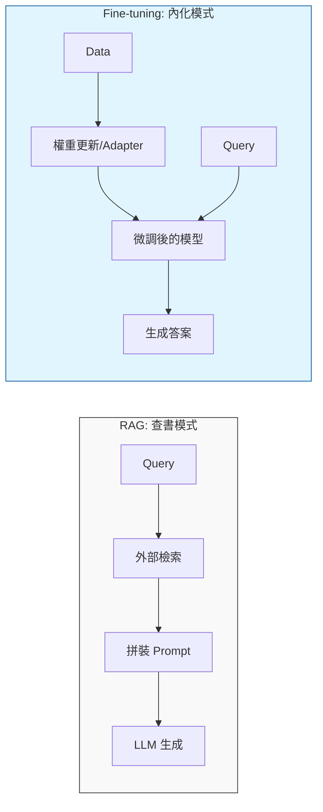

# 指令微調與提示工程進化

## 指令微調 (Instruction Tuning)
與手動對話不同，HW3 要求將大量訓練資料自動化格式化。

### 格式化模板
標準格式通常包含：
- System Prompt：定義模型扮演的角色與任務規則。
- Context：論文段落證據 (Paper Evidence)。
- Input：待偵測的評審句子。
- Output：幻覺類別預測。

## 提示工程 (Prompt Engineering) 高階應用
1. 思維鏈 (Chain of Thought, CoT)：引導模型逐步推導邏輯後再給出分類答案。
2. 分類決策樹：在 System Prompt 中內嵌判別邏輯，幫助模型精準區分 5 種幻覺。

## 技術對比：RAG vs. Fine-tuning

- RAG (檢索增強生成)：
    - 本質：外部檢索，類似「查書」。
    - 特點：模型權重不變，透過將檢索到的文本貼入 Prompt 解決知識短缺。
- Fine-tuning (微調)：
    - 本質：內化行為，類似「改變思考方式」。
    - 特點：透過更新模型權重 (或 Adapter 權重)，讓模型學會特定的比對技能、語氣或輸出格式。
