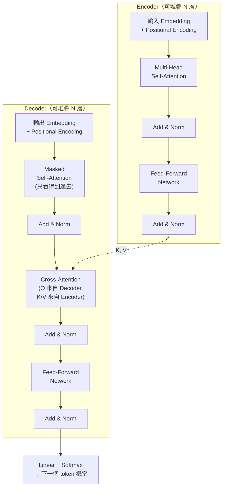
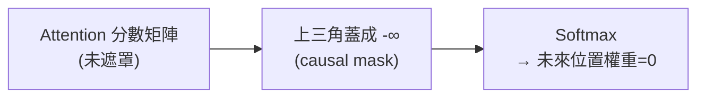

# Transformer 架構全解 (Transformer Architecture)

> [!abstract] **一句話**
> Transformer（Vaswani et al., 2017《Attention Is All You Need》）拿掉了 RNN 的「逐字循環」，全部改用 [[AI/Attention|Self-Attention]] 一次看完整個序列。這篇筆記講的是**整個架構怎麼組出來**（Attention 只是其中一塊積木）；本庫 [[ICCAD_code/5_ML_Coordinate_Regression|座標回歸]] 與 [[ICCAD_code/6_ML_Generative_BTree|生成式 B*-tree]] 兩個模型都是 Transformer 的實際變體，本篇會直接對照。

## 1. 為什麼要拋棄 RNN

| | RNN / LSTM | Transformer |
|---|---|---|
| 處理序列方式 | 一個字一個字循環，狀態逐步傳遞 | 一次看完整個序列 |
| 平行化 | **不行**——第 $t$ 步要等第 $t-1$ 步算完 | **可以**——所有位置同時計算 |
| 長距離依賴 | 遠距離資訊要經過很多步才傳得到，容易衰減（vanishing gradient） | 任兩個位置**距離都是 1**（直接算 attention） |
| 訓練速度 | 慢（序列長度 = 運算步數） | 快（GPU 平行吃滿） |

> [!info] **對應到 ICCAD 的具體理由**
> `model.py` 的文件字串講得很白：Floorplan 裡 block A 可能跟 block B 完全沒有共用網路連線 (net)，但兩者都連到同一個 terminal，所以仍必須協調位置。這種「全局但稀疏」的耦合關係，GCN（圖神經網路，訊息只沿著邊傳遞）要疊很多層才勉強傳得到，而 **Transformer 的全自注意力天生就能讓任兩個 block 直接對話**，不需要它們之間真的有邊相連。

## 2. 整體架構：Encoder 與 Decoder

原始論文是完整的 **Encoder-Decoder** 架構（機器翻譯：Encoder 讀懂來源語言，Decoder 逐字生成目標語言）。但這個「一整塊」不是必須照單全收——見第 4 節，實務上常只取其中一半。

## 3. 關鍵組件逐一拆解

### 3.1 Positional Encoding（位置編碼）
Self-Attention 本身是**排列不變**的——打亂輸入順序，attention 分數的計算方式完全不變，模型天生不知道「誰在誰前面」。解法是把位置資訊**加進**輸入向量：

$$PE_{(pos, 2i)} = \sin\left(\frac{pos}{10000^{2i/d_{model}}}\right), \quad PE_{(pos, 2i+1)} = \cos\left(\frac{pos}{10000^{2i/d_{model}}}\right)$$

用不同頻率的 sin/cos 疊加，讓每個位置都有獨一無二的編碼，且任兩個位置的相對距離可以透過線性組合表示出來。

> [!info] **ICCAD 模型怎麼處理位置**
> [[ICCAD_code/6_ML_Generative_BTree|`model_tree.py`]] 的做法不太一樣：Block 集合本身沒有天然順序（不像句子），所以用可學習的 `step_pos_emb`（而非固定 sin/cos）標記「這是生成序列的第幾步」；`model.py` 則完全不需要位置編碼——因為每個 block 的順序本來就是任意的，模型只需要知道「這是 block」還是「這是 terminal」（靠 `block_type_emb` / `term_type_emb` 兩個可學習向量區分）。

### 3.2 Multi-Head Self-Attention
細節見 [[AI/Attention|Attention 筆記]]——這裡只強調一點：Encoder 用的是**雙向**自注意力（每個位置能看到序列裡的所有位置，過去未來都算），Decoder 的第一層則是下一節講的**遮罩版**。

### 3.3 Masked（Causal）Self-Attention
Decoder 生成文字是**一個字接一個字**吐出來的，訓練時卻想平行算完整句——解法是在 attention 分數矩陣裡，把「看到未來」的位置全部蓋成 $-\infty$（softmax 後變 0），這樣每個位置就只能看到自己與更早的位置：

> [!info] **ICCAD 對照**
> [[ICCAD_code/6_ML_Generative_BTree|`TreeGenerator`]] 的 Decoder 就是標準的 causal self-attention（`torch.triu` 產生上三角遮罩），確保生成第 $t$ 個 Block 時，模型不會偷看到第 $t+1, t+2, ...$ 步還沒發生的決策——這正是「自迴歸 (autoregressive)」推論能成立的前提。

### 3.4 Cross-Attention
只存在於 Decoder：Query 來自 Decoder 自己（「我正在生成的這個字」），Key/Value 來自 Encoder 的輸出（「原文的完整理解」）。這是 Decoder 「參考原文」的機制。

### 3.5 Add & Norm（殘差連接 + Layer Normalization）
每個子層（Attention 或 FFN）的輸出都是 $\text{LayerNorm}(x + \text{Sublayer}(x))$——殘差連接讓梯度能直接跳過子層往回傳（避免深層網路訓練不動），LayerNorm 穩定每層的數值分佈。$[[ICCAD_code/6_ML_Generative_BTree|本庫兩個模型都用 `norm_first=True`]]（Pre-LN），比原始論文的 Post-LN 對深層模型更穩定，是後續研究驗證過的改良。

### 3.6 Feed-Forward Network (FFN)
每個位置獨立經過同一個兩層 MLP（先放大、GELU 非線性、再縮小），讓模型有能力做「跟其他位置無關」的逐點特徵轉換，補足 Attention 只做「加權平均」而沒有真正非線性變換的不足。

## 4. 三大架構家族

| 家族 | 只用哪部分 | 代表模型 | 適合任務 | 本庫對照 |
|---|---|---|---|---|
| **Encoder-only** | 只有 Encoder（雙向） | BERT | 理解型任務：分類、embedding | [[ICCAD_code/5_ML_Coordinate_Regression\|`model.py` FloorplanTransformer]]——對所有 block+terminal 做雙向自注意力，直接回歸座標 |
| **Decoder-only** | 只有 Decoder（causal） | GPT 系列 | 生成型任務：續寫、對話 | [[ICCAD_code/6_ML_Generative_BTree\|`TreeGenerator` 的 Decoder 部分]]——自迴歸吐出「下一個 Block 接在哪」 |
| **Encoder-Decoder** | 兩者都要 | 原始 Transformer、T5 | 序列轉序列：翻譯、摘要 | `TreeGenerator` **整體**其實正是這個家族的變體：Context Encoder（雙向，理解整個 Floorplan case）+ Causal Decoder（生成拓樸序列），只是拿掉了傳統的 cross-attention，改用三個 [[ICCAD_code/6_ML_Generative_BTree\|Pointer Network]] 頭做「指向」而非「生成詞彙」 |

> [!success] **關鍵洞察**
> `TreeGenerator` 不是教科書標準架構的複製貼上，而是**針對問題結構做的客製化組合**：它保留了 Encoder-Decoder 的「先理解、再生成」精神，但把最後的輸出層從「詞彙表 softmax」換成「指向已知集合的 Pointer Network」——因為我們要生成的不是自然語言，而是「這個 Block 該接在哪個已放置節點上」這種**指向式**決策。這正是 Pointer Networks（Vinyals et al. 2015）最初被發明的理由：輸出空間本身就是輸入的一個子集，用固定詞彙表分類沒有意義。

## 5. 參數量與效率的直覺

- 這兩個 ICCAD 模型都刻意做得很小（25 萬～680 萬參數），遠比 GPT/BERT（億級）小非常多——因為問題規模本身就小（$N \leq 128$ 個 block），大模型在這裡只會 overfit，不會更好。
- Self-Attention 的計算複雜度是 $O(N^2 \cdot d)$（$N$=序列長度）。對 NLP 的長文本這是個大問題（近年 Flash Attention、稀疏注意力都是為了解決它），但對 $N \leq 128$ 的 Floorplan 案例完全不是瓶頸。

---
**相關筆記**：[[AI/Attention|Attention 機制細節]] · [[AI/Machine-Learning|機器學習總覽]] · [[ICCAD_code/5_ML_Coordinate_Regression|座標回歸模型 (Encoder-only 實例)]] · [[ICCAD_code/6_ML_Generative_BTree|生成式 B*-tree 模型 (Encoder-Decoder 變體實例)]] · [[index|🌐 全域索引]]
