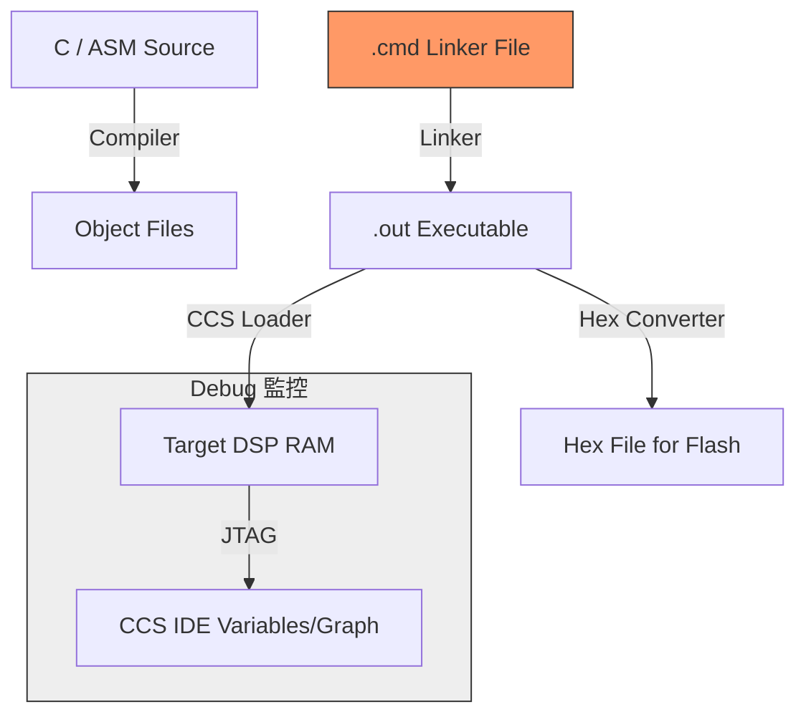

# CCS 工具開發、Debug 陷阱與記憶體配置

在 [[TMS320C6000]] 的開發流程中，[[CCS]] (Code Composer Studio) 不僅是編譯器，更是理解硬體行為的窗戶。然而，許多新手會卡在記憶體分配（Linker）與 Debug 模式下的硬體「非同步」行為。

## 1. Linker Command File (.cmd) 與記憶體配置

Linker 的任務是將編譯好的二進位段（Sections）放置到正確的實體位址。

### MEMORY 指令：定義硬體邊界
`MEMORY` 塊描述了晶片上實際存在的記憶體區域。
```ld
MEMORY
{
    VECTORS: origin = 0x00000000, len = 0x00000400  /* 1KB 為中斷向量預留 */
    IRAM:    origin = 0x00000400, len = 0x0003FC00  /* 內部 L2 RAM */
    SDRAM:   origin = 0x80000000, len = 0x01000000  /* 外部 CE0 SDRAM */
}
```

### SECTIONS 指令：分配內容
- `.text`: 程式碼段。
- `.vectors`: 中斷向量表。
- **`align = 0x400`**：
    > [!important] 關鍵約束：中斷向量對齊
    > 根據 [[中斷機制_Interrupt]] 的硬體限制，[[ISTP]] 必須對齊 1KB。因此在 `.cmd` 中必須寫入：
    > `.vectors : > VECTORS, align = 0x400`
    > 若未對齊，中斷發生時 CPU 會跳轉到錯誤的實體位址。

### C 語言中的 `#pragma CODE_SECTION`
當你需要將某個關鍵運算函式（如 FFT）從外部慢速 SDRAM 搬移到內部高速 IRAM 執行時：
```c
#pragma CODE_SECTION(my_fast_function, ".fast_code")
void my_fast_function(void) { ... }
```
並在 `.cmd` 中指定：
`.fast_code : > IRAM`

## 2. Debug 與硬體行為落差 (死角陷阱)

這是在開發過程中最強大的工具，但也最容易誤導開發者。

### 陷阱一：Halt 狀態下的「非同步」週邊
當你在 [[CCS]] 中點擊 **"Halt" (暫停)** 時，CPU 的 Pipeline 停止了，程式碼不再前進。
- **但是**：[[EDMA]] 與 [[Timer]] 是獨立的硬體控制器。
- **後果**：當你停在斷點看變數時，Timer 可能已經又跑了三圈，EDMA 可能已經搬完了整個緩衝區。這會導致你觀察到的暫存器狀態與「預期中斷點時刻」不一致。

### 陷阱二：Pending Interrupt 與 Reset 殘留
> [!danger] 致命陷阱：Reset 不等於 Power-On
> 在 CCS 點擊 "Reset CPU" 往往只是軟體復位（Reset PC）。
> - **IFR 殘留**：如果 Reset 前有一個中斷發生但未被處理，其旗標會殘留在 `[[IFR]]` 中。
> - **跑飛風險**：當你重新 Load 程式並啟動（Run）的一瞬間，因為 IFR 為 1，CPU 會立即跳進中斷向量表。如果此時你的中斷向量尚未初始化完成，系統會立即崩潰跑飛。

## 3. .map 檔的閱讀技巧

當系統崩潰並回報一個十六進位位址（如 `0x0000A124`）時，你必須學會查閱 `.map` 檔。

### 如何定位 Bug：
1. **Section 列表**：確認 `.text` 是否溢出到了外部記憶體（導致效能劇降）。
2. **Symbol 查詢**：在 `.map` 搜尋該位址，找出是哪一個函式（Function）或全域變數佔用了該空間。
3. **記憶體剩餘**：檢查堆疊（`.stack`）與堆（`.sysmem`）的大小，防止 Buffer Overflow。

## 4. 視覺化：CCS 開發與部署流程



> [!tip] 實務建議
> 每次修改硬體設定（如 [[EMIF]] 或 [[Timer]]）後，建議點擊 **"Reset CPU"** 並手動清除 `[[IFR]]` (透過寫入 `[[ICR]]`)，確保系統處於乾淨的初始狀態。

---
**相關連結：**
- [[核心架構與Pipeline]]
- [[Memory_Map與EMIF]]
- [[中斷機制_Interrupt]]
- [[Timer計時器]]
- [[EDMA_背景搬運]]
