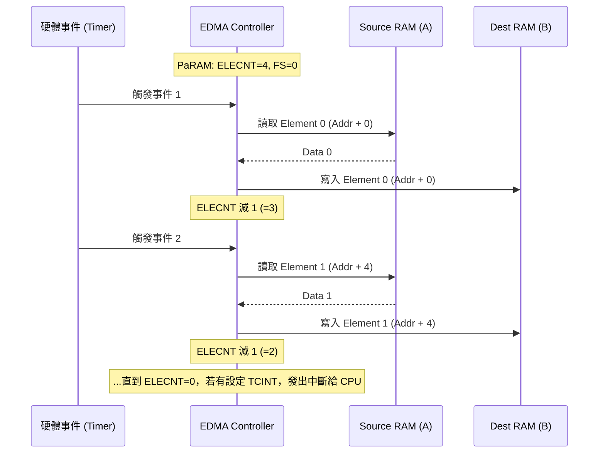

# EDMA 背景傳輸機制詳解

在高性能 DSP 應用（如 1080p 影像處理或 48kHz 音訊濾波）中，CPU 的每一時鐘週期都極其珍貴。[[EDMA]] (Enhanced Direct Memory Access) 的存在，是為了實現「Zero-overhead」的資料搬運，讓 CPU 專注於數學運算，而非瑣碎的記憶體讀寫。

## 1. EDMA vs. CPU 搬運的本質差異

| 特性 | CPU 搬運 (Manual Copy) | EDMA 搬運 (Background) |
| :--- | :--- | :--- |
| **資源消耗** | 佔用 Data Path A/B 與 Pipeline | 獨立的匯流排控制器，不佔用 CPU 週期 |
| **並行性** | 運算停止，等待 Load/Store 完成 | **背景執行**：CPU 運算 A 區，EDMA 搬運 B 區 |
| **觸發方式** | 指令驅動 (軟體) | **事件驅動** (硬體/定時器/外設) |
| **同步性** | 同步執行 | 非同步執行，完成後發出中斷 |

## 2. PaRAM (Parameter RAM) 的 6 大設定深度解析

[[EDMA]] 的核心靈魂在於 [[PaRAM]] 暫存器組。每個通道都配有一組 24-byte 的參數集。

### (1) [[OPT]] (Options Register)
決定傳輸的「性質」：
- **ESIZE (Bit 12-13)**：單次搬移大小 (32/16/8-bit)。
- **SUM/DUM (Bit 0-1)**：來源/目的位址是否自動遞增（固定/遞增/遞減）。
- **FS (Frame Sync, Bit 10)**：
    - `FS=0`: **Element Sync**。每次事件搬一個元素（Element）。
    - `FS=1`: **Frame Sync**。每次事件搬一個框架（Frame）。
- **TCINT / TCC (Bit 16-21)**：中斷觸發碼。搬運完成後，將 `TCC` 的值寫入 `CIPR` 暫存器並觸發 CPU 中斷。

### (2) [[SRC]] 與 [[DST]] (Address Registers)
32-bit 的物理起始位址。必須符合記憶體對齊要求（例如 32-bit 存取位址末兩位須為 0）。

### (3) [[CNT]] (Count Register)
- **ELECNT (Bit 0-15)**：一個 Frame 內有多少個 Element。
- **FRMCNT (Bit 16-31)**：總共有多少個 Frame。
    - **死角重點**：在暫存器寫入時，`FRMCNT` 必須寫入「實際數量 - 1」。例如要搬 10 個 Frame，此位元組應寫 9。

### (4) [[IDX]] (Index Register)
- **ELEIDX**：每個 Element 之間的位址偏移量。
- **FRMIDX**：每個 Frame 之間的位址偏移量。這在處理非連續記憶體（如影像的子塊存取）時至關重要。

### (5) [[RLD]] (Reload & Link Register)
- **ELERLD**：當一個 Frame 搬完後，`ELECNT` 要恢復成多少。
- **Link Address**：當整個任務（所有 Frame）搬完後，PaRAM 自動從哪一個位址載入下一組參數。這稱為 **Channel Linking**。

> [!danger] 致命陷阱：ELERLD 與系統死機
> 當 `FS=0` (Element Sync) 且 `ELECNT=1` 時，如果 `ELERLD` 被誤設為 0，當第一個元素搬完後，硬體會認為任務已結束（或剩餘 0 個），若此時 Link Address 也無效，EDMA 控制器可能會進入未定義狀態或不斷嘗試無效存取，導致 CPU 匯流排鎖死，系統徹底崩潰。

## 3. 觸發來源與事件映射

[[EDMA]] 擁有 16 到 64 個獨立通道，每個通道映射到特定的硬體事件。

- **[[EER]] (Event Enable Register)**：用來致能特定的硬體觸發來源。
- **常見事件來源**：
    - [[Timer]] 0/1 溢位（定時採樣）。
    - [[McBSP]] 接收/發送 Ready（音訊串流）。
    - 外部引腳 `EXT_INT`（外部硬體同步）。

## 4. 視覺化：1D to 1D (Element Sync, FS=0) 搬運示意圖

假設我們要從緩衝區 A 搬運 4 個元素到緩衝區 B，每次觸發搬一個。

## 5. EDMA 完成中斷與 CPU 協作

當搬運完成後，EDMA 會將狀態回報給 CPU。
1. **CIPR (Channel Interrupt Pending Register)**：對應 `TCC` 的位元會變為 1。
2. **CIER (Channel Interrupt Enable Register)**：必須開啟對應位元，中斷才會送達 CPU。
3. **CPU 端的 ISR**：執行 `[[ICR]]` 清除中斷，並開始處理搬好的資料。

> [!warning] 陷阱提示：Cache 一致性
> 當 [[EDMA]] 將資料搬入 [[Internal_SRAM]] 時，CPU 的 [[L1D_Cache]] 可能還留著舊資料。
> **解決方案**：在 CPU 讀取該資料前，必須先執行 **Cache Invalidate** 操作，確保 CPU 從實體記憶體讀取由 EDMA 寫入的新鮮數據。

---
**相關連結：**
- [[核心架構與Pipeline]]
- [[中斷機制_Interrupt]]
- [[Timer計時器]]
- [[Memory_Map與EMIF]]
