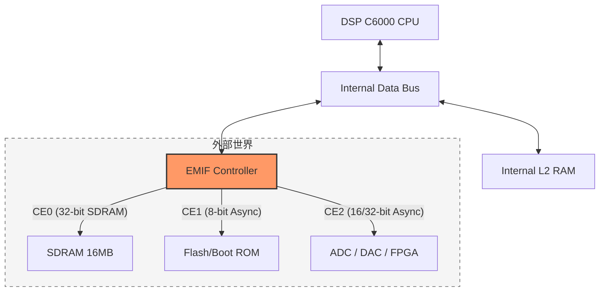

# TMS320C6000 Memory Map 與 EMIF

> [!info] 核心概念：EMIF (External Memory Interface)
> [[EMIF]] 是 [[TMS320C6000]] 核心與外界溝通的樞紐。由於 DSP 內部的 [[L1_RAM]] 與 [[L2_RAM]] 空間有限，所有大型陣列、外部 Codec、[[SDRAM]] 或 [[Flash]] 都必須透過 [[EMIF]] 進行存取。

---

## 1. C6711/C6713 Memory Map 概觀

[[TMS320C6000]] 採用統一編址架構，CPU 視所有空間為連續的 32-bit 位址。

| 位址範圍 (Hex) | 描述 | 預設映射 (C6713) |
| :--- | :--- | :--- |
| `0000 0000` - `0003 FFFF` | 內部 RAM (L2) | [[Internal_SRAM]] (256KB) |
| `0180 0000` - `01B0 FFFF` | Config Registers | [[EMIF_Registers]], [[EDMA_Registers]], Timers |
| `8000 0000` - `8FFF FFFF` | **CE0** 空間 | 外部 [[SDRAM]] (通常接此) |
| `9000 0000` - `9FFF FFFF` | **CE1** 空間 | 8-bit [[Flash]] / Daughterboard ROM |
| `A000 0000` - `AFFF FFFF` | **CE2** 空間 | 外部 I/O (如 [[ADC]], [[DAC]]) |
| `B000 0000` - `BFFF FFFF` | **CE3** 空間 | 外部 I/O 或擴充存儲 |

---

## 2. EMIF 的核心作用與架構

[[EMIF]] 負責將 CPU 內部的同步協定轉換為外部硬體所需的時序。它像是一個「多功能翻譯官」，能同時處理同步與非同步裝置。

### 硬體架構圖 (Mermaid)



---

## 3. CE 空間 (Chip Enable) 劃分與用途

[[EMIF]] 將外部空間劃分為四個 **Chip Enable (CE)** 區域，每個區域都有獨立的控制暫存器（[[CECTL]]），允許混合使用不同類型的記憶體。

- **[[CE0]]**：具備最高優先權，通常配置為 32-bit [[SDRAM]]，作為程式執行的主要擴展區。
- **[[CE1]]**：在 [[Bootloader]] 模式下，通常存放 8-bit 的 [[Flash]] 程式碼。
- **[[CE2]] / [[CE3]]**：常用於連接非同步的周邊裝置，如顯示器控制器或採樣晶片。

---

## 4. EMIF Control Register 設定意義

最重要的暫存器為 **CE Control Register (CECTL)**，其關鍵位元包含：

1. **MTYPE (Memory Type)**：
   - `0011`: 32-bit [[SDRAM]]
   - `0010`: 32-bit Asynchronous (非同步)
   - `0000`: 8-bit Asynchronous
2. **Read/Write Setup/Strobe/Hold**：
   - 用於精確調整非同步時序，確保與低速周邊（如 [[ADC]]）同步。

> [!warning] 隱藏陷阱：SDRAM 刷新
> 若接的是 [[SDRAM]]，除了 CECTL，還必須設定 [[SDCTL]] (SDRAM Control Register) 與 [[SDRP]] (Refresh Period)，否則資料會因電容漏電而遺失。

---

## 5. 實作範例：設定 EMIF

以下為在 C6713 DSK 上設定 CE1 為非同步 8-bit 模式的範例，這通常用於存取板載 Flash。

> [!example] C 語言 EMIF 初始化
> ```c
> #include <csl.h>
> #include <csl_emif.h>
>
> // 定義 CE1 空間的設定參數
> EMIF_Config emifCfg0 = {
>     0x00000030, // gblctl: Global Control (根據硬體手冊設定)
>     0xFFFFFF03, // cectl0: CE0 - SDRAM 32-bit
>     0x00000000, // cectl1: CE1 - 8-bit Async (例如 Flash)
>     0x22A28A22, // cectl2: CE2 - Async Setup/Strobe/Hold
>     0x22A28A22, // cectl3: CE3 - Async Setup/Strobe/Hold
>     0x07117000, // sdctl : SDRAM 控制
>     0x00000410, // sdtim : SDRAM Timing
>     0x0000061A  // sdrp  : SDRAM Refresh Period
> };
>
> void init_emif() {
>     // 使用 CSL (Chip Support Library) 進行初始化
>     EMIF_config(&emifCfg0);
>     
>     // 設定後，即可直接透過指標存取位址
>     // 例如存取 CE1 起始位址
>     unsigned char *flash_ptr = (unsigned char *)0x90000000;
>     unsigned char val = *flash_ptr; 
> }
> ```

---
**相關連結：**
- [[核心架構與Pipeline]]
- [[EDMA_控制器原理]]
- [[Boot_Process_與自舉加載]]
