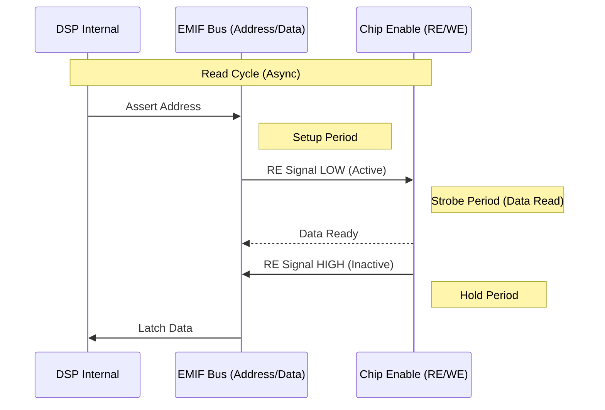
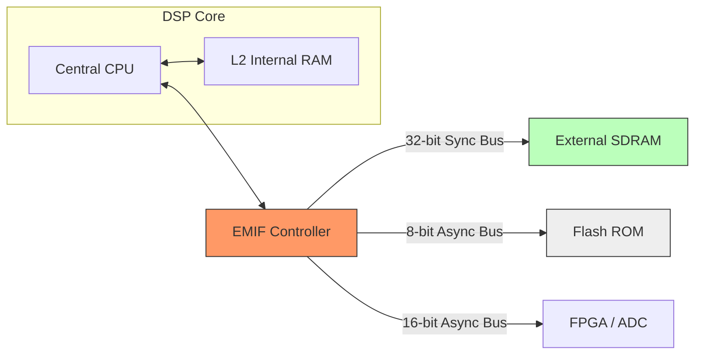

# 記憶體映射與 EMIF (External Memory Interface)

在本章節中，我們將解構 [[TMS320C6000]] 的存儲架構。對於 DSP 工程師而言，理解記憶體映射（Memory Map）與外部介面（[[EMIF]]）的物理時序，是解決系統「跑飛」或資料毀損問題的關鍵。

## 1. 內部記憶體映射 (Memory Map) 與 MAP 模式

[[TMS320C6000]] 採用 32-bit 位址線，理論定址空間為 4GB。然而，內部的 [[Internal_RAM]]（L2）位址會根據硬體引腳設定的 **MAP 模式** 而改變。

### MAP0 vs MAP1 (以 C6713 為例)
這由硬體引腳 `LENDIAN/BOOTMODE` 等決定，直接影響中斷向量表（[[IST]]）的起始位置。

| 模式 | 描述 | 內部 RAM (L2) 起始位址 | 用途 |
| :--- | :--- | :--- | :--- |
| **MAP 0** | ROM 映射模式 | `0x0000 0000` | **預設/常用**。中斷向量表位於 0 位址，啟動後直接執行內部 RAM 程式。 |
| **MAP 1** | RAM 映射模式 | `0x0180 0000` | 較少見。`0x0000 0000` 映射到 [[CE1]] 的外部記憶體。 |

> [!important] Bootloader 啟動點
> 在 `MAP 0` 且 `BOOTMODE = 8-bit ROM` 時，硬體會自動將 [[CE1]] 前 1KB 的內容搬移到 `0x0000 0000`，這就是所謂的 **Auto-boot** 機制。

## 2. EMIF 空間劃分 (CE0 ~ CE3)

[[EMIF]] 將外部定址空間切割為四個 **Chip Enable (CE)** 區域。

| CE 空間 | 位址範圍 (Hex) | 常見硬體連接 | 匯流排寬度支援 |
| :--- | :--- | :--- | :--- |
| **[[CE0]]** | `0x8000 0000` - `0x8FFF FFFF` | [[SDRAM]] (16MB/32MB) | 32-bit |
| **[[CE1]]** | `0x9000 0000` - `0x9FFF FFFF` | [[Flash]] / [[Boot_ROM]] | 8/16/32-bit |
| **[[CE2]]** | `0xA000 0000` - `0xAFFF FFFF` | 外部 I/O, [[FPGA]], [[ADC]] | 8/16/32-bit |
| **[[CE3]]** | `0xB000 0000` - `0xBFFF FFFF` | 擴充周邊 | 8/16/32-bit |

## 3. EMIF 暫存器控制：MTYPE 與時序解析

要存取外部記憶體，必須先正確配置 [[GBLCTL]] (Global Control) 與 [[CExCTL]] (CE Control Register)。

### CExCTL 的 MTYPE 欄位 (Bit 4-7)
這決定了該區域接的是什麼「物理零件」：
- `0000`: 8-bit Asynchronous (如小型 Flash)
- `0001`: 16-bit Asynchronous
- **`0010`: 32-bit Asynchronous**
- **`0011`: 32-bit SDRAM** (僅 CE0 支援完整 SDRAM 時序)
- `0100`: 32-bit SBSRAM

### 非同步存取時序：Setup, Strobe, Hold
這是最容易出錯的地方。存取一個非同步記憶體（如 FPGA 暫存器）的物理過程如下：

1. **Setup (建立時間)**：位址線穩定後，到 `RE/WE` 信號拉低前的時間。
2. **Strobe (脈衝寬度)**：`RE/WE` 信號保持低準位的持續時間（真正的資料交換發生在此時）。
3. **Hold (保持時間)**：`RE/WE` 拉高後，位址與資料線必須維持穩定的時間。

## 4. Endianness 與 Packing/Unpacking 行為

[[TMS320C6000]] 支援大端（[[Big-endian]]）與小端（[[Little-endian]]）模式，透過 `LENDIAN` 引腳在 Reset 時決定。

### 32-bit 寫入 8-bit 記憶體的 Packing
如果 CPU 執行 `STW` (32-bit Store) 到一個配置為 8-bit 的 [[CE1]] 空間，[[EMIF]] 會自動執行以下行為：
- 硬體將一個 32-bit 字組拆分為 4 個 8-bit 位元組。
- 自動產生 4 個連續的匯流排週期。
- **效率陷阱**：這會造成 4 倍的延遲，若程式頻繁在此區域運行，效能會劇烈下降。

## 5. 視覺化：系統連接架構

> [!warning] 陷阱提示：位址線偏移 (Alignment)
> 當存取 8-bit 或 16-bit 記憶體時，DSP 的外部位址線 `EA[2..21]` 對應的是「字組 (Word)」位址。接線時必須查閱手冊，確認是否需要將 `EA[2]` 接到外部晶片的 `A[0]`，否則會產生位址偏移錯誤。

---
**相關連結：**
- [[核心架構與Pipeline]]
- [[中斷機制_Interrupt]]
- [[EDMA_背景搬運]]
- [[Boot_Process_與自舉加載]]
