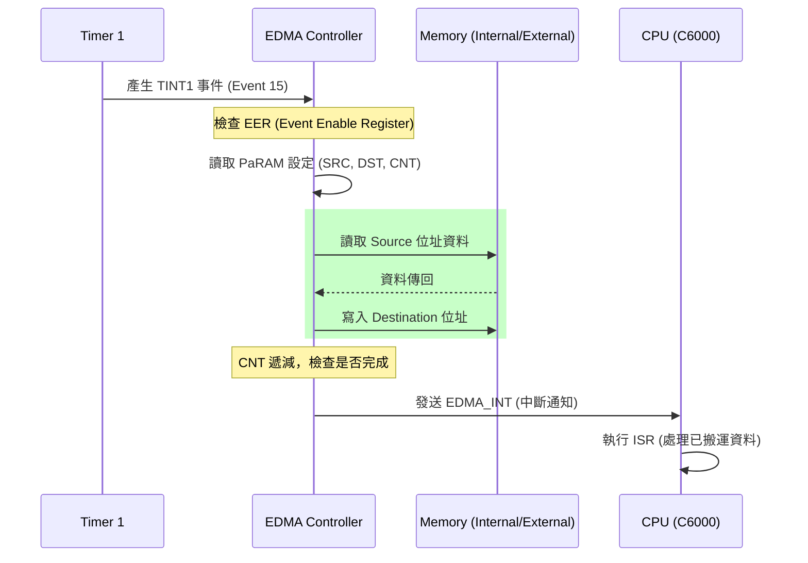

# TMS320C6000 EDMA 背景搬運

> [!info] 核心概念：Zero-overhead 與背景執行
> [[EDMA]] (Enhanced Direct Memory Access) 是一個獨立於 CPU 之外的專用搬運引擎。
> **為什麼不用 CPU 搬資料？**
> 1. **效率極差**：CPU 搬運資料需要執行 `LD` (Load)、`ST` (Store) 指令，會佔用 Pipeline 執行單元與暫存器，且受限於執行週期。
> 2. **Zero-overhead**：[[EDMA]] 在搬運資料時，CPU 可以同時進行 [[FFT]] 或矩陣運算，兩者互不干擾。這實現了真正意義上的「背景執行」，只有在搬運結束時，[[EDMA]] 才會發出中斷告知 CPU。

---

## 1. EDMA 事件映射 (Event Mapping)

[[EDMA]] 不是隨機觸發的，它與外部硬體、內部周邊有固定的連動關係。當特定事件發生時，對應的 [[EDMA]] 通道會被激活。

| 事件編號 | 事件名稱 | 觸發來源 |
| :--- | :--- | :--- |
| 1 | [[TINT0]] | Timer 0 中斷觸發 |
| 2 | [[TINT1]] | Timer 1 中斷觸發 |
| 8 | [[REVT0]] | McBSP0 接收資料就緒 |
| 15 | [[EDMA_INT]] | 其他 EDMA 通道完成連結 (Chaining) |

> [!tip]
> 這些映射是硬體寫死的，工程師必須查閱對應型號（如 C6713）的 Datasheet 來決定使用哪個通道。

---

## 2. PaRAM (Parameter RAM) 核心暫存器

[[EDMA]] 的靈魂在於 [[PaRAM]]，每一組搬運參數由 6 個 32-bit 字組成。

### [[OPT]] (Options Parameter)
決定「怎麼搬」的關鍵：
- **PRI (Priority)**：設定搬運優先權（高/低）。
- **ESIZE (Element Size)**：8-bit, 16-bit 或 32-bit。
- **SUM / DUM (Source/Dest Update Mode)**：決定搬完一個資料後，位址是要遞增、遞減還是固定（固定用於讀取 [[FIFO]] 或 [[ADC]]）。
- **TCINT (Transfer Complete Interrupt)**：設為 1 時，搬運結束會產生中斷。
- **TCC (Transfer Complete Code)**：指定中斷編號。

### 位址與計數暫存器
- **[[SRC]] (Source Address)**：資料源頭位址。
- **[[DST]] (Destination Address)**：資料目的地點。
- **[[CNT]] (Element & Frame Count)**：
  - **ELECNT**：每一幀 (Frame) 有多少個元素。
  - **FRMCNT**：總共有多少幀。
- **[[IDX]] (Index)**：當搬完一幀後，位址跳轉的偏移量。
- **[[RLD]] (Reload / Link)**：當搬運結束，從哪個 [[PaRAM]] 重新載入參數（用於循環緩衝區）。

---

## 3. 運作流程圖 (Mermaid)



---

## 4. Timer 觸發 EDMA 實作範例

以下範例展示如何設定：當 Timer 1 每秒觸發一次時，自動將 1 word (32-bit) 資料從內部變數搬移到外接裝置。

> [!example] C 語言 EDMA 配置
> ```c
> #include <csl.h>
> #include <csl_edma.h>
>
> // 宣告 PaRAM 配置結構
> EDMA_Config edmaCfg = {
>     0x21300004, // OPT: PRI=高, ESIZE=32-bit, TCINT=1, TCC=1
>     (Uint32)&src_data, // SRC: 來源位址
>     0x00010001, // CNT: 1 Frame, 1 Element
>     0xA0000000, // DST: 外部 CE2 位址 (例如 DAC)
>     0x00000000, // IDX: 無偏移
>     0x00000000  // RLD: 無連結
> };
>
> void init_edma_trigger() {
>     EDMA_Handle hEdma;
>     
>     // 1. 開啟通道 15 (由 Timer 1 觸發)
>     hEdma = EDMA_open(15, EDMA_OPEN_RESET);
>     
>     // 2. 寫入 PaRAM
>     EDMA_config(hEdma, &edmaCfg);
>     
>     // 3. 啟用事件 (寫入 EER 暫存器)
>     // 這是關鍵：如果不寫 EER，Timer 事件會被 EDMA 忽略
>     EDMA_enableEvent(hEdma);
> }
> ```

---

## 5. EDMA_INT 中斷通知

當搬運完成且 [[OPT]] 中的 `TCINT` 設為 1 時，[[EDMA]] 控制器會向 CPU 提交一個中斷。
- CPU 會在它的 [[IFR]] 中看到一個對應於 [[EDMA_INT]] 的位元被設為 1。
- 程式在 ISR 中可以讀取 `CIPR` (Channel Interrupt Pending Register) 來確認是哪一個通道完成了搬運。

> [!warning] 隱藏陷阱：快取一致性 (Cache Coherency)
> 當 [[EDMA]] 將資料搬入 [[Internal_SRAM]] 時，CPU 的 [[L1D_Cache]] 可能還留著舊資料。
> **解決方案**：在 CPU 讀取該資料前，必須先執行 Cache Invalidate (作廢) 操作，確保 CPU 從記憶體讀取由 [[EDMA]] 搬入的新值。

---
**相關連結：**
- [[TMS320C6000_核心架構與Pipeline]]
- [[TMS320C6000_Timer計時器]]
- [[TMS320C6000_中斷機制_Interrupt]]
