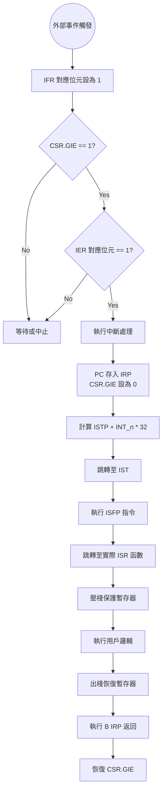

# TMS320C6000 中斷機制 (Interrupt)

> [!info] 核心概念：硬體搶占 (Hardware Preemption)
> [[TMS320C6000]] 的中斷機制是系統即時性 (Real-time) 的關鍵。它允許外部硬體事件（如定時器到期、[[EDMA]] 完成、或是 [[Codec]] 取樣完成）強行中止當前的執行流，轉而執行特定的服務常式。

---

## 1. 中斷硬體處理流程 Timeline

當一個中斷發生時，硬體會經歷以下精確的時序：

1. **偵測 (Detection)**：外部接腳或內部周邊將中斷訊號送至 CPU。
2. **鎖存 (Latching)**：硬體將 [[IFR]] (Interrupt Flag Register) 對應的位元設為 1。
3. **決策 (Decision)**：CPU 檢查 [[CSR]] 的 GIE 位元與 [[IER]] 對應位元。
4. **準備回跳 (Preparation)**：
   - 將目前的 PC 位址存入 [[IRP]] (可屏蔽中斷) 或 [[NRP]] (非屏蔽中斷)。
   - 自動將 [[CSR]] 中的 GIE (Global Interrupt Enable) 設為 0（關閉中斷巢狀）。
5. **分支 (Branch)**：根據 [[ISTP]] 與中斷編號，計算位址並跳轉至 [[IST]] 中對應的向量位元。
6. **擷取 (Fetch)**：執行 [[ISFP]] (Interrupt Service Fetch Packet)。

---

## 2. 中斷三道保險 (Map, Hook, Enable)

要在 C 語言中成功執行中斷，必須完成以下三步驟：

### A. 映射 (Map)
使用 **Interrupt Selector** 將眾多的周邊事件（如 Timer0, UART, External INT）映射到 CPU 的 12 個可屏蔽中斷通道 (INT4~INT15)。
- 暫存器：[[MUXL]] (INT4-7), [[MUXH]] (INT8-15)。

### B. 掛載 (Hook)
在中斷向量表 ([[IST]]) 的對應位置，寫入跳轉指令位址。這通常透過彙編指令 `B ISR_Function` 完成。

### C. 啟用 (Enable)
- **局部開啟**：設定 [[IER]] 對應位元。
- **全域開啟**：設定 [[CSR]] 的 GIE 位元。

---

## 3. 關鍵暫存器解析

### [[CSR]] (Control Status Register)
| Bit | Name | 意義 |
| :--- | :--- | :--- |
| 0 | **GIE** | 全域中斷開啟 (1: 開啟, 0: 關閉)。 |
| 1 | **PGIE** | 前一個中斷開啟狀態 (中斷返回時恢復給 GIE)。 |
| 5-9 | CPUID | 識別處理器核心。 |

### [[IER]] & [[IFR]] (Enable & Flag)
- **[[IFR]]**：唯讀，顯示哪個中斷正在等待處理。
- **[[IER]]**：可讀寫，決定是否允許該通道觸發 CPU。
- 位元 4-15 分別對應 INT4-INT15。

### [[ISTP]] (Interrupt Service Table Pointer)
- **位元 10-31**：指向 [[IST]] 的基底位址。
- **位元 0-9**：硬體保留。

> [!warning] 核心設計：為什麼 ISTP 必須 1024 Bytes (1KB) 對齊？
> 這是為了「極速跳轉」設計的硬體電路邏輯：
> 1. C6000 有 32 個中斷向量（含保留位）。
> 2. 每個向量是一個 [[Fetch Packet]]，固定大小為 32 Bytes。
> 3. $32 \times 32 = 1024$ Bytes。
> 當中斷 $n$ 發生時，硬體直接將中斷編號左移 5 位 ($n \times 32$)，並與 [[ISTP]] 的高位元（10-31位）拼接。
> **這樣做不需要加法器，僅需位元拼接電路，能保證在 1 個時鐘週期內完成跳轉目標位址計算。**

---

## 4. ISFP (Interrupt Service Fetch Packet)

### 什麼是 [[ISFP]]？
它是中斷向量表中儲存的 8 條指令空間 (32 Bytes)。

### 空間限制與解決方案
> [!info] 空間限制
> 由於每個中斷向量只有 32 Bytes，通常放不下複雜的 C 語言函數代碼。
> **解決方案：**
> 在 [[ISFP]] 中僅放置一條跳轉指令 `B _ISR_Func` 與清除中斷旗標的指令。真正的執行邏輯放在一般的程式空間中。

---

## 5. C 語言 `interrupt` 關鍵字的行為

在 C 語言中宣告 ISR 時，必須使用 `interrupt` 關鍵字：
```c
interrupt void timer0_isr(void) { ... }
```

### 編譯器做了什麼？
1. **Context Save (現場保護)**：自動生成程式碼，將所有會用到的暫存器 (A0-A15, B0-B15) 壓入堆疊 (Stack)。
2. **專用返回指令**：普通函數使用 `B B3` 返回，ISR 使用 `B IRP` 返回。
3. **中斷狀態恢復**：恢復 [[CSR]] 狀態，讓系統能再次接收中斷。

> [!warning] 常見錯誤
> 若漏寫 `interrupt` 關鍵字，編譯器會將其視為普通函數。返回時會執行 `B B3`，這會導致程式跳轉回錯誤的位址，造成系統崩潰（PC 亂飛）。

---

## 6. 中斷觸發決策流程 (Mermaid)



---
**相關連結：**
- [[TMS320C6000_核心架構與Pipeline]]
- [[TMS320C6000_Memory_Map與EMIF]]
- [[Timers_與_PWM_控制]]
