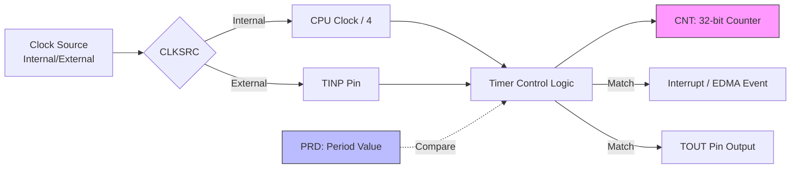

# TMS320C6000 Timer 計時器

> [!info] 核心概念：精確時脈管理
> [[TMS320C6000]] 內建兩個 32-bit 通用定時器 (Timer 0 與 Timer 1)。它們不僅能用於產生週期性中斷，還能透過外部接腳 [[TINP]] 接收脈衝計數，或透過 [[TOUT]] 輸出特定頻率的波形 (如 [[PWM]])。

---

## 1. Timer 硬體方塊圖與運作原理

Timer 的核心是一個 32-bit 的遞增計數器，其運作逻辑如下：
1. 輸入時鐘 (Clock Source) 驅動 [[CNT]] (Counter Register) 遞增。
2. 當 [[CNT]] 的值等於 [[PRD]] (Period Register) 設定的目標值時，計數器歸零。
3. 同時產生兩個訊號：
   - **內部訊號**：觸發 CPU 的中斷 (TINT0/TINT1) 或 [[EDMA]] 事件。
   - **外部訊號**：透過 [[TOUT]] 接腳輸出電位變化。

### 硬體邏輯圖 (Mermaid)



---

## 2. 核心暫存器解析

Timer 的控制空間位於記憶體映射的 [[Config_Registers]] 區。

### Timer Control Register ([[CTL]])
位址：`0194 0000` (Timer 0) / `0198 0000` (Timer 1)

| Bit | Name | 意義 | 功能說明 |
| :--- | :--- | :--- | :--- |
| 10 | **INVOUT** | Output Invert | 0: TOUT 正常輸出, 1: TOUT 反相。 |
| 9 | **CLKSRC** | Clock Source | 0: 內部時鐘 (CPU/4), 1: 外部接腳 TINP。 |
| 8 | **CP** | Clock/Pulse | 0: 脈衝模式 (1 cycle), 1: 時鐘模式 (50% Duty Cycle)。 |
| 7 | **PWID** | Pulse Width | 脈衝寬度設定 (僅在 CP=0 時有效)。 |
| 6 | **GO** | Timer Go | 0: 停止, 1: 開始計數。 |
| 1 | **HLD** | Timer Hold | 0: 保持在當前值 (停止), 1: 釋放計數。 |

### Period Register ([[PRD]])
- 32-bit 暫存器，儲存目標週期值。
- 計算公式：$Period = \text{Desired Time} \times \text{Timer Frequency}$。

### Counter Register ([[CNT]])
- 32-bit 暫存器，顯示當前計數值。
- 可以隨時讀取，但通常在設定時先清零。

---

## 3. 內部時鐘頻率計算

在 [[TMS320C6000]] 架構中，當使用內部時鐘源時，Timer 的驅動頻率固定為 **CPU 頻率的 1/4**。

- **公式**：$F_{timer} = \frac{F_{CPU}}{4}$
- **案例**：
  - 若 C6713 執行於 225 MHz。
  - 則 Timer 頻率 $F_{timer} = 225 / 4 = 56.25 \text{ MHz}$。
  - 每個 Tick 的時間 $T_{tick} = \frac{1}{56.25 \text{ MHz}} \approx 17.77 \text{ ns}$。

---

## 4. 實作範例：設定 1 秒中斷

假設 CPU 頻率為 200 MHz，則 Timer 頻率為 50 MHz。

> [!example] C 語言初始化 Timer
> ```c
> #include <csl.h>
> #include <csl_timer.h>
>
> // 建立 Timer 句柄
> TIMER_Handle hTimer0;
>
> void init_timer1s() {
>     // 1. 開啟 Timer0 模組
>     hTimer0 = TIMER_open(TIMER_DEV0, 0);
>
>     // 2. 設定 Period (PRD)
>     // 50 MHz = 50,000,000 cycles per second
>     TIMER_configArgs(hTimer0, 
>         0x000002C0, // CTL: CLKSRC=0(Internal), CP=1(Clock), HLD=1
>         50000000,   // PRD: 設定為 50M，達成 1 秒觸發
>         0x00000000  // CNT: 初始值清零
>     );
>
>     // 3. 啟動 Timer
>     // 將 CTL 中的 GO 位元設為 1
>     TIMER_start(hTimer0);
> }
> ```

> [!warning] 暫存器寫入順序
> 修改 Timer 設定時，必須先將 `HLD` 設為 0 (Hold 模式)，設定完 `PRD` 與其他位元後，最後再將 `HLD` 與 `GO` 設為 1，以避免計數器在設定中途產生不可預測的觸發。

---
**相關連結：**
- [[中斷機制_Interrupt]]
- [[核心架構與Pipeline]]
- [[EDMA_控制器原理]]
