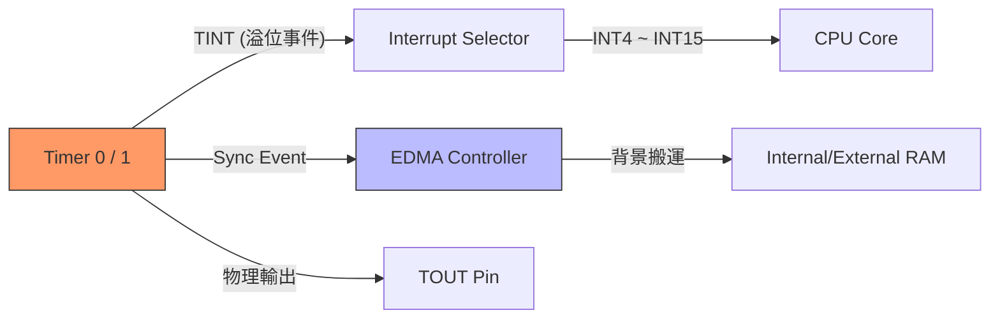

# 硬體計時器 (Timer) 原理與控制

[[TMS320C6000]] 系列通常內建兩個 32-bit 通用計時器（Timer 0 與 Timer 1）。它們不僅用於產生精確的時間基準，更是觸發 [[EDMA]] 背景搬運與實現系統安全（Watchdog）的核心組件。

## 1. Timer 的三個關鍵暫存器

每個計時器由三個主要的 32-bit 暫存器控制：

| 暫存器 | 縮寫 | 功能描述 |
| :--- | :--- | :--- |
| **Timer Control Register** | `[[CTL]]` | 控制計時器的運作模式、時鐘源與啟動/停止。 |
| **Timer Period Register** | `[[PRD]]` | 設定計時器的目標週期值。當 `CNT` 達到此值時觸發溢位。 |
| **Timer Counter Register** | `[[CNT]]` | 目前的計數值。隨著時鐘脈衝遞增。 |

## 2. CTL 暫存器深度解析 (Bit-field)

`CTL` 暫存器決定了計時器的「靈魂」。以下是必須掌握的關鍵位元：

### 啟動與停止邏輯
- **`HLD` (Bit 0)**：Hold 位元。
    - `0`: 計時器處於停止狀態，且 `CNT` 被強制重置為 0。
    - `1`: 計時器釋放，準備運作。
- **`GO` (Bit 1)**：啟動位元。
    - 只有當 `HLD=1` 且 `GO=1` 時，計時器才開始計數。

### 時鐘源與模式設定
- **`CLKSRC` (Bit 2)**：
    - `0`: 使用內部 CPU 時鐘分頻（通常是 CPU 時鐘 / 4）。
    - `1`: 使用外部引腳 `TINP` 輸入。
- **`C/P` (Clock/Pulse Mode) (Bit 6)**：
    - **Clock Mode (`0`)**：`TOUT` 引腳產生 50% 佔空比的連續方波。這是實現連續中斷的最常用模式。
    - **Pulse Mode (`1`)**：當 `CNT` 達到 `PRD` 時，`TOUT` 僅產生一個寬度為一個時鐘週期的脈衝。
- **`PWID` (Pulse Width) (Bit 8-9)**：在 Pulse 模式下設定輸出脈衝的寬度。

> [!warning] 暫存器寫入順序
> 修改 Timer 設定時，必須遵守「先停止、再設定、後啟動」的原則：
> 1. 先寫入 `HLD=0` (停止)。
> 2. 設定 `PRD` 與 `CTL` 其他欄位。
> 3. 最後寫入 `HLD=1, GO=1`。直接在運行中修改 `PRD` 可能導致不可預測的計數異常。

## 3. Timer 的雙重觸發功能 (Event Routing)

計時器溢位（TINT）時產生的事件並非只能傳給 CPU。

### 觸發 CPU 中斷
Timer 事件透過中斷選擇器（Interrupt Selector）映射到 CPU 的可屏蔽中斷。例如，常用 Timer 0 觸發 `[[INT5]]` 來執行固定頻率的控制演算法。

### 觸發 EDMA (Zero-overhead)
這是 DSP 高階應用的關鍵。Timer 溢位可以作為 `[[EDMA]]` 通道的同步觸發源（Sync Event）。
- **應用場景**：每隔 100μs 自動從 [[ADC]] 搬運一個數值到記憶體，全程無需 CPU 介入。

## 4. 看門狗 (Watchdog) 應用：Feeding the Dog

雖然 C6713 等系列沒有專用的硬體 Watchdog 晶片，但通常利用 Timer 1 來實作。

### 實作邏輯：
1. 將 Timer 1 設定為較長的週期（如 500ms）。
2. 開啟中斷，若 Timer 溢位，中斷服務程式執行 **系統重置 (Software Reset)**。
3. 在主程式的迴圈（Main Loop）中，定時執行 `CNT = 0` 或重設計時器的動作。這就是「餵狗」。
4. 若主程式當機（進入死迴圈），無法及時餵狗，Timer 1 就會溢位並強制重置系統。

> [!tip] 實驗室建議
> 在進行音訊實驗時，請務必使用 **Clock Mode**。Pulse 模式產生的信號極短，某些外部設備可能無法正確捕捉到觸發信號。

---
**相關連結：**
- [[核心架構與Pipeline]]
- [[中斷機制_Interrupt]]
- [[EDMA_背景搬運]]
- [[Memory_Map與EMIF]]
