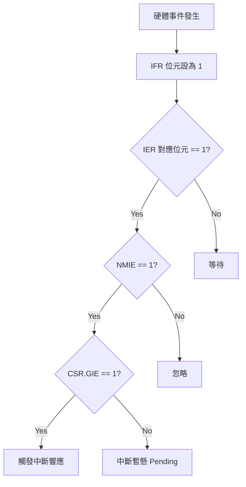
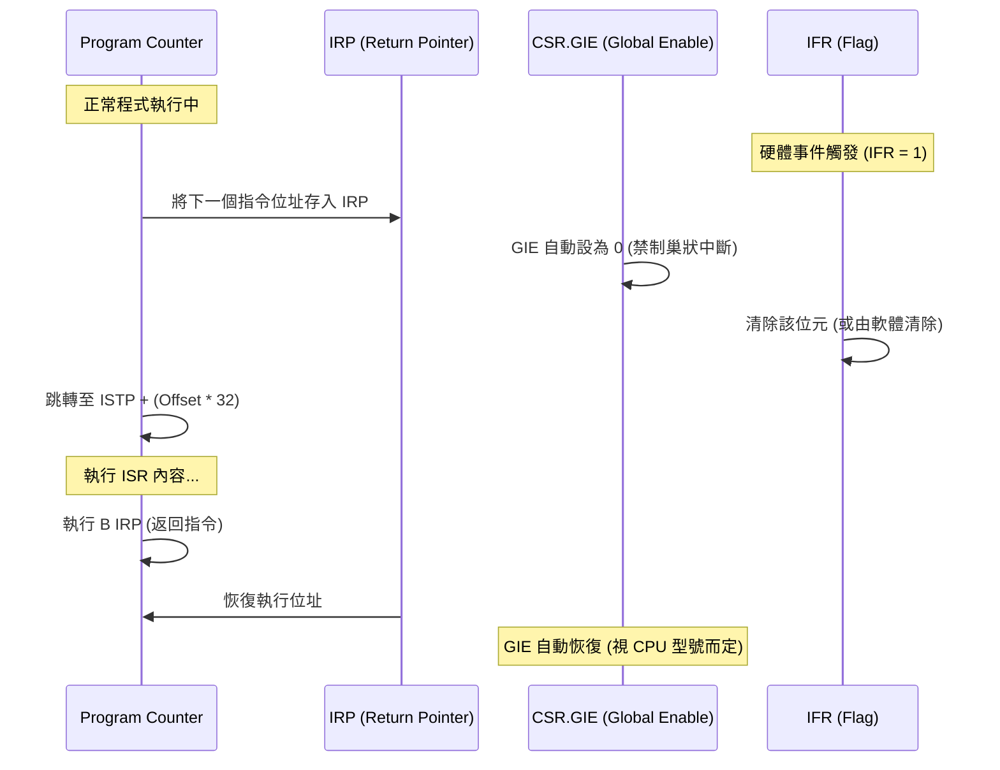

# 中斷機制與暫存器底層原理

在 [[TMS320C6000]] 系統中，中斷（Interrupt）是處理即時任務的核心。然而，中斷的底層硬體行為存在許多「隱形成本」與「硬體限制」，若不理解這些細節，系統極易在進入中斷後崩潰或跑飛。

## 1. 中斷受理的「三道保險」與 7 大暫存器

要讓 CPU 成功響應一個可屏蔽中斷（Maskable Interrupt），必須同時通過以下三道硬體關卡：

### 核心暫存器定義
1. **[[CSR]] (Control Status Register)**：全域開關。其 **GIE (Global Interrupt Enable)** 位元必須為 1。
2. **[[IER]] (Interrupt Enable Register)**：區域開關。對應的中斷位元（如 INT5）必須為 1。此外，**NMIE** (Non-Maskable Interrupt Enable) 必須為 1（通常在 Reset 後由硬體設為 1）。
3. **[[IFR]] (Interrupt Flag Register)**：中斷旗標。當硬體事件發生時，IFR 對應位元會被設為 1。

### 其他關鍵暫存器
- **[[ISR]] / [[ICR]]**：中斷設定與清除暫存器。`ICR` 用於手動清除 `IFR` 中的旗標。
- **[[ISTP]] (Interrupt Service Table Pointer)**：指向中斷向量表（[[IST]]）的基底位址。
- **[[IRP]] (Interrupt Return Pointer)**：保存中斷發生前的下一個指令位址，用於返回。
- **[[NRP]] (Non-maskable Interrupt Return Pointer)**：專用於 NMI 中斷的返回。

## 2. 中斷向量表 (IST) 的硬體限制 (死角陷阱)

[[TMS320C6000]] 的中斷處理並非直接跳轉到函式，而是跳轉到 **[[IST]]** 中對應的 **[[ISFP]]** (Interrupt Service Fetch Packet)。

### ISTP 的 1KB 對齊限制
> [!warning] 致命陷阱：ISTP 對齊
> `ISTP` 的低 10 位元（Bit 0-9）在硬體上是 **強制為 0** 的。這意味著中斷向量表的基底位址必須嚴格對齊於 **1024 Bytes (1KB)** 邊界。
> - **錯誤示例**：若你試圖將 IST 定位在 `0x8000 0600`，硬體讀取時會自動忽略低位，實際指向 `0x8000 0400`，導致中斷發生時跳轉到錯誤的程式段。

### ISFP 的容量限制 (32 Bytes)
每個中斷通道在 IST 中只分配了 **32 Bytes** 的空間（剛好是一個 [[Fetch_Packet]]，內含 8 條 32-bit 指令）。
- 如果你的中斷服務程式超過 8 條指令，你必須在 ISFP 中放入一條 **跳轉指令 (`B`)**，跳向真正的服務函式。
- 如果不使用跳轉，程式會順著 IST 執行到下一個中斷的向量空間，造成災難性後果。

## 3. C 語言 `interrupt` 關鍵字的致命影響

在 C 語言中編寫 ISR 時，必須加上 `interrupt` 關鍵字，這會改變編譯器產生的匯編程式碼。

### 一般函式 vs. 中斷函式
| 特性 | 一般 C 函式 | 中斷 ISR 函式 (`interrupt`) |
| :--- | :--- | :--- |
| **返回位址暫存器** | `B3` (Link Register) | `[[IRP]]` (Interrupt Return Pointer) |
| **返回指令** | `B B3` | `B IRP` |
| **Context Saving** | 僅保存被呼叫者保存暫存器 | **保存所有** 受影響的暫存器 (Push/Pop) |
| **中斷狀態控制** | 不影響 GIE | 自動關閉 GIE (響應時)，返回時恢復 |

> [!danger] 死角陷阱：漏打 `interrupt`
> 如果漏打了 `interrupt`，編譯器會使用 `B B3` 返回。由於中斷發生時 `B3` 的值可能與中斷前無關，CPU 將會跳轉到一個隨機的無效位址，導致系統跑飛且極難調試。

## 4. 視覺化：中斷響應時的暫存器切換

> [!tip] 關於巢狀中斷 (Nested Interrupts)
> C6000 預設不支援巢狀中斷，因為響應中斷時 `GIE` 會自動被關閉。若需要支援，必須在 ISR 內部手動將 `IRP` 存入堆疊，並重新開啟 `GIE`。但這極大增加了系統複雜性與堆疊溢位風險。

---
**相關連結：**
- [[中斷處理機制_ISR_IST_ISTP_ISFP]]
- [[核心架構與Pipeline]]
- [[Memory_Map與EMIF]]
- [[Timer計時器]]
- [[CCS_開發與Debug實務]]
