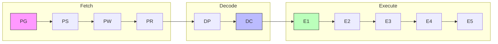
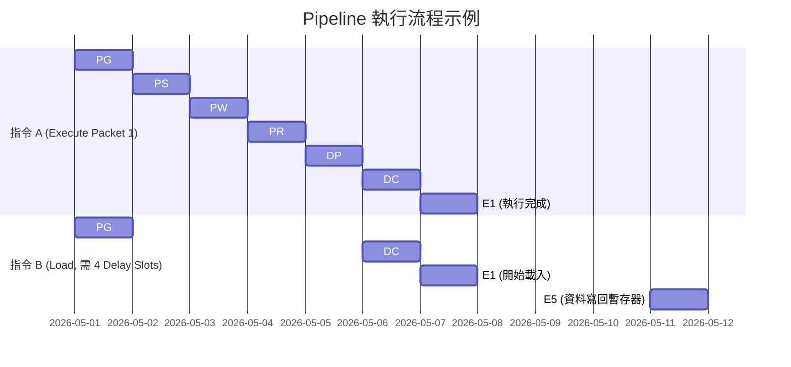

# DSP 核心架構與 Pipeline 機制

在本章節中，我們將深入探討 [[TMS320C6000]] 系列（特別是 C67x 與 C64x 核心）的底層硬體架構。這是一個典型的 [[VLIW]] (Very Long Instruction Word) 結構，其性能核心在於編譯器與硬體管線的完美契合。

## 1. VelociTI VLIW 架構與 Data Path 分工

[[TMS320C6000]] 的 CPU 核心分為兩個幾乎對稱的資料通道：**Data Path A** 與 **Data Path B**。每個通道各包含 16 個（C67x）或 32 個（C64x）通用暫存器（[[Register_File]]），以及 4 個專屬的功能單元。

### 8 個功能單元 (`.L`, `.S`, `.M`, `.D`) 的具體分工

每個 Data Path 都有四類功能單元，總共 8 個，支援在一個時鐘週期內同時發射 8 條指令。

| 功能單元 | 主要職責 (Responsibility) | 支援操作類型 |
| :--- | :--- | :--- |
| **`.L` (ALU)** | 整數/浮點運算、邏輯運算 | `ADD`, `SUB`, `AND`, `OR`, `XOR`, `CMP` |
| **`.S` (Shift)** | 移位、分支、位元操作 | `B` (Branch), `SHL`, `SHR`, `SET`, `CLR`, `EXT` |
| **`.M` (Multiply)** | 硬體乘法器 | `MPY`, `MPYH` (浮點乘法在 C67x 的 .M 中執行) |
| **`.D` (Data)** | 記憶體存取、資料搬移 | `LDW` (Load), `STW` (Store), `ADD` (位址計算) |

> [!important] 跨通道路徑 (Cross Paths)
> 雖然 A 與 B 通道相對獨立，但硬體提供 `1X` 與 `2X` 跨通道存取路徑，允許例如 Side A 的單元存取 Side B 的暫存器，但每個週期僅能進行一次跨通道存取。

## 2. Pipeline 的三個大階段與細分時相

[[TMS320C6000]] 的指令管線非常深，這保證了高時鐘頻率，但也帶來了延遲處理的挑戰。

### Fetch 階段 (提取)
1. **PG (Program Generate)**：計算下一個 [[Fetch_Packet]] 的位址。
2. **PS (Program Send)**：將位址送往程式記憶體。
3. **PW (Program Wait)**：等待記憶體回應（存取延遲）。
4. **PR (Program Ready)**：指令進入 CPU 內部快取。

### Decode 階段 (解碼)
1. **DP (Dispatch)**：將指令分派給對應的功能單元（.L/.S/.M/.D）。
2. **DC (Decode)**：解析指令操作碼（Opcode）並讀取暫存器。

### Execute 階段 (執行)
- **E1 ~ E5**：大部份整數與跳躍指令在 E1 結束；`LDW` 需要到 E5 才完成資料載入。
- **C67x 特殊性**：某些複雜浮點運算可能延伸至 **E10**。

## 3. Pipeline 延遲 (Delay Slots) 與 拖延 (Stall)

在深管線架構中，「發出指令」與「結果生效」之間存在時間差，這就是 [[Delay_Slots]]。

### 核心延遲定義
1. **Branch Delay (5 Slots)**：分支指令（如 `B`）在 E1 執行後，實際跳躍發生在 5 個週期後。因此分支指令後通常緊跟著 5 個 [[NOP]] 指令或無關指令。
2. **Load Delay (4 Slots)**：`LDW` 指令在 E1 啟動，資料直到 E5 才會進入目標暫存器。
    - **死角陷阱**：若在 E2 立即讀取該暫存器，讀到的是「舊值」而非 `LDW` 的結果。
3. **Multiply Delay (1 Slot)**：整數乘法結果在 E2 生效，因此需要 1 個 Delay Slot。

### Memory Stall (記憶體拖延)
當 CPU 存取外部記憶體（如透過 [[EMIF]]）遇到快取缺失（Cache Miss）或資源衝突時，硬體會自動暫停管線執行，直到資料準備就緒。

## 4. 視覺化：Fetch Packet 與 Execute Packet 運作

一個 **[[Fetch_Packet]]** 始終是 8 條指令（256-bit）。而 **[[Execute_Packet]]** 則是其中可以同時並行執行的指令組合。

> [!warning] 陷阱提示：組合語言排程
> 在手寫組合語言或進行核心迴圈最佳化時，必須手動計算所有指令的 Delay Slots。如果編譯器沒有開啟最佳化，它會插入大量的 `NOP`，導致代碼體積膨脹且效率低下。

---
**相關連結：**
- [[Memory_Map與EMIF]]
- [[中斷機制_Interrupt]]
- [[EDMA_背景搬運]]
- [[CCS_開發與Debug實務]]
