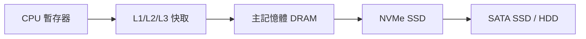

# NVMe SSD 固態硬碟

> [!abstract] **一句話**
> NVMe (Non-Volatile Memory Express) 是專為固態硬碟 (SSD) 設計的高速傳輸協定,直接走 PCIe 通道,擺脫了老舊 SATA/AHCI 為機械硬碟時代設計的瓶頸,把 SSD 的效能真正釋放出來。

## 1. 為什麼需要 NVMe

早期 SSD 沿用 **SATA + AHCI**——但 AHCI 是為「會轉的機械硬碟」設計的,先天限制:
- 只有 **1 個命令佇列**,深度 32。
- 每個 I/O 要經過多層轉換,延遲高。

SSD 沒有機械延遲,瓶頸卡在協定本身。NVMe 就是為 flash 重新設計的協定。

## 2. NVMe 的核心優勢

| 面向 | SATA / AHCI | NVMe |
|---|---|---|
| 匯流排 | SATA (~600 MB/s 上限) | PCIe (每 lane 數 GB/s) |
| 命令佇列數 | 1 | **65,535** |
| 每佇列深度 | 32 | **65,536** |
| 典型循序讀取 | ~550 MB/s | 3,500–14,000+ MB/s |

> [!info] **並行度是關鍵**
> NVMe 最大的突破是「大量並行佇列」。現代 CPU 是多核心的,NVMe 讓每個核心都能有自己的命令佇列直接跟 SSD 溝通,不用擠同一條隊伍——這對高並發的資料中心、AI 訓練資料載入特別重要。

## 3. 與記憶體階層的關係

儲存/記憶體階層由快到慢、由貴到便宜:

NVMe SSD 填補了 DRAM 與傳統硬碟之間的巨大鴻溝。在 [[張添烜 project/CIM/Latency & Throughput|延遲與吞吐量分析]] 中,理解各層存取延遲的數量級差異,是效能優化的基礎。

## 4. 常見規格

- **外型**:M.2 (最常見)、U.2、PCIe 介面卡。
- **PCIe 世代**:Gen3 (~3.5 GB/s)、Gen4 (~7 GB/s)、Gen5 (~14 GB/s)。
- **注意**:M.2 插槽有 SATA 與 NVMe 兩種,外型一樣但協定不同,買錯不通用。

---
**相關筆記**：[[張添烜 project/CIM/Latency & Throughput|延遲與吞吐量]] · [[Fundamentals/Big-endian|位元組順序]] · [[index|🌐 全域索引]]
