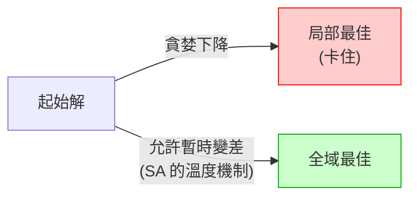

# 最佳化理論與組合爆炸 (Optimization Theory)

> [!abstract] **一句話**
> 最佳化理論研究「如何在龐大的候選解空間裡,有效率地找到（近似）最好的那一個」。ICCAD Floorplanning 屬於其中最難的一類——**組合最佳化 (Combinatorial Optimization)**,解空間隨問題規模指數爆炸,是理解為何 [[ICCAD_code/2_SA_Optimizer_Engine|模擬退火]] 不夠、需要 [[ICCAD_code/6_ML_Generative_BTree|ML 生成式方法]] 的理論根基。

## 1. 兩大類最佳化問題

| 類型 | 變數性質 | 例子 | 求解典範 |
|---|---|---|---|
| **連續最佳化** | 實數（可微分） | 找函數最低點 | 梯度下降 (Gradient Descent)、牛頓法 |
| **組合最佳化** | 離散（排列、選擇、結構） | Floorplan 拓樸、旅行商問題 (TSP) | 啟發式搜尋、Metaheuristics |

[[ICCAD_code/7_Electrostatic_Placer|電靜力法]] 把 Floorplanning 硬轉成**連續**問題（座標可微分）用梯度下降；[[ICCAD_code/2_SA_Optimizer_Engine|B*-tree + SA]] 則正面處理**組合**問題（樹拓樸是離散的）。這是兩條路線最本質的分野。

## 2. NP-Hard 與組合爆炸

> [!danger] **為什麼 Floorplanning 這麼難**
> Floorplanning 是 **NP-hard** 問題:沒有已知的多項式時間演算法能保證找到最佳解。隨模組數 $n$ 增加,可能的擺放組合數呈**階乘/指數**成長。

以 B*-tree 拓樸為例,$n=120$ 個模組的拓樸組合數約 $10^{250}$。對比:
- 可觀測宇宙的原子數約 $10^{80}$。
- SA 在時限內能評估的解約 $10^6$ 個。
- 搜到的比例約 $10^{-244}$——等於「在整個太平洋裡憑運氣撈出一個特定的水分子」。

這就是 [[ICCAD_code/8_Winning_Strategy_and_Roadmap|奪冠策略]] 裡「搜尋空間之牆」的來源:**這不是把 SA 調快就能解決的,是問題本質的物理限制**,必須靠 ML 學到的先驗知識來大幅縮小有意義的搜尋範圍。

## 3. Metaheuristics（元啟發式演算法）

既然無法窮舉,實務上用 **Metaheuristics**——不保證最佳、但能在合理時間內找到「夠好」解的通用搜尋策略:

- **Simulated Annealing (模擬退火)**:本專案主力,理論基礎是 [[AI/Markov-Chain|馬可夫鏈]]——用溫度控制的機率接受準則,在探索（跳出局部最佳）與利用（收斂）之間取得平衡。詳見 [[ICCAD_code/2_SA_Optimizer_Engine|SA 引擎筆記]]。
- **Genetic Algorithm (基因演算法)**:模擬天擇,對一群解做交配/突變。
- **Tabu Search (禁忌搜尋)**:記錄近期走過的解,強制跳脫。

## 4. 局部最佳 (Local Optima) 的陷阱

純貪婪（只接受變好的移動）會卡在第一個局部最佳。[[ICCAD_code/2_SA_Optimizer_Engine|SA 的 Metropolis 準則]] 允許「以機率 $e^{-\Delta/T}$ 接受變差的移動」,這正是跳出局部最佳、朝全域最佳前進的關鍵機制。

## 5. 評估解的品質:目標函數

最佳化的核心是一個把「解」映射到「分數」的**目標函數 (Objective Function)**。在 ICCAD 這就是 [[ICCAD_code/3_Cost_Function_and_Penalty|Cost Function]]——它把面積、線長、各類約束違規揉合成單一標量,SA 才有明確的下山方向。目標函數設計得好不好,直接決定搜尋能不能收斂到有意義的解。

---
**相關筆記**：[[ICCAD_code/2_SA_Optimizer_Engine|SA 引擎]] · [[ICCAD_code/8_Winning_Strategy_and_Roadmap|奪冠策略（搜尋空間分析）]] · [[AI/Markov-Chain|馬可夫鏈]] · [[index|🌐 全域索引]]
