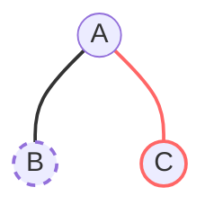
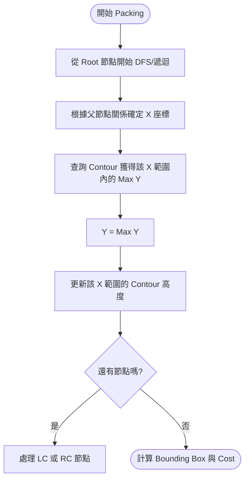
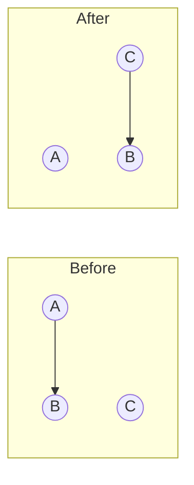
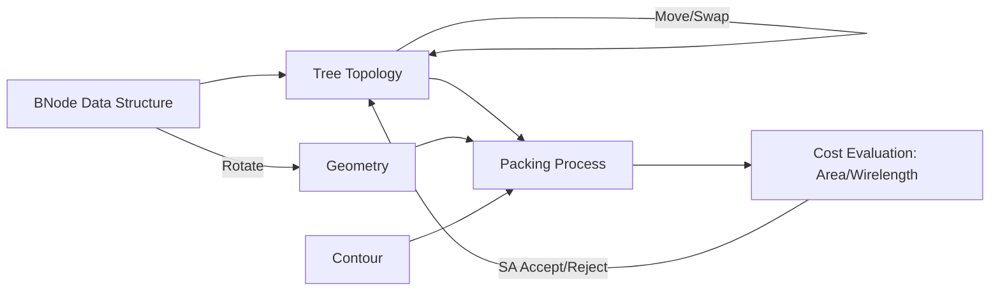

[[ICCAD/ICCAD-Dashboard|⬅️ 返回 ICCAD 儀表板]] | [[index|🌐 全域索引]]

# 📑 B*-tree Floorplanning 技術筆記與教學手冊

## 1. TL;DR (一句話定義)
**B*-tree Floorplanning** 是一種利用「二元樹拓樸結構」來編碼矩形區塊相對位置，並透過「輪廓線 (Contour) 演算法」快速推導出緊湊佈局 (Compact Floorplan) 的表示法。

---

## 2. 這份 B*-tree 在做什麼？
在 VLSI 設計中，我們要決定成千上萬個模組的 (x, y) 座標。
*   **一般二元樹 (Binary Tree)**：只適合表示對稱或特定結構。
*   **B*-tree**：由 **Chang et al.** 提出，它與資料庫常見的 B-tree (用於搜尋平衡) 完全不同。
*   **核心價值**：
    *   **拓樸 (Topology) 與幾何 (Geometry) 分離**：樹的結構決定「誰在誰旁邊」，節點內容決定「區塊大小」。
    *   **保證緊湊**：Packing 過程會自動將所有區塊向左、向下靠攏。
    *   **適合模擬退火 (SA)**：透過交換樹節點、移動子樹或旋轉區塊，能快速探索大量合法的佈局。

---

## 3. 資料結構拆解
在程式碼中，核心資料結構通常如下定義：

### BNode (樹節點)
| 屬性 | 角色 | 說明 |
| :--- | :--- | :--- |
| `id` | 索引 | 對應到 `indexed array` 中的實體 Block。 |
| `parent` | 父節點指標 | 用於回溯與維持樹的合法性。 |
| `lc` / `rc` | 左/右孩子 | 指向拓樸上的相鄰區塊。 |
| `w`, `h` | 寬與高 | 區塊的實體尺寸 (幾何資訊)。 |
| `x`, `y` | 座標 | Packing 後推導出的左下角位置。 |

---

## 4. B*-tree 語意與 Floorplan 對應
這是最關鍵的直覺：**樹的連結代表空間的相對關係**。

*   **左子節點 (Left Child, LC)**：代表該區塊在空間上位於父節點的 **右側** ($x_j = x_i + w_i$)。
*   **右子節點 (Right Child, RC)**：代表該區塊在空間上與父節點 **x 座標相同**，但位於其 **上方** ($x_k = x_i$)。

### 示意圖與 Mermaid 拓樸圖
假設有一棵簡單的樹：`A` 為根，`B` 是 `A` 的左子，`C` 是 `A` 的右子。


*註：實線(左)代表相鄰，虛線(右)代表上方。*

### 對應的幾何佈局 (Geometry)
```text
+-------+
|   C   | (RC) -> Above A, x_C = x_A
+-------+-------+
|   A   |   B   | (LC) -> Right of A, x_B = x_A + w_A
+-------+-------+
```

---

## 5. 初始化與合法性 (Initialization & Validity)
一個合法的 B*-tree 必須滿足以下檢查清單：

*   **唯一根節點 (Root)**：所有節點最終都必須連向同一個根。
*   **雙向一致性**：若 `A->lc == B`，則 `B->parent` 必須等於 `A`。
*   **無循環 (No Cycles)**：樹結構不能形成環。
*   **節點全覆蓋**：所有 `indexed array` 中的節點都必須在樹中出現且僅出現一次。

**初始化方式**：
1.  **Default Tree**：通常將所有節點連成一條長長的左子鏈（斜向右排）。
2.  **Random Tree**：隨機指定父子關係，常用於 SA 的初始狀態。

---

## 6. 可做的轉換 (State Transitions)
這些操作是模擬退火 (SA) 搜尋最優解的手段。

| 操作 | 拓樸 (Topology) 改變？ | 幾何 (Geometry) 改變？ | 前置條件 / 說明 |
| :--- | :---: | :---: | :--- |
| **Rotate** | 否 | 是 | 交換節點的 `w` 與 `h`。不改指標。 |
| **Move** | **是** | 是 | 將節點 `detach` 後插入其他節點的空缺位。 |
| **Swap** | **是** | 是 | 交換兩個節點的 `id` 或在樹中的位置。 |

### 移動 (Move) 的陷阱
*   **禁止自我插入**：不能將節點 A 移動到其子孫節點之下，這會導致斷裂或循環。
*   **空缺判定**：通常尋找有 `lc == NULL` 或 `rc == NULL` 的節點作為插入點。

### 交換 (Swap) 的特殊情況
當兩節點為父子關係時，不能簡單交換指標，否則會形成「互為父子」的死迴圈。必須先 `detach` 其中一個，再重新插入。

---

## 7. Packing 與 Anchored Blocks
**Packing** 是將「樹」轉化為「座標」的過程，核心工具是 **輪廓線 (Contour)**。

### Packing 流程圖


### Anchored / Preplaced Blocks (固定區塊)
固定區塊不受樹的拓樸推導控制，它們有固定的 (x, y)。
*   **行為**：在處理樹節點之前，先將所有 Anchored Blocks 的位置寫入 Contour。
*   **影響**：後續由樹生成的區塊在進行 Packing 時，會被這些「固定障礙物」墊高，從而自動避開重疊。

---

## 8. 範例圖與逐步推演

### 範例：Rotate 操作
```text
[Rotate 前]        [Rotate 後]
+-----+           +---------+
|  A  | w=4, h=2  |    A    | w=2, h=4
+-----+           +---------+
```
*教學點：注意樹的結構完全沒變，但其後的節點（LC/RC）之 X/Y 座標會因為 A 的形狀改變而全體位移。*

### 範例：Move 操作 (B 從 A 的左子移到 C 的右子)


---

## 9. 常見誤解與陷阱
1.  **誤解：B*-tree 就像二元搜尋樹 (BST)**
    *   *真相*：BST 的順序由值的大小決定；B*-tree 的順序由空間的相對位置決定。
2.  **誤解：Rotate 會改變樹的深度**
    *   *真相*：Rotate 只改節點內的數值，完全不碰指標。
3.  **陷阱：忘記更新 Contour**
    *   如果只根據父節點算 Y，會發生重疊。必須透過 Contour 考慮「所有」位於下方的區塊。
4.  **陷阱：SA 接受無效樹**
    *   每一步操作後都必須確保樹是合法的（節點全連結且無環），否則 Cost Function 會噴出錯誤數值。

---

## 10. Debug / 實作檢查清單
*   [ ] **父子一致性**：用迴圈檢查 `node[i].lc->parent == i`。
*   [ ] **節點總量**：Packing 結束後，處理過的節點數是否等於 N？
*   [ ] **邊界檢查**：是否有區塊座標為負值？
*   [ ] **重疊檢查**：隨機抽樣兩個區塊，檢查其矩形是否重疊（這代表 Contour 實作有誤）。
*   [ ] **SA 變動觀測**：連續進行 100 次 Move，檢查樹是否依然保持單一根節點。

---

## 11. 名詞對照表 (Glossary)
| 中文術語 | 英文術語 | 說明 |
| :--- | :--- | :--- |
| 拓樸 | Topology | 指節點間的連接關係。 |
| 幾何 | Geometry | 指區塊的實體尺寸與座標。 |
| 裝箱/封裝 | Packing | 將樹轉換為幾何座標的演算法。 |
| 輪廓線 | Contour | 紀錄當前佈局頂部高度的資料結構。 |
| 模擬退火 | Simulated Annealing | 用於尋找最優佈局的隨機搜尋演算法。 |
| 固定區塊 | Anchored Block | 位置不可移動的預置模組。 |

---

**總覽概念圖**：
