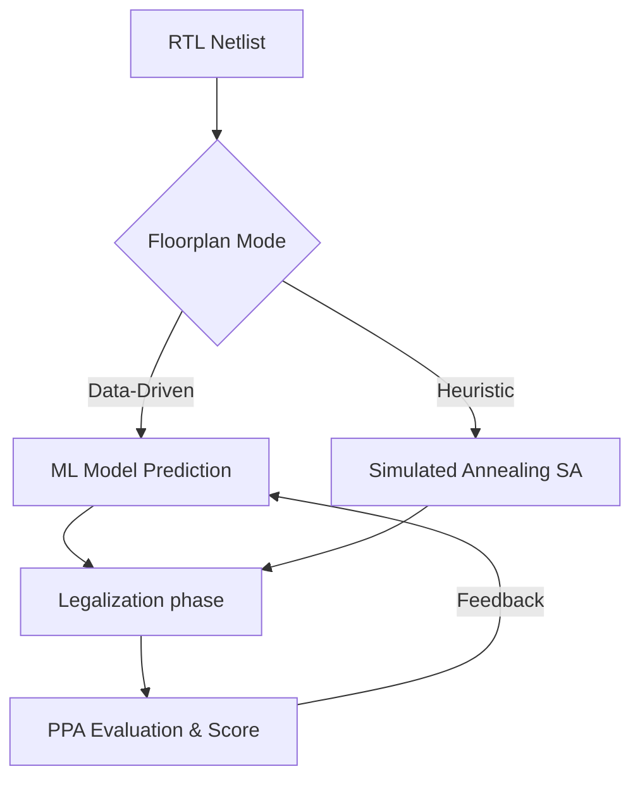

# EDA 範式轉移：傳統演算法 vs. 數據驅動設計

這份筆記記錄了 EDA（電子設計自動化）領域從「傳統規則導向」轉向「人工智慧學習導向」的核心邏輯。

## 1. 核心定義：從「寫演算法」變成「教 AI」

- **傳統方式 (Heuristics-based)**：
    - 依賴工程師編寫複雜的啟發式演算法（如模擬退火 SA）。
    - 邏輯：工程師告訴電腦：「如果 A 發生，就移動模組到 B 位置」。
    - 瓶頸：當模組數 > 60 且約束極多時，計算難以收斂且速度極慢。
- **數據驅動 (Data-Driven)**：
    - 工程師提供百萬計的最佳佈局樣本（如 [[Problem/FloorSet-Detailed|FloorSet 數據集]]）。
    - 邏輯：讓 AI 模型（如 GNN 或 Transformers）自動學習模組、連線與邊界間的「空間關係」。

## 2. 技術革命：解決 NP-complete 障礙

- **跨越計算障礙**：面對指數級爆炸的組合，傳統演算法必須「重頭計算」每個新設計。
- **推論 (Inference) 優勢**：模型訓練完成後，處理新電路只需毫秒級推論。AI 能預測出高品質的初始佈局（Seed），比從零搜尋快數千倍。

## 3. Data-Driven SoC 的三大支柱

1. **巨量數據 (The FloorSet)**：如 100 萬個樣本。讓 AI 理解 MIB、Boundary 等複雜物理規則。
2. **表徵學習 (Representation Learning)**：將 Netlist 轉換為 **圖形 (Graph)** 結構，學習模組間的連通性。
3. **閉環優化 (Agentic Flow)**：AI 不僅產出佈局，還會根據工具反饋（如 HPWL）進行自我修正。

## 4. 深度對比表

| 特性           | 傳統 SoC 設計 (Optimization-based) | 數據驅動 SoC 設計 (Data-driven)   |                          |
| :----------- | :----------------------------- | :-------------------------- | ------------------------ |
| **邏輯來源**     | 數學模型、物理規則                      | 歷史數據、神經網絡                   |                          |
| **運算時間**     | 隨複雜度指數增長 (數小時)                 | 推論時間固定且極快 (數秒/分)            |                          |
| **泛化能力**     | 需針對每個設計手動調參 (Tuning)           | 訓練一次，可應用於多個類似設計             |                          |
| **ICCAD 角色** | 傳統 SA / B*-tree 演算法            | [[Problem/FloorSet-Detailed]] | [[FloorSet 挑戰賽]] 的 AI 模型 |

---
**相關連結**：
- [[Problem/FloorSet-Summary|⚡ 快速複習：FloorSet 挑戰賽]]
- [[Problem/FloorSet-Detailed|📚 規格詳解：FloorSet 挑戰賽]]
