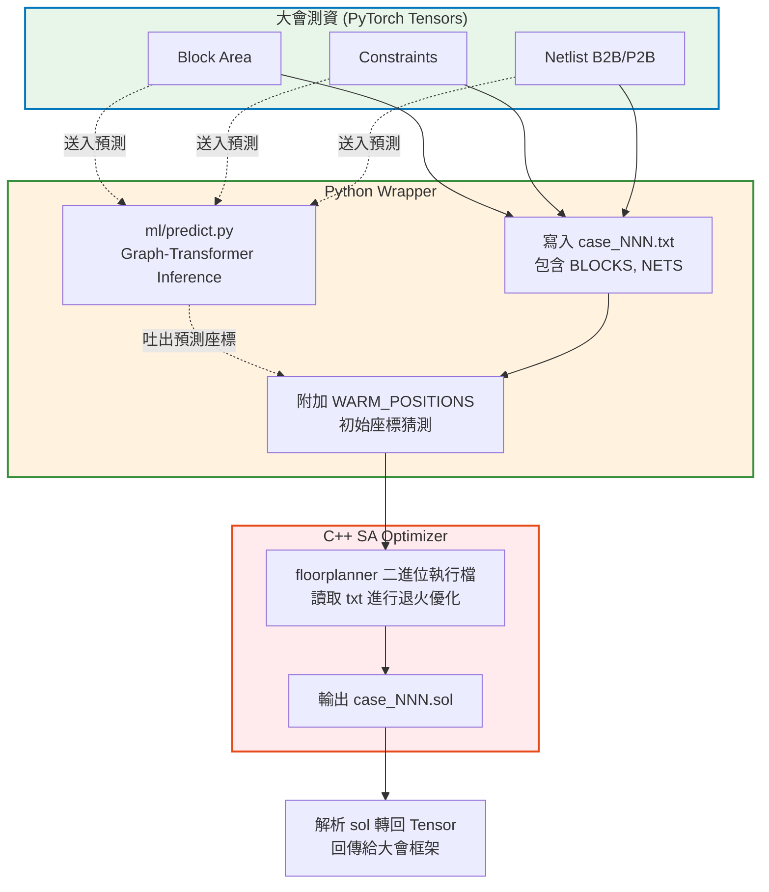

# 1. Data Loader 與 Python 封裝架構 (Wrapper)

> **核心角色**：本模組 (`my_optimizer.py` & `my_optimizer_ml.py`) 負責將大會提供的 PyTorch Tensor 格式測資，轉換為 C++ 核心引擎能看懂的 `.txt` 檔案。同時，它也負責整合 ML 模型預測結果，實現「Warm-start（熱啟動）」，是整個 EDA 流程的**指揮中心 (Orchestrator)**。

## 1.1 資料流架構與流向 (Pipeline)

此模組並不負責「優化佈局」，而是負責「翻譯」與「排程」。

## 1.2 關鍵設計與轉換邏輯

### A. 物理邊界轉換 (Boundary Code)
大會將「邊界約束」以 **Bitmask (位元遮罩)** 的形式傳入。Python 端必須解碼並對應到 C++ Enum 中。

- **Bitmask 邏輯**：1=左, 2=右, 4=上, 8=下。
- **角落轉換**：
  - 左上 (Top-Left) = 1 (左) + 4 (上) = `5`
  - 右下 (Bottom-Right) = 2 (右) + 8 (下) = `10`
- 這個轉換確保 C++ 引擎在打包 (Packing) 計算座標時，知道哪些 Block 必須緊貼特定邊界。

### B. 基準值推估 (Baseline Estimation)
為了防止在 Simulated Annealing 的 Cost Function 中，因為面積數值 ($\sim 50000$) 遠大於線長數值 ($\sim 5$) 而導致退火失效（溫度 $T$ 被面積主導），Python 端會預先計算「基準值」餵給 C++ 進行**正規化 (Normalization)**。

- **預估面積 (Baseline Area)**：$\sum \text{block\_area} \times 1.10$ (預留 10% 留白空間 Whitespace)。
- **預估線長 (Baseline HPWL)**：$\sum \text{net\_weight} \times \frac{\sqrt{\text{Baseline Area}}}{2}$ (假設每條線橫跨約半個晶片長度)。

### C. Feasibility-Triggered Escalation (容錯升級機制)
專題報告亮點：**如何在時限內確保高良率？**
由於 ICCAD 賽制中「Infeasible (有重疊或超出邊界)」的懲罰極重（Cost M=10），腳本中實作了動態預算追加：
1. 先給定較短的 Time Budget（如 `8 + 1*n` 秒）。
2. 若 C++ 回報 `rc=4` (代表跑完了但仍有違規重疊)，程式會啟動**Escalation (升級)**，給予更長的時間 (如 60-90秒) 與**不同的隨機種子 (Seed)** 重新退火。
3. 這樣能保證簡單測資快速通過，困難測資有足夠算力暴力破解。