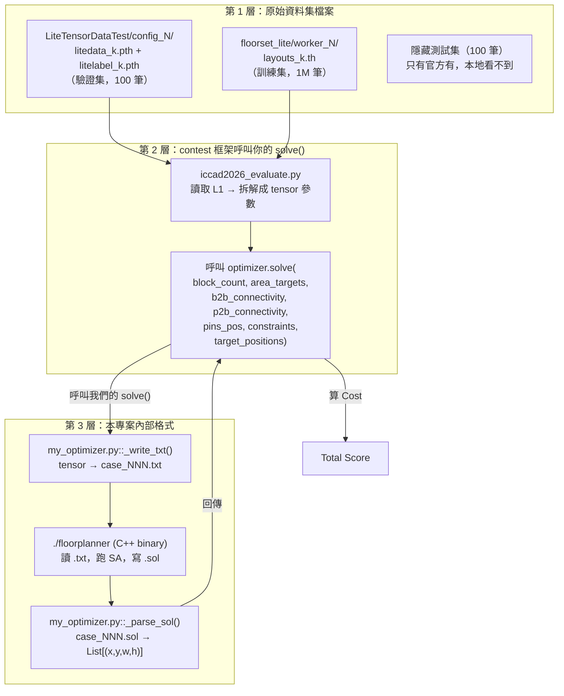

# Input/Output 完整合約：資料存在哪、格式是什麼、對應哪個檔案

> [!info] 🔰 沒讀過 [[Fundamentals/VLSI-Floorplanning-101|VLSI Floorplanning 入門]] 或 [[Fundamentals/FloorSet-Data-Worked-Example|資料實例解析]] 的話，建議先讀那兩篇——那兩篇講「資料代表什麼意思」，這篇講「資料實際存在哪個檔案、經過哪幾層轉換」。

> [!abstract] **這篇筆記回答的核心問題**
> 「輸入資料」其實有**三層不同的東西**，很容易搞混：
> 1. **原始資料集檔案**（Intel/主辦方發布的 `.pth`/`.th` tensor 檔）
> 2. **contest 框架呼叫你程式的 API**（`solve()` 這個函式的參數格式）
> 3. **這個專案自己內部的中介格式**（`.txt`/`.sol` 純文字檔，C++ solver 看的格式）
> 這三層是**依序轉換**的關係，不是同一份東西的三種說法。搞清楚這三層，才知道自己改程式的時候該去動哪一層。

## 0. 全局流程圖



## 1. 第 1 層：原始資料集檔案存在哪

| 資料集 | 路徑 | 用途 | 筆數 |
|---|---|---|---|
| 驗證集 | `ICCAD-C-FloorSet-official/LiteTensorDataTest/config_<n>/litedata_<k>.pth` + `litelabel_<k>.pth` | 本地驗證分數 | 100 |
| 訓練集 | `ICCAD-C-FloorSet-official/floorset_lite/worker_<n>/layouts_<k>.th` | 訓練 ML 模型 | 1,000,000 |
| 測試集 | 官方持有，隱藏 | 正式排名 | 100 |

兩種本地格式的 tensor 結構**不完全一樣**（這是 [[ICCAD_code/1_Data_Loader_and_Wrapper|Data Loader]] 要處理「兩種格式自動偵測」的原因）：

- **驗證集格式**：`data[case] = [blocks[N,6], b2b[B,3], p2b[P,3], pins_pos[T,2]]`，`labels[case] = [metrics[8], geometry[N,5,2]]`
- **訓練集格式**：7-tuple `[blocks, b2b, p2b, pins_pos, tree_sol, fp_sol, metrics]`（多了 `tree_sol` 近似最優拓樸標籤跟 `fp_sol` 座標解）

兩者的 `blocks` 都是 `[N, 6] = (area, is_fixed, is_preplaced, mib_id, cluster_id, boundary_code)`——**area 跟約束欄位是綁在同一個 tensor 裡的**。真實數字範例見 [[Fundamentals/FloorSet-Data-Worked-Example|資料實例解析]]。

## 2. 第 2 層：contest 框架實際呼叫你的函式時，格式長怎樣

> [!danger] **這裡是關鍵，也是最容易搞混的地方**
> 框架呼叫你的 `solve()` 時，**area 被拆出來，跟第 1 層的 `blocks[N,6]` 不是同一個 tensor 形狀**——`constraints` 只剩 5 欄（沒有 area）。這是官方框架 `iccad2026_evaluate.py::FloorplanOptimizer.solve()` 定義的合約：

```python
def solve(
    self,
    block_count: int,                      # 這個 case 有幾個 block
    area_targets: torch.Tensor,             # [N]        每個 block 的目標面積
    b2b_connectivity: torch.Tensor,         # [E, 3]     (block_i, block_j, weight)
    p2b_connectivity: torch.Tensor,         # [E, 3]     (pin_idx, block_idx, weight)
    pins_pos: torch.Tensor,                 # [T, 2]     (px, py)
    constraints: torch.Tensor,              # [N, 5]     (fixed, preplaced, mib, cluster, boundary)
    target_positions: Optional[torch.Tensor] = None,  # [N, 4]  (x, y, w, h)，-1 表示自由
) -> List[Tuple[float, float, float, float]]:
    ...
```

**每個參數對照第 1 層的資料，怎麼算出來的**：

| solve() 參數 | 從第 1 層的哪裡拆出來 |
|---|---|
| `area_targets` | `blocks[:, 0]` |
| `constraints` | `blocks[:, 1:6]`（少了第 0 欄 area） |
| `b2b_connectivity` | 就是 `b2b`，原封不動 |
| `p2b_connectivity` | 就是 `p2b`，原封不動 |
| `pins_pos` | 就是 `pins_pos`，原封不動 |
| `target_positions` | **框架額外算出來的**，不在原始檔案裡：對 `is_fixed=1` 的 block 填入 `(-1,-1,w,h)`；對 `is_preplaced=1` 的填入 `(x,y,w,h)`（從 ground truth 抄來的鎖定值）；其餘全部 `-1`（自由） |

`target_positions` 就是硬約束「怎麼傳給你」的機制——你的 solve() 看到某個 block 的 `w,h` 不是 `-1`，就知道這個 block 是 fixed-shape，長寬不能改。

## 3. 輸出（Output）：solve() 必須回傳什麼

> [!success] **輸出格式只有一種，很單純**
> ```python
> return [(x0, y0, w0, h0), (x1, y1, w1, h1), ..., (x_{N-1}, y_{N-1}, w_{N-1}, h_{N-1})]
> ```
> 一個 list，長度等於 `block_count`，每個元素是一個四元組 `(x, y, w, h)`——**順序必須對應 block 的索引**（第 0 個元素是 block 0 的答案，以此類推）。框架拿到這個 list 後，自己去對照第 1 層檔案裡藏的 baseline（`litelabel` 的 `geometry`/`metrics`），算出 [[ICCAD_code/3_Cost_Function_and_Penalty|Cost]]。

## 4. 第 3 層：這個專案內部怎麼把 tensor 轉成 C++ 看得懂的格式

`solve()` 收到 tensor 之後，不是直接拿去給 C++ 用（C++ 不懂 PyTorch tensor），中間還有一層純文字格式轉換：

### 4.1 寫入 `.txt`（`my_optimizer.py::_write_txt()`）

```
# emitted by my_optimizer.py for the ICCAD 2026 contest
N_BLOCKS    21
N_TERMINALS 68
BASELINE_HPWL 123.456789
BASELINE_AREA 9876.543210
OUTLINE 0.0 0.0
TERMINALS
0 58.0000000000 68.0000000000
...
BLOCKS
0 165.0000000000 0 0 0.0000000000 0.0000000000 0.0000000000 0.0000000000 -1 -1 4 0.10 10.00
...
B2B 44
0 4 0.0000000000
...
P2B 85
20 6 0.0000000000
...
GROUPS 4
3 5 8 17
...
MIB 1
7 1 10 13 14 15 17 18
END
```

`BLOCKS`區塊每一列格式：`id area is_fixed is_preplaced w_locked h_locked x_locked y_locked mib_group_ordinal cluster_group_ordinal boundary_enum ar_min ar_max`（`w_locked/h_locked/x_locked/y_locked` 只有 fixed/preplaced 才非零；`mib/cluster_group_ordinal` 是 `-1` 代表不屬於任何群組）。

> [!info] `BASELINE_HPWL`/`BASELINE_AREA` 這兩個數字**不是官方拿來評分的 baseline**——是 `my_optimizer.py` 自己估的，只用來讓 C++ 內部的 SA cost 數值不要爆掉（見 [[ICCAD_code/3_Cost_Function_and_Penalty|Cost Function 筆記]]對「SA 內部 cost 跟官方 contest cost 是兩回事」的說明）。真正拿來評分的 baseline 藏在第 1 層 `litelabel` 檔案的 `metrics`/`geometry` 裡，框架自己讀，solve() 根本看不到。

### 4.2 C++ solver 讀 `.txt`，跑 SA，寫 `.sol`

`src/parser.cpp` 讀這個 `.txt`，[[ICCAD_code/2_SA_Optimizer_Engine|SA 引擎]]搜尋，[[ICCAD_code/4_Packing_and_Evaluation|packer]]算座標，最後輸出 `case_NNN.sol`，格式很單純：

```
0 43.0 33.0 12.0 16.0
1 116.0 27.0 14.0 11.0
...
```

每一列 `id x y w h`（**注意順序，不是 fp_sol 資料集裡的 `w h x y`，這裡是 `x y w h`——CLAUDE.md 特別提醒這個容易搞混的地方**）。

### 4.3 讀回 `.sol`（`my_optimizer.py::_parse_sol()`）

把 `.sol` 每一列解析回 `(x, y, w, h)` tuple，包成 `List[(x,y,w,h)]`，這就是 `solve()` 的回傳值，回到第 2 層框架手上。

## 5. 這些中介檔案實際存在哪？怎麼自己打開來看？

正常執行時，`.txt`/`.sol` 寫在系統的暫存資料夾（`tempfile.mkdtemp()` 產生，格式 `my_optimizer_XXXXXXXX`），跑完就刪掉。**如果你想自己打開來看**：

```bash
FLOORPLANNER_KEEP=1 python iccad2026_evaluate.py --evaluate my_optimizer.py --test-id 0 --verbose
```

設定這個環境變數後，`my_optimizer.py` 不會刪除暫存資料夾，並且會把路徑印到 stderr（`[my_optimizer] workdir = ...`）——進去那個資料夾就能看到真實的 `case_000.txt` 跟 `case_000.sol`，跟這篇筆記寫的格式對照著看。

## 6. 檔案對照總表

| 你想找 | 去哪個檔案 |
|---|---|
| 原始資料集實際存放位置 | `ICCAD-C-FloorSet-official/` |
| solve() 的參數格式定義（第 2 層合約，官方寫的） | `ICCAD-C-FloorSet-official/iccad2026contest/iccad2026_evaluate.py` 的 `FloorplanOptimizer.solve()` |
| tensor → .txt 的轉換邏輯 | `collaborate/my_optimizer.py::_write_txt()` |
| .txt 的讀取（C++ 端） | `collaborate/src/parser.cpp`（解析輸入） |
| .sol 的寫出（C++ 端） | `collaborate/src/parser.cpp::save_solution()`（`main.cpp` 呼叫它） |
| .sol → List[(x,y,w,h)] 的轉換邏輯 | `collaborate/my_optimizer.py::_parse_sol()` |

---
**相關筆記**：[[Fundamentals/VLSI-Floorplanning-101|VLSI Floorplanning 入門]] · [[Fundamentals/FloorSet-Data-Worked-Example|資料實例解析（真實數字版）]] · [[ICCAD_code/1_Data_Loader_and_Wrapper|1. Data Loader 與 Python 封裝架構]] · [[ICCAD_code/3_Cost_Function_and_Penalty|3. Cost Function 與動態懲罰機制]] · [[ICCAD/ICCAD-Dashboard|回到 Dashboard]]
