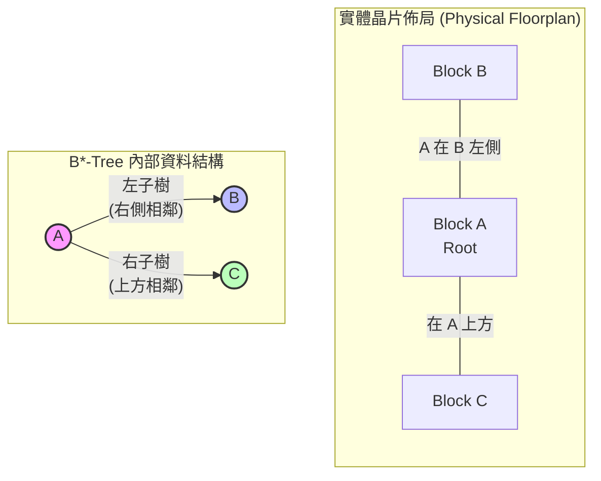
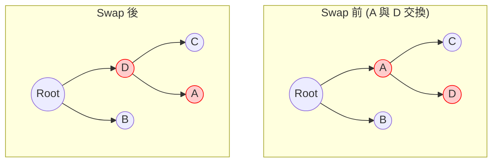
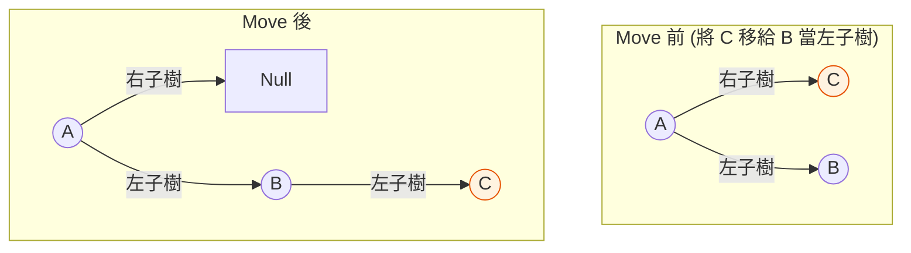

# 2. 核心退火引擎與 B*-Tree (SA Optimizer Engine)

> **核心角色**：C++ 退火引擎 (`sa.hpp`) 是整個 EDA 專案的運算大腦。它負責在無數種 Block 擺放組合中，透過 Simulated Annealing (SA) 尋找最佳解。為了高效表達與計算這些組合，系統採用了 **B*-Tree** 作為狀態表示法。

## 2.1 狀態表示法：實體 Floorplan 到 B*-Tree 的轉換

在 `btree.hpp` 中，程式不直接記錄每個 Block 的 $(x, y)$ 座標，而是記錄它們的「拓撲關係（誰在誰旁邊）」。

- **根節點 (Root)**：通常放置在左下角的 Block。
- **左子樹 (Left Child)**：代表實體佈局中，緊貼在父節點**右側 (Right)** 的 Block。
- **右子樹 (Right Child)**：代表實體佈局中，位於父節點**上方 (Above)** 的 Block。

### Mermaid 轉換對照圖

以下圖解展示了三個 Block (A, B, C) 的實體擺放如何對應到 B*-Tree：

## 2.2 Move 機制 (微擾動作) 與圖解變換

在 `moves.hpp` 中，定義了多種 `MoveKind` 來改變 B*-Tree 的狀態。以下是針對拓撲結構改變最核心的三種 Move：

### A. Rotate (旋轉 - M1)
不改變 B*-Tree 的拓撲結構，僅將單一 Block 的**寬度 (w) 與高度 (h) 互換**。
*(註：Fixed 或是 Preplaced 的硬體模組不可旋轉)。*

### B. Swap (交換節點 - M3)
直接交換 B*-Tree 中兩個節點的內容，保留原有的父子連結關係。這在實體上會導致兩個 Block 互換大致的相對位置。

### C. Move Node (搬移節點 - M2)
將節點 $V$ 從原本的父節點 $P$ 拔除，並插入到另一個隨機節點 $U$ 的左子樹或右子樹。這是改變拓撲最劇烈的 Move (擁有 biggest-Δ)。

### D. 其他重要 Move (論文特有)
- **AspectRatio (AR - M4)**：針對 Soft Block 改變長寬比，但在 `MoveProb` 中有 `sa_ar_clamp` 限制，避免形狀變得太細長 (如 100:1) 導致排線困難。
- **MibSync (M5)**：同一 MIB (Multi-Instantiated Block) 群組的所有成員必須共享同一組 $(w, h)$。這個 Move **必須原子性地**同時更新群組內全部成員，再統一 pack、統一檢查——絕不能只改一半就打包，否則會出現「合法但矛盾」的中間態。
- **FixBoundary (M6)**：直接將違反邊界限制的 Block 強制移往對應方向，屬於 Deterministic 的修復手段。
- **FixGrouping (M7)**：將未緊鄰同群組夥伴的 Block 強制搬到群組旁邊，修復 Grouping 違規。近期改為**雙向 (bidirectional)** 搜尋（可以往左貼、也可以往右貼），修正了舊版「只往右貼」導致的 right-spine 偏斜問題（樹會不自然地一直往右長）。

> [!danger] **`always_accept` 不變量**
> M6 (FixBoundary) 與 M7 (FixGrouping) 是僅有的兩個 `always_accept = true` 的 Move——它們**繞過 Metropolis 準則**，只要能修復違規就無條件接受，不看 $\Delta E$。這兩個 Move 的存在意義是「專職修復軟約束」，不是「探索解空間」。**絕對不能再增加更多 always-accept 的 Move**，否則會破壞 SA 的混合性 (mixing) 保證，讓退火失去統計意義上的收斂性。

## 2.3 降溫計畫 (Cooling Schedule)

`sa.hpp` 採用了特殊的**三階段幾何冷卻 (Three-stage geometric cooling)**：

1. **Stage 1 (探索期)**：溫度維持在 $T_1$ (`alpha_stage1 = 1.0`)。$T_1$ 的初始值是透過隨機亂動 80 次 (`n_probes`) 取平均 $\Delta \text{avg}$，並設定初始接受率為 90% (`p_accept_init = 0.90`) 計算而來。
2. **Stage 2 (快速降溫)**：溫度乘上 $\alpha = 0.92$ (`alpha_stage2`)，迅速逼近局部最佳解。
3. **Reheating (熱回升)**：在進入 Stage 3 之前，強迫將溫度拉回 $T_1$ 的 70% (`stage3_reheat = 0.7`)，藉此跳出局部最佳解 (Local Minima) 的泥淖。
4. **Stage 3 (緩慢退火)**：溫度乘上 $\alpha = 0.99$ (`alpha_stage3`) 進行細部微調，直到時間用盡或長期無改善。