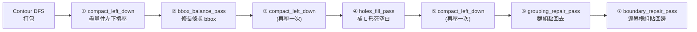

# 4. 拓撲打包與座標推算 (Packing & Skyline)

> **核心角色**：在 `packer.hpp` 中，SA 引擎雖然決定了 B*-Tree 的「拓撲順序」，但硬體實作需要的是真實的 $(x, y)$ 絕對座標。Packer 的工作就是讀取這棵樹（左子樹向右擺，右子樹向上擺），透過 **Contour Line (輪廓線/天際線)** 演算法，將積木由左下角向右上角堆疊擠壓。

## 4.1 座標計算流程 (DFS Traversal)

Packer 使用**深度優先搜尋 (DFS)** 來走訪 B*-Tree。
當我們走訪到節點 $V$（其父節點為 $P$）：
1. **決定 $X$ 座標**：
   - 如果 $V$ 是 $P$ 的左子樹（在右邊）：$x_v = x_p + w_p$。
   - 如果 $V$ 是 $P$ 的右子樹（在上面）：$x_v = x_p$。
2. **決定 $Y$ 座標 (Contour Line)**：
   - 由於下方的 Block 高度不一，$V$ 不能直接掉到 $y=0$。
   - 系統會維護一條「天際線 (Contour)」，記錄目前從 $x_v$ 到 $x_v + w_v$ 這個寬度區間內，最高的高程 $Y_{max}$。
   - $V$ 的底部座標即為 $y_v = Y_{max}$。

## 4.2 處理錨定模組 (Anchored / Preplaced Blocks)

**報告重點**：如果晶片中有已經固定位置的 IP 模組 (Preplaced) 怎麼辦？
- 在 B*-Tree 走訪中，如果遇到 `Preplaced` 模組，它會**無視**由樹結構推算出來的 $X, Y$，強行**覆寫 (Snap)** 回官方規定的絕對座標 $(X_{fix}, Y_{fix})$。
- 然後，它所在的這棵子樹（它的左、右子樹）會改以這個固定的 $(X_{fix}, Y_{fix})$ 作為「錨點 (Anchor)」繼續往外長。
- 這種機制稱為 **PARSAC (Preplaced-Aware SA)**。

## 4.3 重疊檢測 (Overlap Check)

通常，透過 Contour Line 推出來的座標是絕對不會重疊的（因為就像俄羅斯方塊一樣，自然會疊在上面）。
但是，因為有上述的「強制覆寫 (Anchored)」機制，自然長出來的軟模組有可能撞上預先擺好的硬模組。
- 在每次 Packing 結束時，Packer 會快速檢查是否有此類重疊，並回傳 `overlap_free = false` 給 `cost.hpp`，從而在 SA 迴圈中施加巨大的重疊懲罰 ($W_{overlap}=5000$)。

## 4.4 打包後的四道修復通道 (Post-Pack Repair Passes)

> **報告重點**：Contour Line 打包出來的結果雖然合法（不重疊），但**很醜**——會有大量破碎空白、長條形 bbox、群組被打散、邊界模組被拉離邊界。`packer.cpp` 在每次打包後，固定跑以下四道確定性 (deterministic) 修復，且**不改變拓樸，只調整實現座標**，所以 SA 的「拓樸不變性」完全不受影響：

1. **`compact_left_down`**：把每個非錨定模組盡量往左、往下滑到不會重疊為止，交替沿 x/y 軸跑到不動為止（最多 12 輪）。單純的 Contour DFS 打包會留下大量破碎空白，這一步負責壓實。
2. **`bbox_balance_pass`**：Contour Line 打包偏好長出「右深左淺」的長條狀 bbox（尤其樹的右分支很深時）。這一步找出撐開長邊的那個「尖刺」模組，嘗試把它挪到短邊的空位，把 bbox 往目標正方形 ($\sqrt{\text{baseline\_area}}$) 拉回來。
3. **`holes_fill_pass`**：`compact_left_down` 只會沿單一軸壓，遇到「往左會撞、往下也會撞，但往左下角斜插得進去」的 L 形死空白就束手無策。這一步窮舉其他模組的角點座標當候選位置，挑一個能讓 $\max(x+w, y+h)$ 最小的位置塞進去。
4. **`grouping_repair_pass` / `boundary_repair_pass`**：前面三道壓縮會把 Grouping 群組打散、把該貼邊界的模組拉離邊界。這兩道在最後把它們**確定性地**修回去——不是靠隨機的 SA move 碰運氣，而是每次打包都強制檢查修復，大幅降低 $V_{group}$ / $V_{boundary}$，直接壓低 [[ICCAD_code/3_Cost_Function_and_Penalty|contest cost 的 $\exp(2V_{rel})$ 項]]。

---

# 🚀 總結：EDA 報告的反擊戰策略 (PM 視角)

當你在台上報告這個專題時，可以按照這四份筆記的邏輯串出一個完美的故事：

1. **(Note 1) 接手挑戰**：我們讀取了 ICCAD 的 Tensor 測資。為了解決運算量太大，我們加入了 ML Model 提供神經網路預測的「Warm-start」，讓後續的退火贏在起跑點。
2. **(Note 2) 空間搜尋**：我們使用 C++ 撰寫了高效的 SA 引擎，以 **B*-Tree** 取代真實座標進行搜尋。我們設計了 M1(旋轉)、M2(搬移)、M3(交換) 等微擾動作，並搭配三階段幾何冷卻機制避免掉入死胡同。
3. **(Note 4) 實體化**：每一輪微擾後，我們透過 **Contour Line** 演算法，將 B*-Tree 像疊積木一樣打包成真實的 $(x, y)$ 座標，並完美處理了強制預擺 (Preplaced) 的模組。
4. **(Note 3) 質量評估**：最後，這組座標會送入 **Cost Function**。我們發現「面積主導效應」會毀掉線長優化，所以導入了 Baseline 正規化；針對嚴苛的重疊與邊界限制，我們加入了極高的動態懲罰。在無數次的「微擾 $\rightarrow$ 打包 $\rightarrow$ 計分」循環後，我們得到了完美符合晶片設計規範的 Floorplan！