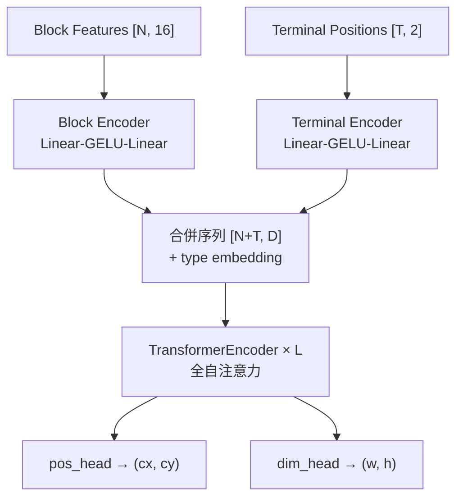
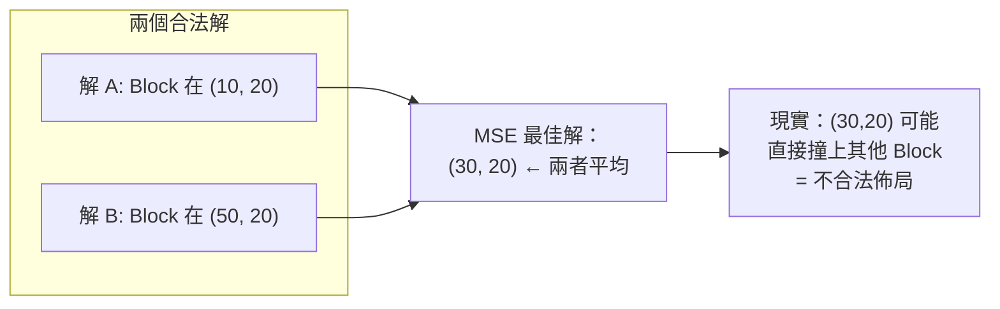

# 5. ML 座標回歸模型與 Mode Collapse 診斷 (Coordinate Regression)

> **核心角色**：`ml/model.py` 是最早的 ML 嘗試——一個 Graph-Transformer，直接對每個 Block 回歸預測 $(cx, cy, w, h)$，目的是給 [[ICCAD_code/2_SA_Optimizer_Engine|SA 引擎]] 一個「熱啟動 (Warm-start)」起點。這篇筆記記錄它的架構，以及**為什麼這個 formulation 在數學上注定會失敗**——這個診斷後來直接催生了 [[ICCAD_code/6_ML_Generative_BTree|第 6 篇：生成式 B*-tree 模型]]。

## 5.1 架構

> [!info] 這是 [[AI/Transformer|Transformer]] 的 **Encoder-only** 家族（跟 BERT 同一類）：只有雙向自注意力，沒有 Decoder、沒有自迴歸生成，直接對每個位置的輸出做回歸。

- 16 維 Block 特徵：面積、log(面積)、is_fixed、is_preplaced、MIB/Cluster flag、邊界 bitmask 四位、b2b/p2b 連線度、以及 fixed/preplaced 的 (w,h,x,y) hint。
- 約 250K 參數，CPU 可訓練，GPU 上 30–60 分鐘/萬筆。
- 推論時 (`ml/predict.py`)：對 fixed/preplaced 的輸出**強制覆寫**回官方給定的 $(w,h[,x,y])$（不管模型預測什麼），對 soft block 的面積做 $\sqrt{a_{target}/a_{pred}}$ 縮放校正到 1% 容忍度內。

## 5.2 為什麼這個 formulation 會 Mode Collapse

> [!danger] **核心問題：回歸的是「多峰 (multi-modal)」的答案**
> 同一組 Block 關係，往往有好幾種**同樣合法、同樣優的**擺法——鏡像對稱、兩個模組互換位置、B\*-tree 走左子樹先或右子樹先……這些都是不同的 $(x,y)$ 解，但 Smooth-L1 / MSE 訓練的目標是「讓輸出接近訓練集裡的那一個特定答案」。

問題在於：如果訓練資料裡，相似輸入對應到兩種不同的合法佈局（比如一個案例 A 在左、B 在右，另一個相似案例反過來），MSE loss 的最佳策略不是「選一個」，而是**輸出兩者的平均值**——因為平均能讓總誤差最小。

**類比**：兩條路都能繞過障礙物（左繞或右繞），但「兩條路的平均」就是直接撞上障礙物。這就是 mode collapse 在這個問題上的具體樣貌。

## 5.3 這對 v1/v2/v3 checkpoint 代表什麼

`ml/weights/floorplan_v1.pt`、`v2.pt`、`v3.pt` 都是用這個 formulation 訓練的。**預期結論（待 T1 基準測試驗證）**：warm-start 對 SA 最終分數的幫助不顯著，因為 SA 拿到的初始座標本身就可能是「平均出來的不合法解」，SA 得先花力氣把它拆散重排，等於白熱身。

## 5.4 與生成式模型的本質差異

| | 座標回歸 (本篇) | 生成式 B*-tree ([[ICCAD_code/6_ML_Generative_BTree\|第 6 篇]]) |
|---|---|---|
| 預測目標 | 連續座標 $(cx,cy,w,h)$ | 離散拓樸決策（parent + 方向） |
| Loss | Smooth-L1 / MSE | Cross-entropy |
| 多峰解的下場 | 兩解相加除以二（平均） | 模型被迫「選一個」，不會混合 |
| Mode collapse 風險 | 高（本篇診斷的病灶） | 低（cross-entropy 訓練不存在「平均兩個 one-hot」這種操作） |

---
**相關筆記**：[[ICCAD_code/6_ML_Generative_BTree|下一篇：生成式 B*-tree 模型]] · [[ICCAD_code/8_Winning_Strategy_and_Roadmap|奪冠策略總覽]]
