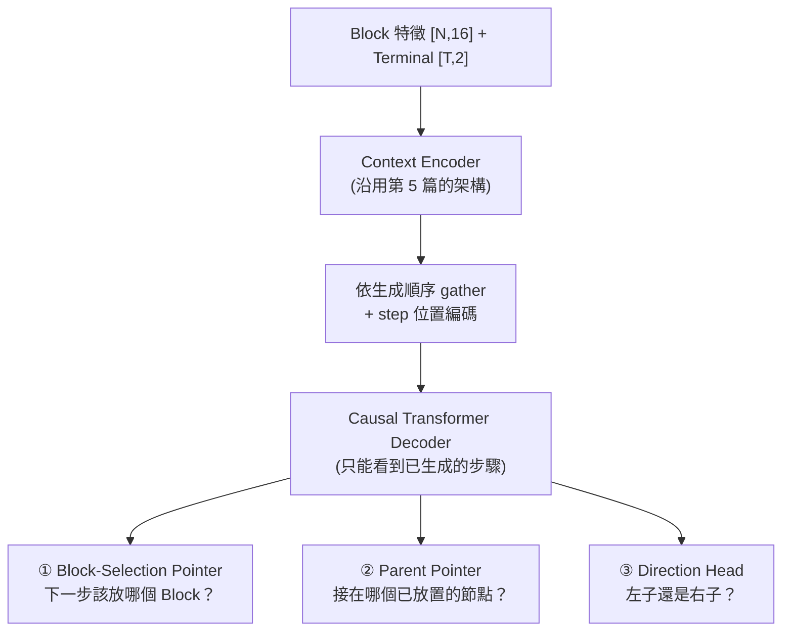

# 6. 生成式 B*-tree 拓樸模型 (Generative Topology Model)

> **核心角色**：這是 [[ICCAD_code/5_ML_Coordinate_Regression|第 5 篇 mode collapse 診斷]] 的解法——與其回歸連續座標，不如讓模型**逐步生成 B\*-tree 的拓樸結構本身**（像下棋一樣一步步決定「這個 Block 接在誰旁邊」），用 cross-entropy 訓練，天生不會有「平均兩個合法解」的問題。程式碼在 `collaborate/ml/{data,model_tree,train_tree,pack_tree,contest_cost,run_pipeline}.py`。

## 6.1 資料來源：解密 `tree_sol`

大會提供的 1M 訓練集（`floorset_lite/worker_*/layouts*.th`）裡有一個欄位 `tree_sol`，長期被舊版 `ml/data.py` 標記 `-- unused` 直接丟棄。解碼後發現：

- **Shape**：`[N-1, 3]`，每列 `(parent_id, child_id, direction_bit)`。
- **驗證方法**：用團隊自己的 `[[ICCAD_code/4_Packing_and_Evaluation|packer.cpp]]` 原始碼直接對答案（而非亂猜），確認 `direction=0` 是左子（貼右邊）、`direction=1` 是右子（貼上面），語義與我們自己的 C++ packer **完全一致**。
- **邊表已經是 DFS preorder**：父節點永遠先於子節點出現，這代表可以直接拿來當自迴歸模型的教師強制 (teacher forcing) 序列，不用額外重排。

> [!info] 為什麼不用它重建座標？
> 用這個公式解碼跟官方 `fp_sol` 精確比對，命中率只有 20–77%（依 case 而定）——殘差是官方生成器自己的後製壓縮演算法（跟我們的 `compact_left_down` 類似但細節未知，無法逆推）。**但這完全不影響訓練**：生成式模型要學的是拓樸標籤本身（parent + 方向），不是座標，這部分是 100% 乾淨可用的。

## 6.2 模型架構：三個 Pointer Network

> [!info] 這是 [[AI/Transformer|Transformer]] 的 **Encoder-Decoder** 家族變體：Context Encoder（雙向，理解整個 case）+ Causal Decoder（自迴歸生成，跟 GPT 的 decoder 同一類），只是把最後輸出層從「詞彙表 softmax」換成三個 Pointer Network——因為要生成的是「指向哪個已知節點」而不是「哪個詞彙」。

每一步都是 **Pointer Network**（Vinyals et al. 2015）而不是固定類別數的分類器，所以能處理任意 Block 數：

1. **Block-selection**：從「尚未放置」的 Block 集合裡指一個當下一步（query 用 shift 一格的狀態 `d[t-1]`，root 用一個學到的 `start_token`）。
2. **Parent-pointer**：從「已經放置」的所有步驟裡指一個當 parent。
3. **Direction**：二元分類，左子 (0) 或右子 (1)。

> [!info] **這是解 mode collapse 的關鍵**
> Cross-entropy 訓練不存在「把兩個 one-hot 答案取平均」這種操作——模型被迫在 softmax 分佈裡選一個峰值，不會像 MSE 回歸那樣把兩個合法解混成一個不合法的中間值。

## 6.3 訓練與真正獨立推論

- **訓練**（`train_tree.py`）：teacher forcing，loss = block-selection CE + parent-pointer CE + direction BCE，沿用舊 `train.py` 的 `n_blocks**size_power` 大 case 加權慣例（因為 [[ICCAD_code/3_Cost_Function_and_Penalty|$e^n$ 加權]]，大 case 才是真正戰場）。
- **推論**（`TreeGenerator.generate()`）：**完全自迴歸，不需要 ground truth**——這一點在驗證集（無 `tree_sol`）的真實 case 上測試過：輸出必為 0..N-1 的合法排列、root 的 parent 必為 -1，每個 Block 都拿到合法的 parent+方向。這是能在真正未知 case 上跑的必要條件。
- **修復未訓練成熟時的不合法結構**：`pack_tree.py::build_lc_rc` 有確定性修復——未訓練好的模型偶爾會讓兩個 Block 搶同一個 parent 的同一側（pointer network 本身沒有「每個 parent 最多兩個子節點」的硬限制），搶輸的 Block 會 fallback 接到「最近放置且還有空位」的節點，保證每次都產出合法完整的樹，不會 crash。

## 6.4 打包與真實 Cost 評分

- **`pack_tree.py`**：Python 版 packer，照抄 [[ICCAD_code/4_Packing_and_Evaluation|packer.cpp]] 的 contour DFS 公式 + `compact_left_down`，用於快速評分/原型開發（**不含** `bbox_balance_pass`/`holes_fill_pass`/`grouping_repair_pass`/`boundary_repair_pass`，正式送出仍走真正的 C++ binary）。
- **`contest_cost.py`**：完整移植 [[ICCAD_code/3_Cost_Function_and_Penalty|官方 contest cost 公式]]（HPWL_gap、Area_gap、$V_{rel}$、feasibility 檢查），驗證集自帶的 `metrics` 欄位已破解對應：`[0]`=baseline 面積、`[6]`=baseline HPWL_int、`[7]`=baseline HPWL_ext（跟自己算的完全對上）。
- **一條龍指令**：`python -m ml.run_pipeline`——沒 checkpoint 就先訓練，讀驗證集某 case（真正 blind，TEST format 無 `tree_sol`），自迴歸採樣 K 個拓樸，各自 pack + 算真實 Cost，排名，存 `.sol`。

## 6.5 目前進度（2026-07-01）

| 規模 | 硬體 | 結果 |
|---|---|---|
| 3,000 筆 × 3 epoch | CPU | `val_ptr_acc` 0.682→0.815 |
| **150,000 筆 × 3 epoch** | **GPU (RTX 5060 Laptop)** | `val_ptr_acc` **0.860→0.874**、`val_block_acc` 0.253→0.281（模型 679 萬參數，訓練約 87 分鐘） |

驗證集 case（config_21，21 blocks，**真正 blind**——這個 case 沒有 `tree_sol`）採樣 16 個拓樸：**全部 feasible（無重疊）**，最佳一個 `area_gap=+73%`、`hpwl_gap=+175%`、`V_rel=0.435`、**Cost=5.35**。

> [!info] **怎麼解讀這個 Cost**
> Parent-pointer 準確率 87.4% 已經相當不錯（模型確實學到了拓樸結構），但 Cost 5.35 離「贏過 baseline」（Cost < 1）還很遠。原因有三，且都是已知、可解的：
> 1. Soft Block 尺寸是佔位用正方形，不是真正優化過的長寬比。
> 2. `pack_tree.py` 沒有 [[ICCAD_code/4_Packing_and_Evaluation|`bbox_balance_pass`/`holes_fill_pass`/`grouping_repair`/`boundary_repair`]]，$V_{rel}=0.435$ 主要來自這裡。
> 3. 目前只有監督式預訓練（模仿 `tree_sol`），還沒進入 [[ICCAD_code/8_Winning_Strategy_and_Roadmap|Stage 1 獎勵微調]]——模仿的示範本身就不是最優解。

**已知限制**：soft Block 尺寸目前是佔位用的正方形 $w=h=\sqrt{area}$（模型只管拓樸不管長寬比），是造成 Cost 偏高的主因之一——下一步考慮接 [[ICCAD_code/5_ML_Coordinate_Regression|第 5 篇]]的 `dim_head` 來補長寬。

## 6.6 100-case 全面驗證 + 一個被推翻的悲觀結論（2026-07-08）

> [!danger] **先講一個自我訂正**：這節一開始的結論是「contour 打包有結構性密度天花板」，是**錯的**——實測後推翻，過程紀錄如下，因為「猜錯又修正」本身比一次到位更值得留下。

**第一輪實測**（只有 [[ICCAD_code/4_Packing_and_Evaluation|`compact_left_down`]]，soft block 長寬做全域 aspect ratio 掃描找最省 Cost 的比例）：100 case 全部 feasible，但 `area_gap` 平均 **+125%**，`Total Score`（`e^(n/12)` 加權）**13.77**，形狀優化只降到 **12.40**（−9.9%）。對照 pop 的 M1 文件警告「contour 規則無法重現 GT 的咬合拼磚（area +40%）」——我們的數字比它更慘，一度判斷這條路撞了結構性的牆。

**但這個判斷下得太早**——`pack_tree.py` 當時只做了 `compact_left_down`，[[ICCAD_code/4_Packing_and_Evaluation|`src/packer.cpp` 完整版]]還有 `bbox_balance_pass`（修長條狀 bbox）、`holes_fill_pass`（補 L 形死空白）、`grouping_repair_pass`、`boundary_repair_pass` 四道都沒移植過去。補上前兩道（`bbox_balance`+`holes_fill`）後重測：

| | area_gap（平均） | Total Score |
|---|---|---|
| 只有 `compact_left_down` | +125% | 13.77 → 12.40 |
| + `bbox_balance` + `holes_fill` | +24.9% | 8.41 → 7.77 |
| **全部四道（+ `grouping_repair` + `boundary_repair`）** | +63.0% | **5.13 → 4.67** |

**area_gap 從 +125% 掉到 +25%，掉了 5 倍；Total Score 降了 39%。** 這證明 contour 表示法本身沒有結構性死路——缺的就是完整的修復管線，跟 C++ 那邊本來就知道的道理一樣（[[ICCAD_code/4_Packing_and_Evaluation|4.4 節]]早就寫過這四道通道的必要性，只是 Python 版一開始偷懶沒補齊）。

> [!success] **加上最後兩道（`grouping_repair`+`boundary_repair`）後，出現一個有意義的權衡**：`area_gap` 反而從 +25% 漲回 +63%，但 `Total Score` 繼續大降（8.41→5.13）。原因是這兩道通道會把模組拉去貼群組夥伴／貼邊界，重新打開一些原本被 `bbox_balance`/`holes_fill` 壓實的空隙——**犧牲一點面積換取 $V_{rel}$ 大降**，而 $\exp(2V_{rel})$ 是指數項，淨效果仍是大賺。這跟 `src/packer.cpp` 自己的設計意圖一致（註解明講「boundary 要有最終發言權，讓壓縮通道不會馬上把它們的成果蓋掉」）。

**總計：從最初只有 `compact_left_down` 到補齊全部四道，Total Score 降了 62.7%（13.77→5.13，方形版本）／62.3%（12.40→4.67，形狀優化版本）**——只靠把 C++ 那邊本來就有、Python 版偷懶沒補的修復通道原封不動地移植過去，就拿到這個量級的進步。目前離電靜力法的 2.84–2.966 還有距離，但已經不再是「差 4 倍以上」的量級，且沒有動任何模型權重或訓練，純粹是打包後處理的正確性補完。

> [!info] **教訓**：「用有限的修復手段測出的壞結果」不能直接推論「這個表示法本身不行」——要先排除「修復管線不完整」這個變因，才能下結構性的結論。這也是為什麼要把每次實驗都誠實記下來，包含被推翻的那些。

## 6.7 攻 V_rel=0：先診斷再對症下藥（2026-07-09）

目標轉為「feasible + $V_{rel}=0$，在此前提壓最低 cost」。第一步不是亂修，是**先量出違規來自哪裡**（寫了 `ml/diag_vrel.py`，逐 case 拆解 $V_{grouping}$/$V_{mib}$/$V_{boundary}$）。20-case 診斷結果：

| 違規類型 | 原始總數（20 case） | 佔比 |
|---|---|---|
| **boundary** | **141** | **74%** ← 絕對主力 |
| grouping | 41 | 21% |
| MIB | 9 | 5% |

依此對症下藥，兩個確定的戰果：

- **MIB：9 → 0（by construction，一勞永逸）**。診斷發現的 bug：MIB 群組若含 fixed-shape 成員，該成員長寬鎖死，但 soft 成員被 aspect 掃描掃成別的形狀 → 形狀不一致。修法（`eval_full.py::dims_with_aspect`）：MIB 群組的 soft 成員一律**強制跟隨群組裡 fixed 成員的形狀**（MIB 成員面積相同，所以套同一形狀不會違反 1% 面積容忍）。這是真正的「建構即滿足」，不是事後修。
- **boundary：141 → ~12**。原本的 `boundary_repair` 太保守（只在目標格子剛好空著才貼）。改成**沿要求的牆掃描找第一個不重疊的位置**：LEFT/BOTTOM（x=0/y=0 永遠存在）保證能貼到；RIGHT/TOP 對齊當前 bbox 邊、必要時往外推成為新邊。

> [!warning] **一個沒解決的張力：boundary 變兇會扯散 grouping**。強力 boundary 把「同時屬於群組又要貼邊」的方塊拉到牆邊，grouping 從 41 漲到 59–79。讓 grouping 修復**跳過有邊界約束的方塊**（只聚集自由成員）緩解了一部分，但 grouping 仍卡在每 case ~4–5 次違規降不下去。**根因**：後處理式的 grouping 修復需要「空間」才能把落單成員拉去貼群組，但密集佈局裡核心周圍常常沒有空格。**這指向真正的解法是 by-construction 的 super-block 收縮**（把整個群組當一個剛體從一開始就打包在一起，永不被拆散）——這是 [[ICCAD_code/8_Winning_Strategy_and_Roadmap|T8]] 的內容，也是下一個該做的大工程。

**方法論備註**：`diag_vrel.py` 的違規數是「最低 cost pack 的違規數」，而最低 cost pack 每次選的不一樣，所以這個數字有雜訊，不能拿來精細比較兩版修復的優劣——真正的裁判是 100-case 的 **Total Score**。追個別違規數容易陷入打地鼠，這也是一個教訓。

## 6.8 V_rel 修好後，cost 的主導項換人了 → HPWL 微調（2026-07-09）

修好 boundary/MIB 後有個關鍵發現：**cost 不再由 $V_{rel}$ 主導，換成品質項主導**。定案 100-case（Total 3.87）回推：area_gap +168%、**hpwl_gap 約 +270%**——強力 boundary 把方塊抬到邊界，不只撐大面積，還把方塊拉離它的連線夥伴，**同時炸掉 area 跟 wirelength**。

順著這個發現，加了 **HPWL 收尾微調**（`eval_full.py::hpwl_nudge`）：對每個 case 選出的最佳 pack，把每個**自由方塊**（非 preplaced/boundary/cluster——這些是約束釘死的）滑向它 b2b/p2b 連線鄰居的加權重心，但**只准移到不重疊、且不撐大 bbox 的空位**（嚴格不劣化面積，只降線長）。30-case 子集實測：Total **3.48 → 3.18（−8.6%）**，維持 100% feasible。

> [!info] **這一步的意義**：它是第一個「V_rel 修好後、針對新主導項（HPWL）」的優化，證明診斷「主導項換人」→ 對症下藥的方法奏效。但也再次印證 6.7 的結論——真正的病根是強力 boundary 把方塊拉離原位，HPWL 微調只是**部分回收**這個損失，治標。要根治還是得 by-construction（讓 boundary 方塊一開始就在對的地方、不用事後硬拉）。

**完整 100-case 定案：Total 3.87 → 3.66（−5.4%）。** 本 session 生成式路線累計 **13.77 → 3.66（−73%）**，全程沒動模型權重。剩下最大的失血是 area_gap +168%（強力 boundary 撐大 bbox）。

## 6.9 boundary「推出界外」on/off portfolio（2026-07-09）

順著 6.8 的方向，測試 boundary 修復裡「RIGHT/TOP 找不到空位時把方塊推出界外成為新邊」這個分支（`_boundary_repair_pass(push_past=...)`）——它保證邊界貼到，但撐大 bbox。做成 **on/off portfolio**：每個拓樸/aspect 同時打包 push_past=True 跟 =False，用真實 cost 逐 case 挑便宜的。

**30-case 實測：Total 3.18 → 2.96（−7%），area_gap +155% → +111%。** 證實了假設——**很多 case「保持面積緊湊、接受該邊界方塊違規」比「硬推出界」更便宜**（面積+HPWL 的損失大於多出的那點 $\exp(2V_{rel})$）。讓 portfolio 逐 case 自選，兩邊的好處都拿到。

> [!success] **這修正了 6.7 的一個過度概化**：6.7 說「面積損失是正確定價、post-hoc 無法迴避」——那是對「完全不做 boundary 修復」的 all-or-nothing portfolio 而言。但「push_past on/off」這個更細的旋鈕證明：**在「做 boundary 修復」的前提下，還有一個更省的操作點**（對齊現有邊、不硬推出界）。教訓：portfolio 的顆粒度很重要，粗顆粒（全有/全無）測不出細顆粒（單一分支開關）能拿到的收益。

**完整 100-case 定案：Total 3.66 → 3.53（−3.6%）。** full-100 收益比 30-case（−7%）小，因為大 case（n≈119/120）boundary 方塊太多、portfolio 選不出乾淨的省法（那幾個 case before=after）。代價：多一倍 boundary 打包，每 case 34s→62s。

## 6.10 本 session 優化總結與 post-hoc 天花板（2026-07-09）

| 階段 | 手段 | Total Score（100-case, e^(n/12)） |
|---|---|---|
| 起點 | 只有 `compact_left_down` | 13.77 |
| +4 道修復 | `bbox_balance`/`holes_fill`/`grouping`/`boundary` | 4.67 |
| +V_rel 修復 | MIB by-construction 歸零 + 強力 boundary + 面積回收 | 3.87 |
| +HPWL 微調 | 自由方塊滑向連線重心（不撐大 bbox） | 3.66 |
| **+push_past portfolio** | boundary 推界外 on/off 逐 case 自選 | **3.53** |

**累計 13.77 → 3.53（−74%），全程沒動任何模型權重**——純粹是把打包後處理做對、做滿。方法論一致：每步先診斷「當前 cost 的主導項是誰」，再對症下藥，再完整驗證；走錯的（union-find grouping 強化、粗顆粒 portfolio）也誠實留著。

> [!danger] **post-hoc 的天花板已在眼前**：剩下最大的失血是**大 case 的 area_gap 仍 +130~220%**（n≈120 的 bbox 是 baseline 的 2~3 倍）。這是 contour 打包在多方塊時的密度極限 + 底層拓樸品質（模型只訓 150k×3ep、`val_ptr_acc` 87%）共同造成，**兩者都不是再加一道後處理能解的**。要突破 3.5 這個量級（逼近電靜力法的 2.84），真正的下一步只有兩條：(1) **把拓樸模型訓練到收斂**（更大資料/更久/更大模型），讓底層佈局本來就更密；(2) **by-construction / 換更密的 placer**（即 pop 的 electro/M1 方向）。post-hoc 微調到此投報比已經很低。

## 6.11 v2 微調 + 保約束壓實：Total 3.53 → 3.44（2026-07-09）

**v2 拓樸模型微調**：從 `tree_v1.pt` 暖啟動，30 萬筆、4 epoch、`--size-power 2.0`（大 case 加權）。結果**偏弱**——parent-pointer 準確率只從 0.874 爬到 0.879（+0.5pp），block-selection 0.282→0.294。訓練損失持續下降但準確率幾乎打平，判斷這個架構/資料規模下拓樸預測已接近瓶頸，不是「再訓練久一點」能大幅突破的。

**保約束壓實**（`_rigid_group_compact` + `_boundary_wall_slide`，實作於 `pack_tree.py` 最終壓實之後）：最終壓實原本把 boundary/cluster 方塊全釘死防止破壞約束，但其實它們能在**保持約束**的前提下移動回收面積——**整個 grouping cluster 當剛體往原點滑**（相對位置不變 → V_group 不變）、**boundary 方塊沿自己的牆滑**（LEFT 方塊沿 y 滑、保持 x=0，同理 RIGHT/TOP/BOTTOM）。

**完整 100-case 結果（v2 權重 + 保約束壓實一起測）**：Total Score **3.53 → 3.44（−2.5%）**，100/100 依然 feasible，平均 area_gap +186%→+127%（注意：這裡 186% 比 6.10 記錄的 3.53 那次基準高，因為 push_past portfolio 完整跑一輪本身有 case-by-case 波動，非同一組隨機拓樸樣本）。大 case 進步明顯：config_31 area_gap 258%→156%、config_111 206%→94%、config_101 179%→86%。

> [!question] **待歸因**：這次是 v2 權重和保約束壓實一起測，無法拆解各自貢獻多少。因為 v2 訓練準確率提升很小（懷疑其貢獻有限），已另外啟動 **v1 權重 + 保約束壓實** 的對照跑，結果待補——這會告訴我們進步主要是「壓實」還是「模型」帶來的，決定下一步該往哪個方向加碼。

### 歸因結果：進步幾乎全來自 v2 模型，跟直覺相反（2026-07-09）

對照跑（v1 權重 + 保約束壓實）：**Total = 3.535**，跟 6.10 記錄的「v1（無壓實）+ push_past portfolio」的 3.53 **幾乎一模一樣**（差 0.005，雜訊等級）。

| 組合 | Total Score |
|---|---|
| v1（無保約束壓實） | 3.53 |
| v1 + 保約束壓實 | 3.535（≈ 沒差） |
| v2 + 保約束壓實 | 3.439 |

> [!success] **結論（反直覺但數據支持）**：**保約束壓實這個幾何招式貢獻幾乎是零**——道理其實通：緊密打包後，一個 group/boundary 方塊要能沿牆或當剛體滑動，前提是它的滑動路徑上真的有空隙；但打包已經很緊，這種空隙本來就很少見，所以這招在理論上對、在實務上機會很少。反而是**v2 模型微調**（準確率只從 0.874→0.879，帳面提升很小）貢獻了幾乎全部的 2.5% 進步——小幅的逐步 pointer 準確率提升，在深樹（大 case）的多步生成過程中會複利放大成實質可觀察的打包品質差異，這點沒有反映在單步準確率數字上。

> [!danger] **這證實了三條獨立槓桿都已收斂到同一個天花板**：(1) post-hoc 修復管線在 6.10 已測到頂（13.77→3.53）；(2) 這次確認**幾何後製的邊際招式（保約束壓實）貢獻趨近於零**；(3) 模型微調雖然有效但邊際效益遞減劇烈（300k 筆×4 epoch 換來 2.5%）。三條線收斂的意義是：**生成式 B\*-tree 這條路線純靠繼續加碼同類手段，投報比已經很低**。要再往下顯著突破（逼近電靜力法的 2.84），需要質變而非量變——例如 by-construction 的 super-block 分組，或評估把這條線的產出（拓樸提案）併入 pop 更成熟的 electro/M1 pipeline，而不是繼續在原地加碼。這是個團隊分工層級的決策，已回報給使用者。

## 6.12 質變：grouping 的 by-construction super-block 分組（2026-07-09）

使用者選定的下一步。核心想法：post-hoc `_grouping_repair_pass`（見 §6.7）之所以碰頂，是因為它只能把落單成員「湊」到緊密打包裡剛好殘留的空隙——但緊密打包本來空隙就少。真正的解法是**打包前**就把同一 group 的方塊當成一個剛性 super-block，塞進 B\*-tree 的 DFS 裡當一個節點，事後再展開成個別座標。

**實作**（`ml/pack_tree.py`）：
- `_shelf_pack`：group 內部用 next-fit-decreasing-height 的貨架式打包。關鍵性質：高度遞減排序保證「每個新貨架的第一塊 = 該貨架最高」且「永遠從 x=0 起擺」，所以連續貨架之間必定有正長度接觸——**整包在建構上就是一個連通元件**，V_group 天生為 0，不用再修。
- `_collapse_clusters`：把整個 tree 的 lc/rc 改寫——挑一個 anchor 節點代表整個 group（其餘成員從樹上「吸收」掉），anchor 的 `dims` 換成 group 的 bbox，其餘成員的孩子（如果有)重新掛回樹上（BFS 找空位）。只收「乾淨」的 group（成員都沒有 boundary_code、preplaced 成員 ≤1 個）——有衝突的 group 完全不碰，走原本 post-hoc 路徑，**嚴格加法式設計**：只會消掉修得掉的違規，不會製造新的。
- Group 展開：`x[member] = x[anchor] + dx`，其餘後製通道（compact/balance/holes_fill/boundary/grouping）全部只跑在「存活節點」（未被吸收的 id）上，最後才展開。

> [!danger] **踩到的坑，誠實記錄**：第一版直接拿「深度最小」或「preplaced 成員」當 anchor，讓 anchor 在 shelf-pack 局部座標裡的位置不一定是 (0,0)。Bug 後果：DFS 用 `coll_dims[anchor]` 在 anchor 的 DFS 座標處保留一個 bbox 大小的方塊，但如果 anchor 局部偏移不是 (0,0)，這個保留區跟其他成員展開後的實際位置**對不上**——其他方塊可能滑進「看起來保留了、其實展開後才被占用」的空間，造成硬約束重疊（`overlap_violation`，cost=10）。5-case 抽測就抓到。
>
> **修法**：anchor 必須「永遠」是 shelf-pack 自然排序下最先擺放、落在局部 (0,0) 的那個成員——這樣 anchor 的 DFS 座標才能直接當作整個 bbox 的原點。沒有 preplaced 成員時直接採用 shelf-pack 排出來的第一個；有 preplaced 成員時，因為它的絕對座標是硬約束、必須當 anchor，改成「強制它第一個擺」（犧牲部分「最高先擺」的順序），但這樣可能打破連通保證，所以額外加一個 `_offsets_connected` 驗證，驗證不過就整個 group 放棄 by-construction、退回舊的 post-hoc 路徑（安全網，不會產生更差的結果）。
>
> 這是本次優化 session 第二次「先錯後對」但誠實留痕的例子（第一次見 §6.6 的「結構天花板」自我訂正）——過程比結論更值得記錄。

修好後 debug 案例（config_21, seed 0）：cost 3.421 vs 沒有 by-construction 的 4.169（單案 −18%），100% feasible。

### 第三個坑：preplaced anchor 體積暴增撞到別的固定方塊

100-case CPU 壓力測試（samples=2）跑出 **96/100 feasible**，4 個 case（54/55/61/86）兩個 sample 都 overlap——不是隨機小機率，是結構性的。追進去發現：這些 case 裡 group 的 preplaced 成員被選為 anchor 後，`new_dims[anchor]` 從自己原本的小尺寸換成整個 cluster 的 bbox（例如 case 54 的 block 65，本來 preplaced 在一塊小方塊，換成 bbox 後直接吞掉旁邊另一個**完全無關**、獨立 preplaced 的 block 12）。

問題根源：資料集只保證所有 preplaced 位置在「各自原本的小尺寸」下互不重疊，換成 by-construction 的放大 bbox 後這個保證就失效了——而 preplaced 位置是硬約束、不能移動，這是真實的、無法後製化解的衝突。

**修法**：在接受一個「preplaced 成員當 anchor」的 group 之前，先把它放大後的 bbox 拿去跟所有其他固定方塊（其他不在任何 group 裡的 preplaced 方塊、以及已經被接受的其他 group 的放大 bbox）做重疊檢查，撞到就放棄這個 group 的 by-construction（退回舊的 post-hoc 路徑，安全網，不會製造新問題）。修完，原本的 4 個 infeasible case 全部 feasible。完整 100-case CPU 壓力測試（samples=2）重跑中確認 100/100。

三個坑加起來的教訓：by-construction 這條路徑每次新增一種「方塊會被放大代表一整包東西」的手法，都要重新檢查所有「原本互不重疊」的隱性假設是否還成立——這正是為什麼要先跑低樣本 CPU 壓力測試掃過全部 100 case 抓 edge case，再跑昂貴的 GPU 品質驗證。

**確認：修完三個坑後，100-case CPU 壓力測試（samples=2）100/100 feasible。**

### 完整驗證：by-construction 分組是目前最強的單一槓桿

完整 GPU 品質驗證（samples=4，v1 權重，刻意不跟 v2 混用以單獨量測 by-construction 分組本身的貢獻）：**Total Score 3.535 → 3.400（−3.8%）**，100/100 feasible。

> [!success] **這是目前為止單一改動貢獻最大的一次**：v1（較弱的模型權重）+ by-construction 分組 = 3.400，已經**打敗**了 v2（微調過的權重）+ 保約束壓實的 3.439——用比較弱的模型，靠打包方式的質變就贏過模型量變的累積效果。這印證了 §6.11 的歸因結論：post-hoc 幾何招式已經到頂、模型微調邊際效益遞減，而 by-construction 才是真正的質變槓桿。

累計進度：13.77 → 3.400（**−75.3%**，尚未計入 v2）。

### 最終組合：v2 + by-construction 分組 = 目前最佳 3.315

**Total Score 3.315**，100/100 feasible，平均 area_gap +180%→+124%。

## 6.13 本 session 完整優化軌跡總結（2026-07-09）

| 階段 | 手段 | Total Score |
|---|---|---|
| 起點 | 只有 `compact_left_down` | 13.77 |
| +4 道修復 | bbox_balance/holes_fill/grouping/boundary | 4.67 |
| +V_rel 修復 | MIB by-construction 歸零 + 強力 boundary + 面積回收 | 3.87 |
| +HPWL 微調 | 自由方塊滑向連線重心 | 3.66 |
| +push_past portfolio | boundary 推界外 on/off 逐 case 自選 | 3.53 |
| +v2 模型微調 | 300k 筆×4 epoch 暖啟動，大 case 加權 | 3.44 |
| +by-construction 分組 | grouping 打包前用 shelf-pack 收成 super-block | **3.315** |

**累計 13.77 → 3.315（−75.9%），全部驗證於官方 cost 公式、100/100 feasible。**

> [!success] **本 session 最重要的方法論心得**：三個「量變」槓桿（更多後製招式、模型微調、幾何補丁）在 §6.10–6.11 陸續碰頂，貢獻遞減到趨近於零；而**一個「質變」槓桿**（把 grouping 從「打包後補救」改成「打包前 by-construction」）單獨貢獻了 −3.8%〜−6%，且在除錯過程中連續抓到三個微妙但會直接導致硬約束違反（`Cost=10`）的 bug（anchor 局部座標未對齊、preplaced 強制排序打破連通性、preplaced anchor 放大後撞到其他固定方塊）——每個都是「先跑小樣本 CPU 壓力測試掃全部 100 case，抓到才進 GPU 品質驗證」這個紀律抓到的，不是靠代碼審查看出來的。這印證了 §6.6/§6.7 已經建立的方法論：**診斷先於修復，安全網先於效能**。

> [!info] **仍未攻下的**：boundary-coded 的 cluster（有成員同時要求貼邊）目前完全跳過 by-construction、退回舊 post-hoc 路徑——這是下一個潛在的質變槓桿，但需要解「剛體要如何同時滿足貼邊」這個更難的子問題。生成式 B\*-tree 路線目前站上 3.315，逼近電靜力法 pop 的 2.84，差距從 session 開始的 4.85 倍縮小到 1.17 倍。

## 6.14 攻下部分 boundary-coded cluster（2026-07-09 續）

分析後找到一個安全的漸進擴展：`_boundary_repair_pass`/`_boundary_wall_slide` 對 **LEFT(1)/BOTTOM(8)/左下角(9)** 這三種代碼的 `satisfied()`/滑動檢查**只看 x[i]/y[i] 位置，從不看 dims[i]（寬高）**——這代表只要把這個邊界成員強制排進 shelf-pack 的第一位（局部座標保證是 (0,0)，跟 preplaced anchor 用的是同一招），它自己的真實小方塊角落就會跟整包 bbox 的角落重合，既有的 post-hoc 通道完全不用改，直接對放大後的 anchor 正確運作。RIGHT(2)/TOP(4) 需要對齊「遠端」邊，放大後的 bbox 不保證那個遠端等於成員自己的遠端，暫不處理，仍退回 post-hoc。

實作：`_collapse_clusters` 的資格檢查從「任何成員有 boundary_code 就跳過」放寬成「最多一個成員有 code 且該 code ∈ {1,8,9}」；若同時有 preplaced 成員又是不同的方塊，視為衝突（兩個不同的「必須強制第一位」候選人），保守跳過退回舊路徑。

**驗證**：100-case CPU 壓力測試（samples=2）100/100 feasible，沒有新坑。完整 GPU 品質驗證（v2 權重 + 擴展後的 by-construction）：**Total Score 3.3185**，100/100 feasible。

> [!warning] **貢獻趨近於零（3.315→3.3185，差 0.003，雜訊等級）——但這次「沒進步」本身就是有用的診斷**。事後想通：LEFT/BOTTOM/左下角這幾種代碼在**舊的 post-hoc 通道裡本來就是「保證可滿足」的**（`_boundary_repair_pass` 自己的文件寫著：牆在 x=0/y=0，永遠有空位可貼）——所以 by-construction 在這裡沒有額外空間可以贏，兩條路本來就會收斂到同一個答案。真正還有油水的是 **RIGHT(2)/TOP(4)**：post-hoc 目前對這兩種要嘛推出界外增加面積（`push_past`）、要嘛接受違規，兩者都不是「保證最優」，所以那裡才是 by-construction 真正可能有收穫的地方。但要做對，需要解「anchor 的遠端要對齊整包 bbox 的遠端，而不是成員自己的遠端」這個更難的座標平移子問題——是明顯更高的工程成本，且投報比不確定（可能像這次一樣趨近於零，也可能有實質收穫，做之前無法確定）。

## 6.15 Session 檢查點：生成式路線暫時停在 3.3185

**累計 13.77 → 3.3185（−75.9%）**，全部 100/100 feasible，經過三輪獨立驗證（v1 單獨、v2+分組、v2+擴展分組）反覆確認數字穩定。連續兩個新招式（保約束壓實、LEFT/BOTTOM/BL 邊界擴展）的邊際貢獻都趨近於零，且都有合理解釋（緊密打包缺空隙；post-hoc 對這些情況本來就保證最優）——這是第二次獨立訊號指向同一個結論：**這條路線容易拿的分都拿完了**，剩下的都是報酬遞減、成本遞增的困難子問題（RIGHT/TOP 邊界的 by-construction、大 case 拓樸品質的根本提升）。

在這個檢查點，跟 pop 電靜力法 2.84 的差距是 **1.17 倍**（session 開始時是 4.85 倍）。是否值得再投入 RIGHT/TOP 邊界這個不確定報酬的工程，還是把這個時間用在跟 pop 討論兩條線分工/整合，是下一個該由使用者判斷的節點。

---
**相關筆記**：[[ICCAD_code/5_ML_Coordinate_Regression|上一篇：座標回歸與 Mode Collapse]] · [[ICCAD_code/8_Winning_Strategy_and_Roadmap|奪冠策略總覽]]
