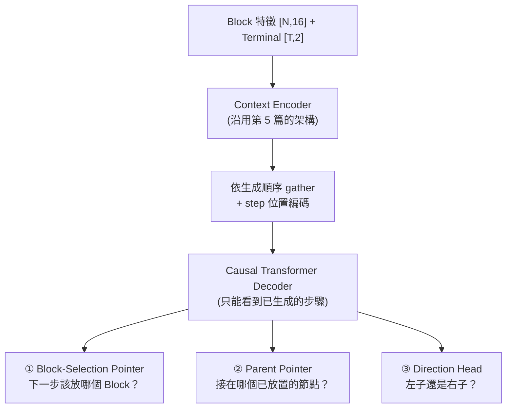

# 6. 生成式 B*-tree 拓樸模型 (Generative Topology Model)

> **核心角色**：這是 [[ICCAD_code/5_ML_Coordinate_Regression|第 5 篇 mode collapse 診斷]] 的解法——與其回歸連續座標，不如讓模型**逐步生成 B\*-tree 的拓樸結構本身**（像下棋一樣一步步決定「這個 Block 接在誰旁邊」），用 cross-entropy 訓練，天生不會有「平均兩個合法解」的問題。程式碼在 `collaborate/ml/{data,model_tree,train_tree,pack_tree,contest_cost,run_pipeline}.py`。

## 6.1 資料來源：解密 `tree_sol`

大會提供的 1M 訓練集（`floorset_lite/worker_*/layouts*.th`）裡有一個欄位 `tree_sol`，長期被舊版 `ml/data.py` 標記 `-- unused` 直接丟棄。解碼後發現：

- **Shape**：`[N-1, 3]`，每列 `(parent_id, child_id, direction_bit)`。
- **驗證方法**：用團隊自己的 `[[ICCAD_code/4_Packing_and_Evaluation|packer.cpp]]` 原始碼直接對答案（而非亂猜），確認 `direction=0` 是左子（貼右邊）、`direction=1` 是右子（貼上面），語義與我們自己的 C++ packer **完全一致**。
- **邊表已經是 DFS preorder**：父節點永遠先於子節點出現，這代表可以直接拿來當自迴歸模型的教師強制 (teacher forcing) 序列，不用額外重排。

> [!info] 為什麼不用它重建座標？
> 用這個公式解碼跟官方 `fp_sol` 精確比對，命中率只有 20–77%（依 case 而定）——殘差是官方生成器自己的後製壓縮演算法（跟我們的 `compact_left_down` 類似但細節未知，無法逆推）。**但這完全不影響訓練**：生成式模型要學的是拓樸標籤本身（parent + 方向），不是座標，這部分是 100% 乾淨可用的。

## 6.2 模型架構：三個 Pointer Network

每一步都是 **Pointer Network**（Vinyals et al. 2015）而不是固定類別數的分類器，所以能處理任意 Block 數：

1. **Block-selection**：從「尚未放置」的 Block 集合裡指一個當下一步（query 用 shift 一格的狀態 `d[t-1]`，root 用一個學到的 `start_token`）。
2. **Parent-pointer**：從「已經放置」的所有步驟裡指一個當 parent。
3. **Direction**：二元分類，左子 (0) 或右子 (1)。

> [!info] **這是解 mode collapse 的關鍵**
> Cross-entropy 訓練不存在「把兩個 one-hot 答案取平均」這種操作——模型被迫在 softmax 分佈裡選一個峰值，不會像 MSE 回歸那樣把兩個合法解混成一個不合法的中間值。

## 6.3 訓練與真正獨立推論

- **訓練**（`train_tree.py`）：teacher forcing，loss = block-selection CE + parent-pointer CE + direction BCE，沿用舊 `train.py` 的 `n_blocks**size_power` 大 case 加權慣例（因為 [[ICCAD_code/3_Cost_Function_and_Penalty|$e^n$ 加權]]，大 case 才是真正戰場）。
- **推論**（`TreeGenerator.generate()`）：**完全自迴歸，不需要 ground truth**——這一點在驗證集（無 `tree_sol`）的真實 case 上測試過：輸出必為 0..N-1 的合法排列、root 的 parent 必為 -1，每個 Block 都拿到合法的 parent+方向。這是能在真正未知 case 上跑的必要條件。
- **修復未訓練成熟時的不合法結構**：`pack_tree.py::build_lc_rc` 有確定性修復——未訓練好的模型偶爾會讓兩個 Block 搶同一個 parent 的同一側（pointer network 本身沒有「每個 parent 最多兩個子節點」的硬限制），搶輸的 Block 會 fallback 接到「最近放置且還有空位」的節點，保證每次都產出合法完整的樹，不會 crash。

## 6.4 打包與真實 Cost 評分

- **`pack_tree.py`**：Python 版 packer，照抄 [[ICCAD_code/4_Packing_and_Evaluation|packer.cpp]] 的 contour DFS 公式 + `compact_left_down`，用於快速評分/原型開發（**不含** `bbox_balance_pass`/`holes_fill_pass`/`grouping_repair_pass`/`boundary_repair_pass`，正式送出仍走真正的 C++ binary）。
- **`contest_cost.py`**：完整移植 [[ICCAD_code/3_Cost_Function_and_Penalty|官方 contest cost 公式]]（HPWL_gap、Area_gap、$V_{rel}$、feasibility 檢查），驗證集自帶的 `metrics` 欄位已破解對應：`[0]`=baseline 面積、`[6]`=baseline HPWL_int、`[7]`=baseline HPWL_ext（跟自己算的完全對上）。
- **一條龍指令**：`python -m ml.run_pipeline`——沒 checkpoint 就先訓練，讀驗證集某 case（真正 blind，TEST format 無 `tree_sol`），自迴歸採樣 K 個拓樸，各自 pack + 算真實 Cost，排名，存 `.sol`。

## 6.5 目前進度（2026-07-01）

| 規模 | 硬體 | 結果 |
|---|---|---|
| 3000 筆 × 3 epoch | CPU | `val_ptr_acc` 0.682→0.815；驗證集 case（21 blocks）採樣 8 個拓樸全部 feasible，最佳 Cost 遠高於 1（訓練量太小，符合預期） |
| 150,000 筆 × 3 epoch | GPU (RTX 5060) | 進行中 |

**已知限制**：soft Block 尺寸目前是佔位用的正方形 $w=h=\sqrt{area}$（模型只管拓樸不管長寬比），是造成 Cost 偏高的主因之一——下一步考慮接 [[ICCAD_code/5_ML_Coordinate_Regression|第 5 篇]]的 `dim_head` 來補長寬。

---
**相關筆記**：[[ICCAD_code/5_ML_Coordinate_Regression|上一篇：座標回歸與 Mode Collapse]] · [[ICCAD_code/8_Winning_Strategy_and_Roadmap|奪冠策略總覽]]
