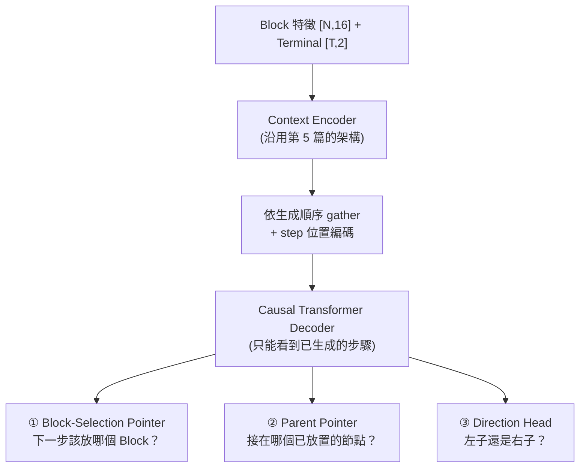

# 6. 生成式 B*-tree 拓樸模型 (Generative Topology Model)

> **核心角色**：這是 [[ICCAD_code/5_ML_Coordinate_Regression|第 5 篇 mode collapse 診斷]] 的解法——與其回歸連續座標，不如讓模型**逐步生成 B\*-tree 的拓樸結構本身**（像下棋一樣一步步決定「這個 Block 接在誰旁邊」），用 cross-entropy 訓練，天生不會有「平均兩個合法解」的問題。程式碼在 `collaborate/ml/{data,model_tree,train_tree,pack_tree,contest_cost,run_pipeline}.py`。

## 6.1 資料來源：解密 `tree_sol`

大會提供的 1M 訓練集（`floorset_lite/worker_*/layouts*.th`）裡有一個欄位 `tree_sol`，長期被舊版 `ml/data.py` 標記 `-- unused` 直接丟棄。解碼後發現：

- **Shape**：`[N-1, 3]`，每列 `(parent_id, child_id, direction_bit)`。
- **驗證方法**：用團隊自己的 `[[ICCAD_code/4_Packing_and_Evaluation|packer.cpp]]` 原始碼直接對答案（而非亂猜），確認 `direction=0` 是左子（貼右邊）、`direction=1` 是右子（貼上面），語義與我們自己的 C++ packer **完全一致**。
- **邊表已經是 DFS preorder**：父節點永遠先於子節點出現，這代表可以直接拿來當自迴歸模型的教師強制 (teacher forcing) 序列，不用額外重排。

> [!info] 為什麼不用它重建座標？
> 用這個公式解碼跟官方 `fp_sol` 精確比對，命中率只有 20–77%（依 case 而定）——殘差是官方生成器自己的後製壓縮演算法（跟我們的 `compact_left_down` 類似但細節未知，無法逆推）。**但這完全不影響訓練**：生成式模型要學的是拓樸標籤本身（parent + 方向），不是座標，這部分是 100% 乾淨可用的。

## 6.2 模型架構：三個 Pointer Network

> [!info] 這是 [[AI/Transformer|Transformer]] 的 **Encoder-Decoder** 家族變體：Context Encoder（雙向，理解整個 case）+ Causal Decoder（自迴歸生成，跟 GPT 的 decoder 同一類），只是把最後輸出層從「詞彙表 softmax」換成三個 Pointer Network——因為要生成的是「指向哪個已知節點」而不是「哪個詞彙」。

每一步都是 **Pointer Network**（Vinyals et al. 2015）而不是固定類別數的分類器，所以能處理任意 Block 數：

1. **Block-selection**：從「尚未放置」的 Block 集合裡指一個當下一步（query 用 shift 一格的狀態 `d[t-1]`，root 用一個學到的 `start_token`）。
2. **Parent-pointer**：從「已經放置」的所有步驟裡指一個當 parent。
3. **Direction**：二元分類，左子 (0) 或右子 (1)。

> [!info] **這是解 mode collapse 的關鍵**
> Cross-entropy 訓練不存在「把兩個 one-hot 答案取平均」這種操作——模型被迫在 softmax 分佈裡選一個峰值，不會像 MSE 回歸那樣把兩個合法解混成一個不合法的中間值。

## 6.3 訓練與真正獨立推論

- **訓練**（`train_tree.py`）：teacher forcing，loss = block-selection CE + parent-pointer CE + direction BCE，沿用舊 `train.py` 的 `n_blocks**size_power` 大 case 加權慣例（因為 [[ICCAD_code/3_Cost_Function_and_Penalty|$e^n$ 加權]]，大 case 才是真正戰場）。
- **推論**（`TreeGenerator.generate()`）：**完全自迴歸，不需要 ground truth**——這一點在驗證集（無 `tree_sol`）的真實 case 上測試過：輸出必為 0..N-1 的合法排列、root 的 parent 必為 -1，每個 Block 都拿到合法的 parent+方向。這是能在真正未知 case 上跑的必要條件。
- **修復未訓練成熟時的不合法結構**：`pack_tree.py::build_lc_rc` 有確定性修復——未訓練好的模型偶爾會讓兩個 Block 搶同一個 parent 的同一側（pointer network 本身沒有「每個 parent 最多兩個子節點」的硬限制），搶輸的 Block 會 fallback 接到「最近放置且還有空位」的節點，保證每次都產出合法完整的樹，不會 crash。

## 6.4 打包與真實 Cost 評分

- **`pack_tree.py`**：Python 版 packer，照抄 [[ICCAD_code/4_Packing_and_Evaluation|packer.cpp]] 的 contour DFS 公式 + `compact_left_down`，用於快速評分/原型開發（**不含** `bbox_balance_pass`/`holes_fill_pass`/`grouping_repair_pass`/`boundary_repair_pass`，正式送出仍走真正的 C++ binary）。
- **`contest_cost.py`**：完整移植 [[ICCAD_code/3_Cost_Function_and_Penalty|官方 contest cost 公式]]（HPWL_gap、Area_gap、$V_{rel}$、feasibility 檢查），驗證集自帶的 `metrics` 欄位已破解對應：`[0]`=baseline 面積、`[6]`=baseline HPWL_int、`[7]`=baseline HPWL_ext（跟自己算的完全對上）。
- **一條龍指令**：`python -m ml.run_pipeline`——沒 checkpoint 就先訓練，讀驗證集某 case（真正 blind，TEST format 無 `tree_sol`），自迴歸採樣 K 個拓樸，各自 pack + 算真實 Cost，排名，存 `.sol`。

## 6.5 目前進度（2026-07-01）

| 規模 | 硬體 | 結果 |
|---|---|---|
| 3,000 筆 × 3 epoch | CPU | `val_ptr_acc` 0.682→0.815 |
| **150,000 筆 × 3 epoch** | **GPU (RTX 5060 Laptop)** | `val_ptr_acc` **0.860→0.874**、`val_block_acc` 0.253→0.281（模型 679 萬參數，訓練約 87 分鐘） |

驗證集 case（config_21，21 blocks，**真正 blind**——這個 case 沒有 `tree_sol`）採樣 16 個拓樸：**全部 feasible（無重疊）**，最佳一個 `area_gap=+73%`、`hpwl_gap=+175%`、`V_rel=0.435`、**Cost=5.35**。

> [!info] **怎麼解讀這個 Cost**
> Parent-pointer 準確率 87.4% 已經相當不錯（模型確實學到了拓樸結構），但 Cost 5.35 離「贏過 baseline」（Cost < 1）還很遠。原因有三，且都是已知、可解的：
> 1. Soft Block 尺寸是佔位用正方形，不是真正優化過的長寬比。
> 2. `pack_tree.py` 沒有 [[ICCAD_code/4_Packing_and_Evaluation|`bbox_balance_pass`/`holes_fill_pass`/`grouping_repair`/`boundary_repair`]]，$V_{rel}=0.435$ 主要來自這裡。
> 3. 目前只有監督式預訓練（模仿 `tree_sol`），還沒進入 [[ICCAD_code/8_Winning_Strategy_and_Roadmap|Stage 1 獎勵微調]]——模仿的示範本身就不是最優解。

**已知限制**：soft Block 尺寸目前是佔位用的正方形 $w=h=\sqrt{area}$（模型只管拓樸不管長寬比），是造成 Cost 偏高的主因之一——下一步考慮接 [[ICCAD_code/5_ML_Coordinate_Regression|第 5 篇]]的 `dim_head` 來補長寬。

## 6.6 100-case 全面驗證 + 一個被推翻的悲觀結論（2026-07-08）

> [!danger] **先講一個自我訂正**：這節一開始的結論是「contour 打包有結構性密度天花板」，是**錯的**——實測後推翻，過程紀錄如下，因為「猜錯又修正」本身比一次到位更值得留下。

**第一輪實測**（只有 [[ICCAD_code/4_Packing_and_Evaluation|`compact_left_down`]]，soft block 長寬做全域 aspect ratio 掃描找最省 Cost 的比例）：100 case 全部 feasible，但 `area_gap` 平均 **+125%**，`Total Score`（`e^(n/12)` 加權）**13.77**，形狀優化只降到 **12.40**（−9.9%）。對照 pop 的 M1 文件警告「contour 規則無法重現 GT 的咬合拼磚（area +40%）」——我們的數字比它更慘，一度判斷這條路撞了結構性的牆。

**但這個判斷下得太早**——`pack_tree.py` 當時只做了 `compact_left_down`，[[ICCAD_code/4_Packing_and_Evaluation|`src/packer.cpp` 完整版]]還有 `bbox_balance_pass`（修長條狀 bbox）、`holes_fill_pass`（補 L 形死空白）、`grouping_repair_pass`、`boundary_repair_pass` 四道都沒移植過去。補上前兩道（`bbox_balance`+`holes_fill`）後重測：

| | area_gap（平均） | Total Score |
|---|---|---|
| 只有 `compact_left_down` | +125% | 13.77 → 12.40 |
| + `bbox_balance` + `holes_fill` | +24.9% | 8.41 → 7.77 |
| **全部四道（+ `grouping_repair` + `boundary_repair`）** | +63.0% | **5.13 → 4.67** |

**area_gap 從 +125% 掉到 +25%，掉了 5 倍；Total Score 降了 39%。** 這證明 contour 表示法本身沒有結構性死路——缺的就是完整的修復管線，跟 C++ 那邊本來就知道的道理一樣（[[ICCAD_code/4_Packing_and_Evaluation|4.4 節]]早就寫過這四道通道的必要性，只是 Python 版一開始偷懶沒補齊）。

> [!success] **加上最後兩道（`grouping_repair`+`boundary_repair`）後，出現一個有意義的權衡**：`area_gap` 反而從 +25% 漲回 +63%，但 `Total Score` 繼續大降（8.41→5.13）。原因是這兩道通道會把模組拉去貼群組夥伴／貼邊界，重新打開一些原本被 `bbox_balance`/`holes_fill` 壓實的空隙——**犧牲一點面積換取 $V_{rel}$ 大降**，而 $\exp(2V_{rel})$ 是指數項，淨效果仍是大賺。這跟 `src/packer.cpp` 自己的設計意圖一致（註解明講「boundary 要有最終發言權，讓壓縮通道不會馬上把它們的成果蓋掉」）。

**總計：從最初只有 `compact_left_down` 到補齊全部四道，Total Score 降了 62.7%（13.77→5.13，方形版本）／62.3%（12.40→4.67，形狀優化版本）**——只靠把 C++ 那邊本來就有、Python 版偷懶沒補的修復通道原封不動地移植過去，就拿到這個量級的進步。目前離電靜力法的 2.84–2.966 還有距離，但已經不再是「差 4 倍以上」的量級，且沒有動任何模型權重或訓練，純粹是打包後處理的正確性補完。

> [!info] **教訓**：「用有限的修復手段測出的壞結果」不能直接推論「這個表示法本身不行」——要先排除「修復管線不完整」這個變因，才能下結構性的結論。這也是為什麼要把每次實驗都誠實記下來，包含被推翻的那些。

## 6.7 攻 V_rel=0：先診斷再對症下藥（2026-07-09）

目標轉為「feasible + $V_{rel}=0$，在此前提壓最低 cost」。第一步不是亂修，是**先量出違規來自哪裡**（寫了 `ml/diag_vrel.py`，逐 case 拆解 $V_{grouping}$/$V_{mib}$/$V_{boundary}$）。20-case 診斷結果：

| 違規類型 | 原始總數（20 case） | 佔比 |
|---|---|---|
| **boundary** | **141** | **74%** ← 絕對主力 |
| grouping | 41 | 21% |
| MIB | 9 | 5% |

依此對症下藥，兩個確定的戰果：

- **MIB：9 → 0（by construction，一勞永逸）**。診斷發現的 bug：MIB 群組若含 fixed-shape 成員，該成員長寬鎖死，但 soft 成員被 aspect 掃描掃成別的形狀 → 形狀不一致。修法（`eval_full.py::dims_with_aspect`）：MIB 群組的 soft 成員一律**強制跟隨群組裡 fixed 成員的形狀**（MIB 成員面積相同，所以套同一形狀不會違反 1% 面積容忍）。這是真正的「建構即滿足」，不是事後修。
- **boundary：141 → ~12**。原本的 `boundary_repair` 太保守（只在目標格子剛好空著才貼）。改成**沿要求的牆掃描找第一個不重疊的位置**：LEFT/BOTTOM（x=0/y=0 永遠存在）保證能貼到；RIGHT/TOP 對齊當前 bbox 邊、必要時往外推成為新邊。

> [!warning] **一個沒解決的張力：boundary 變兇會扯散 grouping**。強力 boundary 把「同時屬於群組又要貼邊」的方塊拉到牆邊，grouping 從 41 漲到 59–79。讓 grouping 修復**跳過有邊界約束的方塊**（只聚集自由成員）緩解了一部分，但 grouping 仍卡在每 case ~4–5 次違規降不下去。**根因**：後處理式的 grouping 修復需要「空間」才能把落單成員拉去貼群組，但密集佈局裡核心周圍常常沒有空格。**這指向真正的解法是 by-construction 的 super-block 收縮**（把整個群組當一個剛體從一開始就打包在一起，永不被拆散）——這是 [[ICCAD_code/8_Winning_Strategy_and_Roadmap|T8]] 的內容，也是下一個該做的大工程。

**方法論備註**：`diag_vrel.py` 的違規數是「最低 cost pack 的違規數」，而最低 cost pack 每次選的不一樣，所以這個數字有雜訊，不能拿來精細比較兩版修復的優劣——真正的裁判是 100-case 的 **Total Score**。追個別違規數容易陷入打地鼠，這也是一個教訓。

## 6.8 V_rel 修好後，cost 的主導項換人了 → HPWL 微調（2026-07-09）

修好 boundary/MIB 後有個關鍵發現：**cost 不再由 $V_{rel}$ 主導，換成品質項主導**。定案 100-case（Total 3.87）回推：area_gap +168%、**hpwl_gap 約 +270%**——強力 boundary 把方塊抬到邊界，不只撐大面積，還把方塊拉離它的連線夥伴，**同時炸掉 area 跟 wirelength**。

順著這個發現，加了 **HPWL 收尾微調**（`eval_full.py::hpwl_nudge`）：對每個 case 選出的最佳 pack，把每個**自由方塊**（非 preplaced/boundary/cluster——這些是約束釘死的）滑向它 b2b/p2b 連線鄰居的加權重心，但**只准移到不重疊、且不撐大 bbox 的空位**（嚴格不劣化面積，只降線長）。30-case 子集實測：Total **3.48 → 3.18（−8.6%）**，維持 100% feasible。

> [!info] **這一步的意義**：它是第一個「V_rel 修好後、針對新主導項（HPWL）」的優化，證明診斷「主導項換人」→ 對症下藥的方法奏效。但也再次印證 6.7 的結論——真正的病根是強力 boundary 把方塊拉離原位，HPWL 微調只是**部分回收**這個損失，治標。要根治還是得 by-construction（讓 boundary 方塊一開始就在對的地方、不用事後硬拉）。

**完整 100-case 定案：Total 3.87 → 3.66（−5.4%）。** 本 session 生成式路線累計 **13.77 → 3.66（−73%）**，全程沒動模型權重。剩下最大的失血是 area_gap +168%（強力 boundary 撐大 bbox）。

## 6.9 boundary「推出界外」on/off portfolio（2026-07-09）

順著 6.8 的方向，測試 boundary 修復裡「RIGHT/TOP 找不到空位時把方塊推出界外成為新邊」這個分支（`_boundary_repair_pass(push_past=...)`）——它保證邊界貼到，但撐大 bbox。做成 **on/off portfolio**：每個拓樸/aspect 同時打包 push_past=True 跟 =False，用真實 cost 逐 case 挑便宜的。

**30-case 實測：Total 3.18 → 2.96（−7%），area_gap +155% → +111%。** 證實了假設——**很多 case「保持面積緊湊、接受該邊界方塊違規」比「硬推出界」更便宜**（面積+HPWL 的損失大於多出的那點 $\exp(2V_{rel})$）。讓 portfolio 逐 case 自選，兩邊的好處都拿到。

> [!success] **這修正了 6.7 的一個過度概化**：6.7 說「面積損失是正確定價、post-hoc 無法迴避」——那是對「完全不做 boundary 修復」的 all-or-nothing portfolio 而言。但「push_past on/off」這個更細的旋鈕證明：**在「做 boundary 修復」的前提下，還有一個更省的操作點**（對齊現有邊、不硬推出界）。教訓：portfolio 的顆粒度很重要，粗顆粒（全有/全無）測不出細顆粒（單一分支開關）能拿到的收益。完整 100-case 定案數字待補。

---
**相關筆記**：[[ICCAD_code/5_ML_Coordinate_Regression|上一篇：座標回歸與 Mode Collapse]] · [[ICCAD_code/8_Winning_Strategy_and_Roadmap|奪冠策略總覽]]
