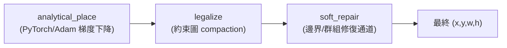

# 7. 電靜力法擺放器 (Electrostatic Placer)

> **核心角色**：與 [[ICCAD_code/2_SA_Optimizer_Engine|B*-tree + SA]]、[[ICCAD_code/6_ML_Generative_BTree|生成式拓樸模型]] 完全獨立的**第三條路線**——不用離散拓樸搜尋，改用連續梯度下降直接優化座標。目前**分數最佳**（Total Score 2.966，100/100 feasible）。程式碼在 `collaborate/electro_submission/`。

## 7.1 核心思路：把 Block 當「帶電粒子」

沿用晶片業界成熟的 ePlace / DREAMPlace 典範：把每個 Block 想成互相排斥的帶電粒子，重疊的地方電荷密度高、排斥力大，透過梯度下降讓系統自然「鬆弛」到不重疊的狀態。跟 [[ICCAD_code/2_SA_Optimizer_Engine|SA 的離散跳躍]]完全不同——這裡全程是連續、可微分的優化。

1. **`analytical_place.py`**：用 PyTorch Adam optimizer 直接對 $(x,y)$ 做梯度下降，目標函數結合 HPWL（線長）與電靜力排斥項（防重疊）。全程沒有 B\*-tree、沒有離散搜尋。
2. **`legalize.py`**：連續解出來的座標不保證完全合法（可能還有微小重疊或超出邊界），這一步用約束圖 compaction 把它拉回合法範圍。
3. **`soft_repair.py`**：跟 [[ICCAD_code/4_Packing_and_Evaluation|packer.cpp 的 grouping/boundary_repair_pass]] 概念類似，legalize 之後再修一次邊界與群組約束。

## 7.2 為什麼這條路線分數反而最好

- **不受 B\*-tree 離散搜尋空間限制**：[[ICCAD_code/8_Winning_Strategy_and_Roadmap|搜尋空間分析]]顯示純 SA 在大 case 數學上贏不了（$10^{250}$ 組合 vs $10^6$ 預算）；電靜力法完全繞開這個問題，直接在連續空間裡做梯度下降，複雜度跟 Block 數是多項式關係，不是組合爆炸。
- **純 Python + PyTorch，不需要編譯 C++ binary**：部署更輕量，也不受 [[ICCAD_code/1_Data_Loader_and_Wrapper|Linux ELF 執行檔跨平台限制]]影響。

## 7.3 已驗證分數

**Total Score = 2.966**，100/100 feasible，所有座標 $\geq 0$（100-case 驗證集）。

環境變數控制：
- `ELECTRO_SEEDS=N`：多起始點 (multi-start) 數量。
- `ELECTRO_ITERS=K`：梯度下降迭代次數（預設 600）。
- `ELECTRO_CLAMP=0 ELECTRO_NONNEG=0`：允許負座標（Total 降到 ≈2.334 但 cost 更低——這是一個尚待理解的 trade-off）。

## 7.4 在整體策略中的角色：安全網

在 [[ICCAD_code/8_Winning_Strategy_and_Roadmap|兩條腿並存策略]]中，電靜力法是**保底方案 (safety net)**——不管生成式拓樸模型訓練得如何，這條路線隨時能交出一個已驗證、分數不差的結果。兩條路線共用同一套幾何精修後端，不是互斥選項。

---
**相關筆記**：[[ICCAD_code/6_ML_Generative_BTree|生成式 B*-tree 模型]] · [[ICCAD_code/8_Winning_Strategy_and_Roadmap|奪冠策略總覽]]
