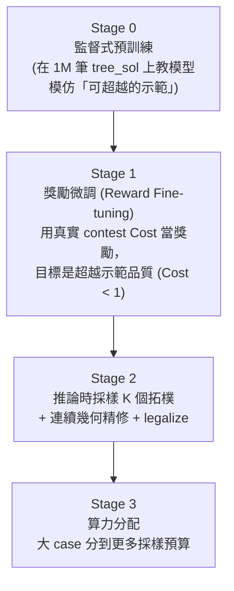
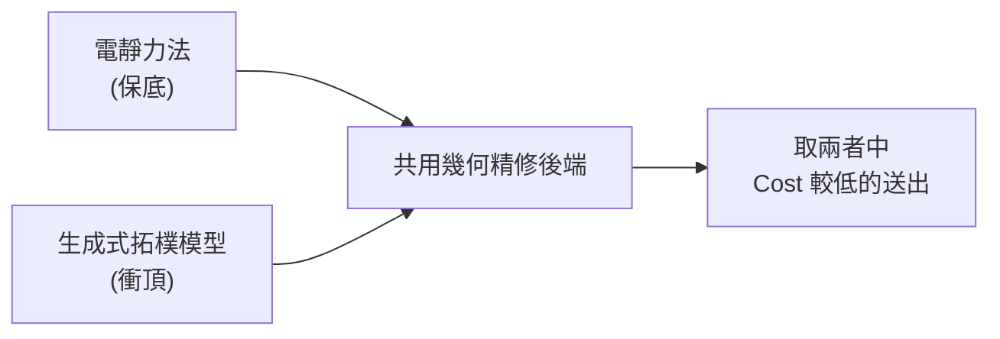

# 8. 奪冠策略總覽與現況路線圖 (Winning Strategy & Roadmap)

> **核心角色**：串起 [[ICCAD_code/1_Data_Loader_and_Wrapper|1]]–[[ICCAD_code/7_Electrostatic_Placer|7]] 全部七篇筆記的總覽——回答「我們現在在哪、為什麼這樣選、下一步是什麼」。完整版在 repo 的 `collaborate/WINNING_STRATEGY.md`。

## 8.1 三條並存路線

| 路線 | 方法 | 現況 |
|---|---|---|
| **A（主力）** | [[ICCAD_code/2_SA_Optimizer_Engine\|B*-tree + Fast-SA]]，C++ 多執行緒多 seed | 穩定成熟，Alpha 已過 |
| **B（ML 輔助）** | [[ICCAD_code/5_ML_Coordinate_Regression\|座標回歸 Warm-start]] | 已訓練 v1/v2/v3，**診斷出 mode collapse 病灶** |
| **C（獨立路線）** | [[ICCAD_code/7_Electrostatic_Placer\|電靜力法]] | **目前分數最佳**（Total 2.966，100% feasible） |

## 8.2 三個關鍵診斷（決定了整個策略方向）

### 診斷一：$e^n$ 加權讓大 case 決定一切
[[ICCAD_code/3_Cost_Function_and_Penalty|總分是 $\sum e^n \times \text{Cost}_n$]]，$n$ 從 21 到 120。一個 120-block case 權重是 21-block 的 $e^{99}{\approx}8{\times}10^{42}$ 倍。**小 case 全部滿分也贏不了大 case 輸一點**。

### 診斷二：純 SA 在大 case 數學上贏不了
$n{=}120$ 的 B\*-tree 拓樸組合數約 $10^{250}$，SA 在時限內的評估次數約 $10^6$——搜到的比例是 $10^{-244}$，等於在太平洋裡憑運氣找一滴特定的水分子。**這不是調參數能解決的問題，是搜尋空間本身的物理限制。**

### 診斷三：座標回歸的 Mode Collapse
[[ICCAD_code/5_ML_Coordinate_Regression|詳見第 5 篇]]——MSE/Smooth-L1 回歸多峰解時，最佳策略是輸出「所有合法解的平均」，而平均出來的座標通常本身就不合法（撞在一起）。

## 8.3 奪冠路線：四階段生成式管線

- **Stage 0**（[[ICCAD_code/6_ML_Generative_BTree|第 6 篇已完成部分]]）：用 1M 筆 `tree_sol` 訓練生成式模型模仿「近似最優但非最優」的示範。
- **Stage 1**（尚未開始）：類比 AlphaGo → AlphaZero——用真實 contest Cost 當獎勵訊號做強化學習微調，目標是**超越**示範品質（訓練資料本身不是最優解，只是「還不錯的起點」）。
- **Stage 2**：推論時不只採樣一個拓樸，採樣 K 個候選，各自用真正的 [[ICCAD_code/4_Packing_and_Evaluation|packer.cpp]] 精修 + legalize，挑 Cost 最低的送出。
- **Stage 3**：善用 $e^n$ 加權——把算力（採樣數 K、精修迭代數）優先分給 n 大的 case。

## 8.4 兩條腿並存策略

不管生成式模型訓練進度如何，[[ICCAD_code/7_Electrostatic_Placer|電靜力法]]隨時能交出一個已驗證分數；生成式模型是用來衝更高名次的上限，兩者不是互斥選擇，是同時保留。

## 8.5 現況時間軸

| 日期 | 里程碑 |
|---|---|
| 2026-04-28 | 決議採用 PARSAC + B*-tree + Fast-SA，分階段加 ML |
| 2026-05-26 | Alpha test 截止日通過 |
| 2026-06-21 | 電靜力法驗證完成，Total 2.966 |
| 2026-06-30 | 進入 Beta→Final 衝刺；發現 `tree_sol` 被舊版 `ml/data.py` 標記 unused 丟棄 |
| 2026-07-01 | 解密 `tree_sol` schema、建立生成式 B\*-tree 模型（[[ICCAD_code/6_ML_Generative_BTree\|第 6 篇]]）、一條龍 pipeline 打通、GPU 環境就緒開始大規模訓練 |

## 8.6 下一步（舊版，已被 §8.7 取代——保留供對照）

1. ~~生成式模型完整訓練（更大規模、更多 epoch）~~ → 已做（v1→v2），邊際效益遞減，見 §8.7。
2. Soft Block 尺寸預測（接 [[ICCAD_code/5_ML_Coordinate_Regression|第 5 篇]]的 `dim_head`，或新增專門的 head）。
3. ~~Stage 1 獎勵微調（RL against 真實 contest Cost）~~ → **不建議再做**，見 §8.7 的密度天花板證據。
4. Approach A vs C 的正式跑分比較，決定最終送出哪個（或哪個組合）→ **C 已確定領先，見 §8.7**。

## 8.7 重大修正：生成式 B\*-tree 路線的完整結果 + 密度天花板證據（2026-07-09/14）

### 生成式 B\*-tree（Approach B 的接班人）最終戰績

Total Score **13.77 → 3.3185（−75.9%）**，100/100 feasible。主要槓桿：補齊打包後製修復管線、
v2 模型微調、**by-construction 分組**（grouping 打包前用 shelf-pack 收成剛性 super-block，
本 session 最大單一貢獻）。連續三個新招式（保約束壓實、邊界擴展、HPWL cluster 微調）貢獻都
趨近於零——post-hoc/幾何改進空間已到頂。完整過程見 [[ICCAD_code/6_ML_Generative_BTree|第 6 篇]] §6.6–6.16。

### 關鍵發現：Approach C（電靜力法）不只分數更好，還有嚴謹證據證明 Approach B 的表示法有天花板

查證隊友 pop 的 upstream repo（含尚未合併的 `temp` 分支）發現：

1. **電靜力法現況已經不是 2.966，是 2.7215～2.8414**（S1 群組/邊界感知壓縮，已在真評測器
   full-100 驗證，100/100 feasible，平均 runtime **~2-9 秒/case**——比我們的生成式路線快
   5-25 倍）。本地獨立重跑確認：2.728，100/100 feasible，1.91s/case 平均。
2. **`probe_m3_tree.py`（pop 的實驗，2026-07-07）：把 GT（真實最優解）反推成 B\*-tree
   （貪婪最近槽位抽取，best-of-3 插入序）再用標準 contour packer 重建**——即「拓樸預測
   100% 準確」的品質上限：

   | 指標（重建/GT） | 數值 |
   |---|---|
   | 面積比 | **1.403**（接上壓縮後降到 1.282） |
   | 排列一致度 | 0.93（保住了） |
   | 重疊 | 0.00% |

   **判決**：合法性免費成立（packer 保證零重疊），**緊密度免費不成立**——GT 是互相咬合
   的緊密拼磚，不是 left/bottom contour packing 能重現的排版。**就算拓樸預測完美，
   B\*-tree/contour 表示法的密度天花板仍比電靜力法現況差。**

> [!danger] **這推翻了 §8.3 的四階段生成式管線規劃，尤其是 Stage 1（RL 獎勵微調衝 Cost<1）**：
> 原規劃假設「訓練得夠好、模型會學到接近最優的拓樸」，但 pop 的 M3 探針證明**即使拓樸 100%
> 正確，contour 打包的密度都達不到 GT 水準**——問題不在訓練，在表示法本身結構性放棄了
> GT 那種互相咬合的緊密度。RL 微調能小幅逼近這個 1.28-1.40 倍面積的天花板，但無法突破它，
> 而這個天花板本身就已經輸給電靜力法現況。**不建議再投入 Stage 1。**

### Pop 的 M1：一個沒有這個天花板的建構式自回歸模型（⚠️ 只有設計文件，程式碼不存在）

`temp` 分支有 **`ml/M1_README.md`**（2026-07-07）描述一個新模型 M1：跟我們的生成式模型
概念很像（自回歸逐塊生成、純監督模仿、cross-entropy 避免 mode-averaging），**但預測的是
32×32 自由格點座標，不是樹結構**——這正是繞開 B\*-tree 密度天花板的關鍵設計（M3 探針的
教訓直接內建進 M1 的設計）。

> [!warning] **更正（2026-07-14）**：一開始誤以為 M1 已經有可用的實作（README 寫「已驗證」、
> commit message 寫「end-to-end verified」），檢查 `git worktree add` 出來的實際檔案才發現
> **`ml/m1_common.py`/`m1_model.py`/`m1_dataset.py`/`m1_train.py`/`m1_infer.py` 這些程式碼
> 從未進過 git history**，搜遍整個 `temp` 分支只找到 `ml/M1_README.md` 這份文件。等於 M1
> **目前只有設計規格，沒有可以拿來用或訓練的程式碼**——README 描述的「60 case 冒煙測試,
> near=0.02」等驗證結果，程式碼本身沒有留下痕跡。真正可行的只有：(1) 跟 pop 要實際程式碼
> （跨隊溝通），或 (2) 照設計文件自己重新實作（規模跟本 session 做生成式 B\*-tree 模型
> 相當，是全新工程，不是「接手」）。這是本 session 自己犯的「沒查證就相信文件描述」的
> 錯誤，抓到後立刻更正——教訓：commit message 和 README 是意圖聲明，不是程式碼存在的證明。

目前確定可用、已獨立驗證的只有 **`electro/`**（2.72 分，100/100 feasible，1.91s/case，用
`git worktree add` 檢出 `upstream/temp` 到獨立目錄後跑真評測器確認，沒有動到主工作目錄）。
若要投入 M1，第一步必須是**跟 pop 要實際程式碼**，我們既有的訓練基礎設施（1M 檔案讀取、
GPU 訓練迴圈、size-power 加權、checkpoint 管理）在拿到程式碼後才用得上。

### 修正後的下一步

1. ~~繼續生成式 B\*-tree 的 post-hoc/RL 優化~~ → **不建議**，表示法天花板已證實，投報比低。
2. **M1 暫緩**——只有設計文件，沒有程式碼，第一步是跨隊溝通拿程式碼，不是我們能單方面推進的。
3. Approach A vs B vs C：**C（電靜力法 + S1 壓縮）目前確定領先且已獨立驗證**（2.72 vs
   生成式 3.32，且快 25 倍）。最終送出應以 C 為主力，B 保留作為對照/備援。
4. 是否同步 pop 的 `temp` 分支、如何分工（拿 M1 程式碼、或自己重新實作），是團隊分工層級
   決策，已回報給使用者。

---
**回到**：[[ICCAD/ICCAD-Dashboard|ICCAD 儀表板]]
