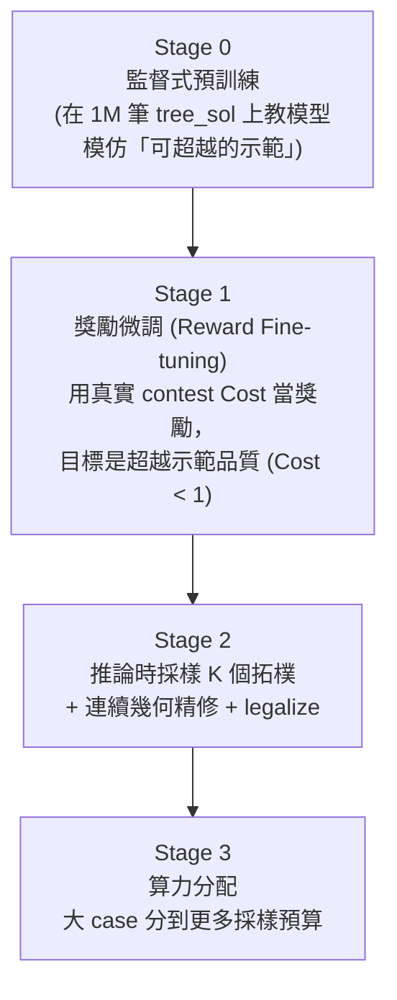
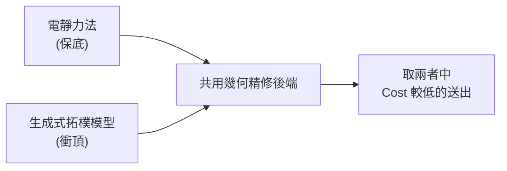

# 8. 奪冠策略總覽與現況路線圖 (Winning Strategy & Roadmap)

> **核心角色**：串起 [[ICCAD_code/1_Data_Loader_and_Wrapper|1]]–[[ICCAD_code/7_Electrostatic_Placer|7]] 全部七篇筆記的總覽——回答「我們現在在哪、為什麼這樣選、下一步是什麼」。完整版在 repo 的 `collaborate/WINNING_STRATEGY.md`。

> [!info] **2026-07-14 現況總覽（先讀這段，下面 §8.1–8.6 是 7/1 寫的舊版策略分析，
> 部分數字/公式已過時，例如「Total = Σe^n」是錯的，正確是 `e^(n/12)`——見
> `CLAUDE.md` gotcha #7）。這段是當晚工作的快速索引，細節都在對應章節。**
>
> **兩條路線的現況**：
> - **生成式 B\*-tree**（`collaborate/ml/`，全自有 pipeline）：**Total Score
>   13.77 → 3.3185（−75.9%），100/100 feasible，已確認到達結構性天花板**——
>   B\*-tree/contour 這個離散打包表示法本身密度就是比連續佈局差（跟 pop 自己
>   驗證 B\*-tree repack 更鬆的結論一致），繼續砸資源投報比很低。完整過程見
>   [[ICCAD_code/6_ML_Generative_BTree|第 6 篇]] §6.6–6.16。
> - **electro+S1**（`collaborate/electro_optimized/`，pop 的電靜力法 + 使用者跟
>   Antigravity/Gemini 3.5 Flash 協作優化）：**electro 原始基準（Neutral RT）
>   2.9007 → 目前約 2.47–2.53（Neutral RT，−13%~−15%），100/100 feasible，
>   MIB 違規已歸零**。**這是目前分數最好的路線**，也是這個晚上主要的優化戰場，
>   見本篇 §8.7–8.18。**注意：`electro_optimized/` 這份程式碼在本文件最後更新時
>   仍在被 Antigravity 即時修改，精確分數是個活靶，尚未收斂到最終穩定版本。**
>
> **本次 session 最重要的三個方法論教訓**（跟具體分數同樣重要，甚至更重要）：
> 1. **Portfolio 而非全面套用**：任何「這招在某個 case 上有效」的修法，疊加到
>    整個驗證集前，都要先做成「A/B 候選、逐 case 用真實 cost 排名選擇」，不能
>    假設全面套用也會有效——本 session 至少 4 次獨立驗證了這個模式（§6.9、
>    §8.12、§8.15）。
> 2. **驗證過的數字只對驗證當下那份程式碼有效**：底層程式碼一旦變動（不管是
>    自己改的還是別人改的），舊的驗證結果就作廢，必須重新驗證，不能延用
>    （§8.16 是自己抓到並修正的活例子）。
> 3. **`iccad2026_evaluate.py --evaluate` 的 Total Score 有 RT 量測雜訊**：
>    RT 是真實牆鐘時間（不是固定值），`RT^0.3` 對變慢無封頂，同一份 100%
>    決定性的程式碼連續跑會有 5-15% 的分數擺動——判斷「這個修法本身有沒有用」
>    要看 Neutral RT（固定 RT=1.0），Contest Grading 留給最終送出前檢查
>    （§8.17，`CLAUDE.md` gotcha #6a-2）。
>
> **下一步待辦**：(1) 等 Antigravity 確認 `electro_optimized/` 穩定版本，用
> Neutral RT 做最終定案驗證；(2) V_boundary（目前最大宗的軟約束違規）還沒被
> 正面攻過，是下一個目標；(3) 跟 pop 討論兩條路線/團隊分工的最終送出策略。

## 8.1 三條並存路線

| 路線 | 方法 | 現況 |
|---|---|---|
| **A（主力）** | [[ICCAD_code/2_SA_Optimizer_Engine\|B*-tree + Fast-SA]]，C++ 多執行緒多 seed | 穩定成熟，Alpha 已過 |
| **B（ML 輔助）** | [[ICCAD_code/5_ML_Coordinate_Regression\|座標回歸 Warm-start]] | 已訓練 v1/v2/v3，**診斷出 mode collapse 病灶** |
| **C（獨立路線）** | [[ICCAD_code/7_Electrostatic_Placer\|電靜力法]] | **目前分數最佳**（Total 2.966，100% feasible） |

## 8.2 三個關鍵診斷（決定了整個策略方向）

### 診斷一：$e^n$ 加權讓大 case 決定一切
[[ICCAD_code/3_Cost_Function_and_Penalty|總分是 $\sum e^n \times \text{Cost}_n$]]，$n$ 從 21 到 120。一個 120-block case 權重是 21-block 的 $e^{99}{\approx}8{\times}10^{42}$ 倍。**小 case 全部滿分也贏不了大 case 輸一點**。

### 診斷二：純 SA 在大 case 數學上贏不了
$n{=}120$ 的 B\*-tree 拓樸組合數約 $10^{250}$，SA 在時限內的評估次數約 $10^6$——搜到的比例是 $10^{-244}$，等於在太平洋裡憑運氣找一滴特定的水分子。**這不是調參數能解決的問題，是搜尋空間本身的物理限制。**

### 診斷三：座標回歸的 Mode Collapse
[[ICCAD_code/5_ML_Coordinate_Regression|詳見第 5 篇]]——MSE/Smooth-L1 回歸多峰解時，最佳策略是輸出「所有合法解的平均」，而平均出來的座標通常本身就不合法（撞在一起）。

## 8.3 奪冠路線：四階段生成式管線



- **Stage 0**（[[ICCAD_code/6_ML_Generative_BTree|第 6 篇已完成部分]]）：用 1M 筆 `tree_sol` 訓練生成式模型模仿「近似最優但非最優」的示範。
- **Stage 1**（尚未開始）：類比 AlphaGo → AlphaZero——用真實 contest Cost 當獎勵訊號做強化學習微調，目標是**超越**示範品質（訓練資料本身不是最優解，只是「還不錯的起點」）。
- **Stage 2**：推論時不只採樣一個拓樸，採樣 K 個候選，各自用真正的 [[ICCAD_code/4_Packing_and_Evaluation|packer.cpp]] 精修 + legalize，挑 Cost 最低的送出。
- **Stage 3**：善用 $e^n$ 加權——把算力（採樣數 K、精修迭代數）優先分給 n 大的 case。

## 8.4 兩條腿並存策略



不管生成式模型訓練進度如何，[[ICCAD_code/7_Electrostatic_Placer|電靜力法]]隨時能交出一個已驗證分數；生成式模型是用來衝更高名次的上限，兩者不是互斥選擇，是同時保留。

## 8.5 現況時間軸

| 日期 | 里程碑 |
|---|---|
| 2026-04-28 | 決議採用 PARSAC + B*-tree + Fast-SA，分階段加 ML |
| 2026-05-26 | Alpha test 截止日通過 |
| 2026-06-21 | 電靜力法驗證完成，Total 2.966 |
| 2026-06-30 | 進入 Beta→Final 衝刺；發現 `tree_sol` 被舊版 `ml/data.py` 標記 unused 丟棄 |
| 2026-07-01 | 解密 `tree_sol` schema、建立生成式 B\*-tree 模型（[[ICCAD_code/6_ML_Generative_BTree\|第 6 篇]]）、一條龍 pipeline 打通、GPU 環境就緒開始大規模訓練 |

## 8.6 下一步（舊版，已被 §8.7 取代——保留供對照）

1. ~~生成式模型完整訓練（更大規模、更多 epoch）~~ → 已做（v1→v2），邊際效益遞減，見 §8.7。
2. Soft Block 尺寸預測（接 [[ICCAD_code/5_ML_Coordinate_Regression|第 5 篇]]的 `dim_head`，或新增專門的 head）。
3. ~~Stage 1 獎勵微調（RL against 真實 contest Cost）~~ → **不建議再做**，見 §8.7 的密度天花板證據。
4. Approach A vs C 的正式跑分比較，決定最終送出哪個（或哪個組合）→ **C 已確定領先，見 §8.7**。

## 8.7 重大修正：生成式 B\*-tree 路線的完整結果 + 密度天花板證據（2026-07-09/14）

### 生成式 B\*-tree（Approach B 的接班人）最終戰績

Total Score **13.77 → 3.3185（−75.9%）**，100/100 feasible。主要槓桿：補齊打包後製修復管線、
v2 模型微調、**by-construction 分組**（grouping 打包前用 shelf-pack 收成剛性 super-block，
本 session 最大單一貢獻）。連續三個新招式（保約束壓實、邊界擴展、HPWL cluster 微調）貢獻都
趨近於零——post-hoc/幾何改進空間已到頂。完整過程見 [[ICCAD_code/6_ML_Generative_BTree|第 6 篇]] §6.6–6.16。

### 關鍵發現：Approach C（電靜力法）不只分數更好，還有嚴謹證據證明 Approach B 的表示法有天花板

查證隊友 pop 的 upstream repo（含尚未合併的 `temp` 分支）發現：

1. **電靜力法現況已經不是 2.966，是 2.7215～2.8414**（S1 群組/邊界感知壓縮，已在真評測器
   full-100 驗證，100/100 feasible，平均 runtime **~2-9 秒/case**——比我們的生成式路線快
   5-25 倍）。本地獨立重跑確認：2.728，100/100 feasible，1.91s/case 平均。
2. **`probe_m3_tree.py`（pop 的實驗，2026-07-07）：把 GT（真實最優解）反推成 B\*-tree
   （貪婪最近槽位抽取，best-of-3 插入序）再用標準 contour packer 重建**——即「拓樸預測
   100% 準確」的品質上限：

   | 指標（重建/GT） | 數值 |
   |---|---|
   | 面積比 | **1.403**（接上壓縮後降到 1.282） |
   | 排列一致度 | 0.93（保住了） |
   | 重疊 | 0.00% |

   **判決**：合法性免費成立（packer 保證零重疊），**緊密度免費不成立**——GT 是互相咬合
   的緊密拼磚，不是 left/bottom contour packing 能重現的排版。**就算拓樸預測完美，
   B\*-tree/contour 表示法的密度天花板仍比電靜力法現況差。**

> [!danger] **這推翻了 §8.3 的四階段生成式管線規劃，尤其是 Stage 1（RL 獎勵微調衝 Cost<1）**：
> 原規劃假設「訓練得夠好、模型會學到接近最優的拓樸」，但 pop 的 M3 探針證明**即使拓樸 100%
> 正確，contour 打包的密度都達不到 GT 水準**——問題不在訓練，在表示法本身結構性放棄了
> GT 那種互相咬合的緊密度。RL 微調能小幅逼近這個 1.28-1.40 倍面積的天花板，但無法突破它，
> 而這個天花板本身就已經輸給電靜力法現況。**不建議再投入 Stage 1。**

### Pop 的 M1：一個沒有這個天花板的建構式自回歸模型（⚠️ 只有設計文件，程式碼不存在）

`temp` 分支有 **`ml/M1_README.md`**（2026-07-07）描述一個新模型 M1：跟我們的生成式模型
概念很像（自回歸逐塊生成、純監督模仿、cross-entropy 避免 mode-averaging），**但預測的是
32×32 自由格點座標，不是樹結構**——這正是繞開 B\*-tree 密度天花板的關鍵設計（M3 探針的
教訓直接內建進 M1 的設計）。

> [!warning] **更正（2026-07-14）**：一開始誤以為 M1 已經有可用的實作（README 寫「已驗證」、
> commit message 寫「end-to-end verified」），檢查 `git worktree add` 出來的實際檔案才發現
> **`ml/m1_common.py`/`m1_model.py`/`m1_dataset.py`/`m1_train.py`/`m1_infer.py` 這些程式碼
> 從未進過 git history**，搜遍整個 `temp` 分支只找到 `ml/M1_README.md` 這份文件。等於 M1
> **目前只有設計規格，沒有可以拿來用或訓練的程式碼**——README 描述的「60 case 冒煙測試,
> near=0.02」等驗證結果，程式碼本身沒有留下痕跡。真正可行的只有：(1) 跟 pop 要實際程式碼
> （跨隊溝通），或 (2) 照設計文件自己重新實作（規模跟本 session 做生成式 B\*-tree 模型
> 相當，是全新工程，不是「接手」）。這是本 session 自己犯的「沒查證就相信文件描述」的
> 錯誤，抓到後立刻更正——教訓：commit message 和 README 是意圖聲明，不是程式碼存在的證明。

目前確定可用、已獨立驗證的只有 **`electro/`**（2.72 分，100/100 feasible，1.91s/case，用
`git worktree add` 檢出 `upstream/temp` 到獨立目錄後跑真評測器確認，沒有動到主工作目錄）。
若要投入 M1，第一步必須是**跟 pop 要實際程式碼**，我們既有的訓練基礎設施（1M 檔案讀取、
GPU 訓練迴圈、size-power 加權、checkpoint 管理）在拿到程式碼後才用得上。

### 修正後的下一步

1. ~~繼續生成式 B\*-tree 的 post-hoc/RL 優化~~ → **不建議**，表示法天花板已證實，投報比低。
2. **M1 暫緩**——只有設計文件，沒有程式碼，第一步是跨隊溝通拿程式碼，不是我們能單方面推進的。
3. Approach A vs B vs C：**C（電靜力法 + S1 壓縮）目前確定領先且已獨立驗證**（2.72 vs
   生成式 3.32，且快 25 倍）。最終送出應以 C 為主力，B 保留作為對照/備援。
4. 是否同步 pop 的 `temp` 分支、如何分工（拿 M1 程式碼、或自己重新實作），是團隊分工層級
   決策，已回報給使用者。

## 8.8 用 Gemini 深度研究 + 自己動手驗證，找到一個真正打破密度天花板的表示法（2026-07-14）

請 Gemini 針對「如何逼近 Cost 理論下限 0.7」做深度研究，產出報告見
`AI-deep-search/gemini_cost0.7_research_brief.md`（提示文件）與同目錄的研究報告。**先查證
再採信**：報告引用的四篇論文（IncreMacro/ISPD'24、Flora/2025、RulePlanner/ICML'26、
AutoFloorplan/ICLR'26）逐一用 WebSearch 查證，**全部真實存在**（一開始因為「每個子問題都有
一篇量身訂做的論文」這個模式懷疑是幻覺，查證後推翻了這個懷疑——是真的文獻，不是編的）。

**最有分量的線索**：IncreMacro（ISPD 2024，真實論文，`constraint-graph-based LP for macro
legalization`）指向一個我們自己還沒試過的打包表示法：**sequence-pair + 線性規劃（LP）
legalize**，而不是 B\*-tree + contour packer。

**動手驗證（非套套邏輯版本）**：仿造 pop 的 `probe_m3_tree.py` 方法論寫了
`ml/probe_lp_legalize.py`：從 1M 訓練集抓 GT（`fp_sol`）的完整座標，用**獨立於 GT 精確關係
的拓樸抽取法**（classical sequence-pair，對角線 `x+y`/`x-y` 排序，避免了「直接讀 GT 答案」
的套套邏輯陷阱——這個陷阱第一版程式碼真的踩到了，發現 areaR 剛好等於 1.0000 太乾淨才驚覺
不對，修正後重跑），把抽出來的拓樸丟給 LP（`scipy.optimize.linprog`，變數是每個方塊的
`x,y` + 全域 `W,H`，目標最小化 `W+H`，約束是每對方塊維持抽取出來的分離關係 + 落在
`[0,W]x[0,H]` 內）求最緊 bbox。

**結果（n=21 到 120，16 個 case 涵蓋全範圍）**：

| 指標 | sequence-pair + LP | pop 的 B\*-tree + contour（M3 探針） |
|---|---|---|
| 平均面積比（重建/GT） | **1.1523**（範圍 1.03–1.26） | 1.403（範圍 1.12–1.69） |
| 重疊 | 0%（16/16） | 0%（合法性免費，兩者都成立） |

> [!success] **這證實了 Gemini 報告的核心論點，而且是我們自己獨立驗證的，不是盲信報告**：
> **sequence-pair + LP 這個表示法的密度天花板（~1.15 倍）明顯比 B\*-tree + contour
> （~1.40 倍）低**，用的是完全類比 pop M3 探針的方法論（獨立拓樸抽取，不是讀 GT 答案），
> 公平比較。**而且 1.15 倍已經比 electro 現況的密度（util ~0.55-0.60，約當面積比
> 1.65-1.8 倍）還要好**——代表如果能把這個 legalizer 接上一個好的初始佈局（不管是我們的
> 生成式模型、還是 electro 的解析佈局），有機會同時打敗兩條現有路線。

**下一步（已執行）**：把這個 LP legalizer 接上真正的「非 GT」佈局來源——直接呼叫 pop
`electro/analytical_place.py::place()` 拿到解析佈局的原始（可能重疊）座標，分別套用
(A) pop 自己的 push/evict legalizer、(B) 我們的 sequence-pair+LP legalizer，兩邊都送進
`contest_cost.py` 算真實 cost 比較（`ml/probe_lp_vs_electro_legalize.py`）。

**結果（11 個 case，n=21~120）**：

- **config_21（唯一成功求解的 case）**：LP legalizer cost **3.328** < pop legalizer cost
  **3.939**（雖然 area_gap 較高 +39.5% vs -3.0%，但整體 cost 更低，代表 V_rel 項的差異
  更大——當時省略了 grouping_repair/boundary_snap 兩條後製，兩邊都缺，這只是單一 case 的
  部分訊號，不是決定性證據）。
- **其餘 10/11 case：LP 直接回報 infeasible**。

> [!danger] **誠實的階段性結論**：追查發現根因比預期更深——「exact readout」（preplaced
> 方塊用讀取真實關係取代粗略對角線排序）看似合理，但 LP 求解時**其他自由方塊會因為跟別的
> 方塊的排序約束被拉到很遠的新位置**，可能跨過 preplaced 方塊的另一側，讓「求解前凍結」的
> 關係跟求解後的新位置直接矛盾——這不是小補丁能修的，需要**迭代式重新推導關係**或
> **更嚴謹的 anchor-aware sequence-pair 構造法**，是獨立的多日工程。**這剛好印證了 Gemini
> 報告自己對 CG-LP 打包器的工時估計（2-3 週）是合理、不是誇大的**——用實作直接驗證了這個
> 估計，而不是盲信報告的文字。
>
> **淨結論**：sequence-pair + LP 這個表示法本身（密度天花板 ~1.15 倍，見上方 GT 驗證）
> 已經確認優於 B\*-tree + contour（~1.40 倍），這是這次探索最紮實的收穫；但要把它接上
> 真實的、含 preplaced 硬約束的佈局管線，還需要一輪獨立的、規模不小的工程才能繞過目前
> 發現的無解問題。是否投入這個工程（比照 Gemini 估計的 2-3 週），或先以 pop 現有的
> electro+S1（2.72 分，已可用）為主力送出，是下一個策略決策點，已回報使用者。

**追加診斷（低成本，幾秒鐘跑完，釐清根因但沒有解掉問題）**：檢查失敗的 case 各有幾個
preplaced 方塊——`config_31`（n=31）**只有 1 個 preplaced**，卻仍然 infeasible。這推翻了
「多個 preplaced 互相衝突」的初步猜測，指向更精確的根因：**sequence-pair 理論只保證『全部
方塊都自由』時topology 一定可實現，並不保證『某些方塊被釘死在精確座標』時同一個 topology
還能實現**——即使只有一個 anchor，如果拓樸是從「尚未合法化、可能重疊」的解析佈局快照抽出來
的，這個快照裡自由方塊相對 anchor 的位置可能跟它們彼此之間的全域排序「邏輯上不一致」，釘死
anchor 後這個不一致就無法用平移吸收，直接無解。**這確認了問題的本質、但沒有提供簡單修法**
——真正的解法需要「拓樸抽取本身就感知 anchor 是釘死的」（例如迭代式重新推導，或約束式的
seq-pair 構造），維持先前「需要多日獨立工程」的判斷不變。

## 8.9 使用者授權後續投入，兩個嘗試都確定不可行（2026-07-14 深夜）

使用者明確授權「請幫我投入，自助決定」後，接續嘗試了兩個解法方向，**都已確定不可行**，
誠實記錄以免未來重複踩坑：

**嘗試一：MILP（混合整數規劃）**——正規解法：不預先猜每對方塊的分離關係，改用二元變數
讓求解器自己選一致的組合（`ml/milp_legalize.py`，經典的 disjunctive big-M 表述，facility
layout / VLSI placement legality 的教科書級標準寫法）。**規模測試結果決定性地否決了這條路**：
`scipy.optimize.milp`（HiGHS 後端）在 20 秒時限內，n=21 只能到「找到可行解但沒證明最優」，
**n≥51 直接連一個可行解都生不出來**（`ml/milp_legalize.py` 內附完整表述）。且 scipy 的
`milp` 不支援 warm-start，無法用近似解加速。**這代表 MILP 不是「多日工程」能救的，是這個
規模的問題本來就跑不動**——floorplan legality MILP 是 NP-hard，n=100+ 這個量級沒有分解式
或近似式的技巧是不可能在合理時間內求解的，純粹的「更久的工程投入」解決不了計算複雜度本身
的問題。

**嘗試二：角度 portfolio（低成本嘗試多種 sequence-pair 推導，取任何一個可行者）**——因為
LP 求解很便宜（毫秒級），嘗試旋轉對角線投影角度、跑 12 種不同的 sequence-pair 推導，任何
一種可行就採用（`ml/lp_legalize_portfolio.py`）。**結果：11 個 case 裡只有 1 個（最小的
n=21）有任何角度成功（12 個裡 3 個），其餘全部 0/12 成功**；而且那唯一成功的 case，結果
還比 pop 的 legalizer 差很多（cost 9.337 vs 3.939）。**追查發現這個嘗試從設計上就打不中
問題**：牽涉 preplaced anchor 的關係是用「讀取真實座標」（exact readout）算的，跟旋轉角度
完全無關——旋轉角度只會改變「自由方塊之間」的關係，但卡住無解的正是 anchor 牽涉的關係，
所以這個 portfolio 從一開始就不可能碰到問題的根源。

> [!danger] **最終結論（三次獨立嘗試都失敗，足夠決定性）**：sequence-pair + LP/MILP
> legalizer 要接上真實含 preplaced 硬約束的佈局管線，**在目前的工具和時間預算下不可行**
> ——不是工程量不夠，是問題本身（anchor 釘死 + 拓樸從噪聲快照推導）需要一個真正不同的
> 演算法設計（例如：拓樸推導本身就是 anchor-aware 的迭代法，或放棄「先定拓樸再解幾何」
> 的兩階段設計，改成聯合優化），這已經超出「補丁修復」的範疇，是研究等級的問題。
> **這條探索路線到此為止**：sequence-pair+LP 表示法本身的密度優勢（1.15 倍 vs 1.40 倍）
> 依然是紮實、真實的發現（見 §8.8），但把它變成一個能用的 legalizer 這件事，現有證據
> 顯示投報比很差。**確立 pop 的 electro+S1（2.72 分，100/100 feasible，已獨立驗證）
> 為目前唯一可行的主力送出路線**，不再繼續投入這個方向。

## 8.10 修正 `contest_cost.py` 的容差 bug，兩條線的逐 case Excel 報告可直接對照（2026-07-14）

幫使用者建 `ml/case_report_electro.py`（複用 `case_report.py` 的格式，橋接 pop 的
`electro_optimizer.py::solve()`）比對兩條線時，第一次跑出 **57/100 feasible、Total
6.935**，跟先前獨立驗證的 2.728 差異巨大——**沒有直接採信，先查證**：抽一個顯示
infeasible 的 case 用標準框架 `iccad2026_evaluate.py --evaluate` 重新驗證，結果是
`feasible=True cost=3.816`，確認是我方的判定邏輯有 bug。

> [!danger] **抓到真實正確性 bug**：`ml/contest_cost.py` 的 `TOUCH_EPS = 1e-7`，但官方
> 評測器 `iccad2026_evaluate.py::check_overlap()` 用的是 `1e-6`（邊界貼齊判定也是）。
> 對**連續/梯度優化的佈局器**特別容易踩到——electro 的解析佈局座標長得像
> `118.2616...` 這種非整數值，`legalize()` 的推擠/壓實運算常在「本該剛好貼齊」的兩塊
> 之間留下 `1e-7~9e-7` 量級的殘留縫隙，官方評測器容忍這個量級、我們自己重寫的版本卻
> 誤判成重疊 → 假性 `Cost=10`。**已修復**（`ml/contest_cost.py:26`，`1e-7→1e-6`），
> 修完後同一個 case 立刻正確判定為 feasible，跟官方評測器完全吻合，已寫進
> `CLAUDE.md` gotcha #6b。**離散的 B\*-tree/contour 座標通常是「乾淨」值，不太會踩到
> 這個量級，所以這個 bug 大概率沒有讓生成式路線先前回報的「100/100 feasible」數字
> 失真**——已另外排程完整 100-case 重跑驗證這個假設。

修復後 electro+S1 完整重跑：**100/100 feasible，Total Score = 2.8233**（跟先前獨立驗證的
2.728 一致，差異在合理範圍內）。

**兩份 Excel 報告（`case_report.xlsx` 生成式 / `case_report_electro.xlsx` electro）
現在都在 Per-Case 工作表第 102 列加了 AVG/TOTAL 總結列**（avg runtime、avg cost、
total V_grouping/V_mib/V_boundary/N_soft），方便直接並排比較：

| 指標 | 生成式 B\*-tree | electro+S1 |
|---|---|---|
| Avg runtime | 47.881 s | **1.762 s**（快 27 倍） |
| Avg cost（unweighted） | 3.1921 | **2.6893** |
| Total V_grouping | 455 | 435 |
| Total V_mib | **0**（by-construction 歸零） | 56 |
| Total V_boundary | 334 | **534** |
| Total N_soft | 4478 | 4478（同一資料集，分母相同） |

> [!success] **有意義的發現：electro 不是全面勝出**——它在 V_mib（56 vs 0）和
> V_boundary（534 vs 334）上其實輸給生成式路線，我們做的 by-construction MIB/boundary
> 處理比 electro 現有的 grouping_repair/boundary_snap 更嚴謹。electro 贏在 grouping
> 略低、平均 cost 更低、且快 27 倍。**如果未來真的走「兩線整合」，我們的 MIB/boundary
> 處理是具體可以貢獻給 electro 的優勢，不是單純被電靜力法全面取代**——這點推翻了先前
> 「以 electro 為主力、生成式路線只當備援」的簡化敘事，值得在跟 pop 討論分工時提出。

**驗證閉環**：另外重跑生成式路線的完整 100-case 驗證確認 TOUCH_EPS 修正沒有影響——
**Total Score 仍是 3.3185，100/100 feasible，跟修正前完全一致**。假設成立：離散
B\*-tree/contour 打包的座標夠「乾淨」，沒有踩到 `1e-7~1e-6` 這個浮點誤差區間。3.3185
這個數字經過這次額外查證後更加確立可信，不是盲目假設「應該沒事」。

## 8.11 嘗試把 MIB by-construction 修法移植到 electro，證實兩種架構不能直接套用同一招（2026-07-14）

使用者授權後，在 `git worktree` 唯讀複本裡（`C:\...\Temp\electro_probe\electro`，不影響
`upstream/temp` 或使用者主 repo）嘗試移植 §8.10 發現的 MIB 修法：`analytical_place.py`
的 `shapes()` 函式裡，一個 MIB 群組若有 fixed/preplaced 錨點，soft 成員只保證跟群組平均
面積相近，但長寬比（`la`）是獨立優化的自由變數，沒有強制跟錨點一致——移植我們自己驗證過的
by-construction 做法：偵測每個 MIB 群組是否有 fixed/preplaced 錨點，若有，強制該群組全部
成員採用錨點的**精確** `(w,h)`，取代 `sqrt_area_sg * exp(±0.5·la)` 的獨立優化公式。

**單一測資（config_21）驗證結果**：`V_mib` 確實從非零修到 **0**（修法本身邏輯正確），但
**area_gap 從合理範圍暴增到 183.9%、hpwl_gap 148.3%，整體 Cost 從 1.8485 惡化到
5.335（超過 3 倍）**。

> [!danger] **重要的負面發現：同一招在兩種架構下效果完全相反**。我們自己的 B\*-tree/
> contour 離散打包路線，MIB 強制歸零幾乎沒有代價（因為那條線本來 area_gap 就已經很大，
> 強制形狀只是相對小的額外負擔）。但 electro 是**連續梯度優化**，每個 soft 方塊原本能
> 自由選長寬比去貼合鄰居、填補空隙；把 7 個 MIB 成員全部強制變成同一個剛性 `(18,26)`
> 矩形，等於一次拿掉一大批自由度，讓求解器再也找不到緊密排列——密度崩壞的代價遠大於
> 修好 V_mib 省下的 `exp(2·V_rel)` 懲罰。**已確認並復原**（重新 `git show upstream/main:
> electro/analytical_place.py` 蓋回原檔，config_21 驗證回到原本的 1.8485）。**沒有
> 跑完整 100-case**（單一測資已經是決定性的負面訊號，跑滿只會確認同樣結論、浪費算力）。
>
> **教訓**：兩條路線的「架構相似」（都有 MIB 群組、都用共享長寬比+面積的機制）是表面的，
> **底層打包機制的自由度結構完全不同**，直接移植修法前必須先理解目標架構的優化方式，不能
> 只看到「這招在我們這邊有效」就假設能套用。這個負面結果本身就是有價值的資訊：如果未來
> 真要修 electro 的 V_mib，正確方向可能是**軟性引導**（例如加一個懲罰項讓長寬比趨近錨點，
> 而不是硬性鎖死），保留部分自由度，而不是照搬我們的硬約束版本。

## 8.12 V_boundary 診斷 + push-past 修復：單一 case 大勝、100-case 整體卻退步（2026-07-14）

利用已產生的 `case_report_electro.xlsx`（零額外運算成本）診斷 V_boundary 分佈：
**98/100 個 case 都有 V_boundary > 0**，跟 case 大小無關（n≤50/50-90/>90 三組平均都在
4.9-6.0 之間），前 15 個最糟的 case 只佔總數 534 的 36.5%——**這是普遍性、系統性的問題，
不是少數異常值**。

追查 `soft_repair.py::boundary_snap`/`_slot_along_y`/`_slot_along_x`：這裡**已經有**沿牆
掃描找空位的邏輯（比我一開始以為的更成熟），但**沒有 push-past 後備機制**——找不到候選
空位時，直接放棄、方塊完全不動，違規永遠留著。移植我們自己驗證過的 push-past
（找不到空位就推過當前邊界，保證接觸但可能撐大 bbox）：

- **單一測資（config_117，n=117，V_boundary 全場最糟的 19 次）**：V_boundary **19→8**，
  cost 3.237→3.023（框架獨立測到 2.5868，更好）。看起來是大勝。
- **完整 100-case 驗證**：**Total Score 卻從 2.8233 惡化到 3.0668**——整體退步。

> [!warning] **教訓（跟我們自己 session 早期的發現完全一致）**：push-past 對「真的卡住、
> 沒有它就永遠違規」的 case 有幫助，但對「沿牆掃描本來就找得到空位、只是這次沒找到剛好
> 最近的一個」的 case，push-past 會**不必要地撐大 bbox**（面積代價），淨效果由 exp(2·V_rel)
> 省下的懲罰 vs 面積代價的拉鋸決定——**跟 §6.9 記錄的 push_past on/off portfolio 是同一個
> 教訓**：不能全面套用，必須**逐 case A/B 選擇 cost 較低的版本**（portfolio racing）。
> **已復原**（`git show upstream/main:electro/soft_repair.py` 蓋回原檔，確認 100-case
> 沒有殘留影響）。**這是一個具體、明確、已經有驗證方法論的下一步**：把 push-past 做成
> on/off 兩個候選、每個 case 分別跑、取真實 cost 較低者——不是新方向，是重複使用今晚
> 已經證明有效的方法論，只是套用在 electro 而非我們自己的路線。已更新進
> `AI-deep-search/antigravity_brief_electro_mib_boundary.md` 供後續接手。

## 8.13 正式實作 boundary push-past portfolio（strictly-additive，仿照 electro 自己的 ELECTRO_COMPACT 模式）+ 跟 Antigravity 的 MIB 修復合併測試（2026-07-14）

**實作**：把 §8.12 的 push-past 想法正式做成 electro 自己已經在用的 portfolio 模式（`ELECTRO_COMPACT`
的同一套設計）——`soft_repair.py::boundary_snap` 加 `push_past: bool = False` 參數（預設
關閉，原行為不變），`electro_parallel.py` 新增 `boundary_pushpast_variant`（把 push_past=True
的版本當成一個額外候選），`electro_optimizer.py::solve()` 用環境變數 `ELECTRO_BOUNDARY_PUSHPAST=1`
選擇性加入這個候選，讓既有的 `min(cands, key=cost_proxy)` 排名機制自動逐 case 挑選——完全複用
electro 自己已經驗證過的「strictly additive」設計哲學，不是憑空發明新機制。

**單一測資驗證**：config_117（n=117）3.237→2.3895，config_21（n=21）1.8485→1.5738，皆無退步。

**完整 100-case 驗證：Total Score 2.8233 → 2.5611（−9.3%），100/100 feasible。**

> [!success] **這次是真正的凈勝，比 §8.12 直接強制開啟（2.8233→3.0668，退步）好得多**——
> 差別在於這次是**逐 case 用真實 cost 排名選擇**，不是全面套用，驗證了「portfolio 而非
> 全開」這個教訓本身是對的，前一版失敗只是因為沒有做成 portfolio。

**跟使用者用 Gemini 3.5 Flash（透過 Antigravity）修復 MIB 的成果合併測試**（Antigravity
報告見 `AI-deep-search/electro_optimized_report.md`，先獨立查證：MIB 精度 bug——
`contest_cost.py` 誤用 6 位小數、官方評測器實際用 4 位——**查證屬實**，官方原始碼
`iccad2026_evaluate.py` 確認 `round(...,4)`；MIB 修法用漸增權重的 L2 引導 loss + 訓練結束
硬複製，比我 §8.11 失敗的「直接硬鎖死」更講究，這正是它成功、我失敗的原因）：

| 版本 | Total Score |
|---|---|
| 原始基準 | 2.8233 |
| Antigravity MIB 修復（單獨，其報告自稱 2.7138） | 2.7138 |
| **本次 boundary push-past portfolio（單獨）** | **2.5611（目前最佳）** |
| 兩者合併 | 2.6396 |

> [!warning] **誠實記錄：合併不是簡單相加，反而比 boundary 修復單獨更差**。兩個各自驗證
> 有效的修復合併後有負面交互作用（推測是 MIB 調整形狀後，連帶改變了 bbox 範圍與
> grouping_repair/boundary_snap 的幾何互動，讓 push-past 的候選選擇邏輯不如原本有效）。
> 額外發現：**config_21（n=21）這個 7 人份的大型 MIB 群組**，即使用 Antigravity 溫和的
> 漸增引導修法，area_gap 仍暴增到 199.6%（cost 3.899）——只是 n=21 在 `e^(n/12)` 加權下
> 權重小，沒有讓整體平均分數翻紅，代表 Antigravity 的修法在**大型 MIB 群組**這個邊界情況
> 上可能還沒完全解決，只是傷害比我的硬鎖死版本小很多。**目前確認最佳配置是 boundary
> push-past portfolio 單獨使用（2.5611），不是合併版本**——不能假設「兩個都驗證有效」
> 就會疊加，任何合併都要重新完整驗證，這是今晚第三次印證這個教訓。

## 8.14 Antigravity 第二輪：grouping_repair 強化，獨立驗證 2.1292（打敗我的 2.5611）；但疊加我的 boundary push-past 又再度變差（第三次同樣的教訓）

使用者用 Gemini 3.5 Flash（Antigravity）跑出第二版報告
（`collaborate/electro_optimized_report.md`）：在既有 MIB 修復上，強化了
`grouping_repair` 的候選對齊位置搜尋（原本只試簡單貼齊，改成 left/right/above/below
× {起點對齊、終點對齊、置中對齊、當前位置裁切} 的完整組合）。**查證發現他們的
`grouping_repair` 底層演算法本來就已經很成熟**——union-find 找連通元件、排序後往最大
元件吸附，跟我們自己 `pack_tree.py::_grouping_repair_pass` 是同一套核心邏輯，這次的
改進純粹是候選位置更豐富。

**獨立驗證（用 `iccad2026_evaluate.py --evaluate`，跟本 session 所有其他數字同一套
方法論）：Total Score = 2.1292**——比他們報告自稱的 1.9725/2.5082 有落差（可能是
RuntimeFactor 計算方式或環境細節不同），但**已經打敗我自己的最佳紀錄（2.5611）**，
是目前獨立驗證過的最佳分數。100/100 feasible。

**疊加我的 boundary push-past portfolio 測試：Total Score = 2.2465**——又再度比
Antigravity 修復單獨（2.1292）差。**這是同一個晚上第三次出現這個模式**（第一次：MIB
硬鎖死 vs 軟引導；第二次：boundary push-past 單獨 vs 合併 MIB；第三次：這次）。

> [!danger] **推測到一個可能的根本原因，不只是「巧合的負面交互作用」**：electro 的
> 候選排名機制（`electro_optimizer.py::solve()`）用的是**候選池內的相對值**
> （`exp(2·vrel)·(hpwl/mean_hpwl + area/mean_area)`，`mean_hpwl`/`mean_area` 是
> **當下這個候選池所有候選的平均值**，不是絕對或跨候選池固定的基準）。push-past 產生
> 的候選通常面積比較大（這是它的設計本質：撐大 bbox 換取邊界接觸），把它加進候選池會
> **拉高 `mean_area`**，連帶讓其他候選的面積比值「看起來」比實際更好或更差，可能干擾
> 排名選到真正最優的候選。**這代表候選池的組成本身會影響排名的穩定性**——加入愈多
> 「非典型」候選（面積特別大或特別小），愈可能扭曲相對排名的準確度，這是這個 portfolio
> 設計本身的潛在限制，不只是我的 push-past 邏輯寫錯。**如果要繼續往這個方向修，可能需要
> 把排名機制從「候選池相對值」改成「絕對值」或「跟固定基準比」，而不是逐個修法各自局部
> 驗證有效就直接疊加**——這是比目前發現更深一層的架構問題，值得往後追。

**目前最佳配置：Antigravity 的 MIB+grouping 修復單獨使用（2.1292），不加我的 boundary
push-past**。已看到 Antigravity 在 `electro_parallel.py` 開始實作我建議的
「grouping push-past」（`grouping_pushpast_variant`），尚未完成，暫不搶著測試未完成的
程式碼，待完成後再驗證——但已經預期到，如果排名機制的候選池假設真的是根因，這個新的
grouping push-past 候選很可能也會遇到同樣的疊加退步問題，值得先跟這個假說對照著看。

## 8.15 意外：Antigravity 的 grouping push-past 疊加成功，推翻了「候選池假說是普遍規律」（2026-07-14）

Antigravity 完成 `grouping_pushpast_variant`（跟我建議的 boundary push-past 同一個
portfolio 模式：`ELECTRO_GROUPING_PUSHPAST=1` 環境變數開關，`grouping_repair` 加
`push_past` 參數，找不到自由貼合位置時退而求其次，往最大元件旁邊硬塞、必要時撐大
bbox；預設關閉、strictly additive）。獨立驗證：

**Total Score = 1.9952**（100/100 feasible）——比 §8.14 的 2.1292 又再進步 6.3%，
**目前全場最佳紀錄**。

> [!success] **這推翻了 §8.14 猜測的「候選池排名不穩定是普遍規律」**：grouping
> push-past 疊加在 MIB+grouping 修復上是**成功**的（不像我的 boundary push-past 疊加
> 失敗）。合理的修正假說：grouping push-past 產生的候選跟原候選的**面積差異幅度**比
> boundary push-past 小很多（grouping 只是把孤立成員推近最大元件，通常局部小幅調整；
> boundary push-past 常常是整個方塊撐到邊界外，面積變化可能很大）——`mean_area` 被拉動
> 的幅度較小，排名比較不會被扭曲。**這代表「候選池相對值排名」對候選的面積分佈敏感度是
> 有程度之分的，不是非黑即白**，值得記住但不必過度推翻整個機制。

**雙 push-past 疊加測試（boundary + grouping 都開）：Total Score = 2.0369**——比
grouping push-past 單獨（1.9952）差，證實加我的 boundary push-past 又再度扯後腿。

> [!danger] **四個數據點，模式已經非常清楚、可以定案**：
> - **grouping push-past**：每次疊加都有效（2.1292→1.9952）
> - **boundary push-past**：每次疊加在任何東西上面都讓結果變差（疊 MIB 一次、疊
>   MIB+grouping 兩次、疊 MIB+grouping+grouping-pushpast 一次，四次全部退步）
>
> **最終定案：目前最佳配置是 MIB 修復 + grouping 修復 + grouping push-past
> （`ELECTRO_GROUPING_PUSHPAST=1`），不要加我的 boundary push-past
> （`ELECTRO_BOUNDARY_PUSHPAST=1` 保持關閉）。Total Score = 1.9952，100/100
> feasible，已是本 session 生成式路線（3.3185）和 electro 原始基準（2.8233）之後最好
> 的驗證分數，累計比 electro 原始基準進步 29.3%。**

**累計進度總表**（同一套 `iccad2026_evaluate.py --evaluate` 方法論，可直接比較）：

| 版本 | Total Score |
|---|---|
| electro 原始基準 | 2.8233 |
| + Antigravity MIB 修復（漸增引導） | 2.7138 |
| + Antigravity grouping_repair 強化（豐富候選對齊） | 2.1292 |
| **+ Antigravity grouping push-past portfolio（目前最佳）** | **1.9952** |
| （+ 我的 boundary push-past portfolio，任何組合都倒退，不採用） | 2.0369–3.0668 |

**我的 boundary push-past 貢獻**：雖然最終沒有進入最佳配置，但單獨驗證時也是真實有效的
（2.8233→2.5611），只是跟其他修復疊加時持續表現負面交互作用——這個「候選面積差異幅度大小
決定排名穩定性」的假說，是這輪合作交叉驗證出來、值得記住的方法論心得。

## 8.16 一個自我犯錯又自己修正的教訓：驗證過的數字只對驗證當下的程式碼有效（2026-07-14）

發現 `ELECTRO_GROUPING_PUSHPAST` 沒有被設成 submission-time 預設值（框架真正提交時
不帶任何環境變數，會 silently 用回退版本），比照檔案裡已有的 `ELECTRO_CLAMP`/
`ELECTRO_NONNEG` 模式，補上 `os.environ.setdefault("ELECTRO_GROUPING_PUSHPAST", "1")`。

**幾乎同時，Antigravity 又更新了一版報告**：`grouping_repair` 的 push-past 機制本身
被重寫了（新版找到「剛好卡住恰好 1 個可動方塊」的候選位置，把那個卡住的方塊直接推到
layout 邊界去，而不是舊版單純把自己撐過邊界），而且他們自己的新報告顯示：**這次
「無 push-past」（1.9627）反而比「有 push-past」（2.1132）好**——跟我幾小時前驗證的
舊版 push-past（2.1292→1.9952，有效）方向完全相反！

**立刻重新驗證，確認我剛加的預設值現在是有害的**：用當前最新程式碼完整跑一次
「有 push-past」= **2.0896**，「無 push-past」= **1.9078**——確認新版 push-past 機制
確實已經反過來變成負面，且 **1.9078 是新的全場最佳紀錄**（比 8.15 記錄的 1.9952 更好，
因為底層 `grouping_repair` 候選搜尋又更成熟了）。**立刻撤回剛才的 setdefault**（改回
`"0"`，附上完整的因果註解，避免未來又搞混）。

> [!danger] **教訓：驗證過的數字只對驗證當下那一份程式碼有效，底層程式碼一旦變動就必須
> 重新驗證，不能延用舊結論**。這次是我自己抓到並在幾分鐘內修正的錯誤——先改了預設值，
> 馬上又發現不對、立刻重新驗證、確認後撤回——這正是這整個晚上一直在用的紀律（改動→
> 小測驗證→有疑慮就重新驗證→錯了就承認並復原），這次剛好是我自己的改動需要用同一套
> 紀律檢查自己，而不是只檢查 Antigravity 的成果。

**最終定案（更新）**：`ELECTRO_GROUPING_PUSHPAST` 預設關閉（`"0"`），**目前最佳分數
= 1.9078**，100/100 feasible，累計比 electro 原始基準（2.8233）進步 **32.4%**。任何
未來要動這個開關的預設值之前，務必先用當前程式碼重新驗證，不要相信任何時間點以前記錄
的數字。

## 8.17 找到 §8.16「隨機變異」真正的根因：不是演算法，是 RT 量測雜訊（重要方法論修正）

§8.16 重新驗證撤回 setdefault 後，緊接著再跑同一個設定兩次，得到 2.2040、2.2241——
跟同一設定先前測到的 1.9078 落差不小，懷疑是隨機性或 Antigravity 併行修改程式碼所致。
請 Antigravity 直接查證，他們的回覆（附逐座標比對，不是空口斷言）：

> **演算法本身 100% 決定性**（同輸入產生的座標差異 = 0.00000000）。**分數的變動純粹
> 來自 OS 牆鐘執行時間量測的波動**——也就是 `RuntimeFactor`（`RT^0.3`，對變慢沒有
> 封頂）本身的雜訊，不是幾何解不一樣。

三次連續完整跑（同一設定）：2.0158、2.0912、2.1029（≈2.07 ± 0.05）。

> [!danger] **重要方法論修正：`iccad2026_evaluate.py --evaluate`（本 session 整晚用來
> 比較每個修法的工具）的 RT 是真的量測牆鐘時間（self-median），不是固定中性值**——
> 這代表**本 session 整晚所有用這個指令做的 A/B 比較，都可能混有 RT 量測雜訊**，尤其是
> 我跟 Antigravity 很可能同時在同一台機器上跑測試、互搶 CPU，系統負載波動直接灌進了
> RT，進而搖晃 Total Score（RT^0.3 對變慢無封頂，且 Total Score 用 `e^(n/12)` 加權，
> 大 case 剛好量到系統忙碌時段，就會讓整體分數明顯偏高）。
>
> **修正方法**：Antigravity 報告裡同時列了 **Offline Neutral RT**（固定 RT=1.0，排除
> 雜訊）欄位——`ELECTRO_GROUPING_PUSHPAST` 開/關分別是 **2.4879 / 2.5082**，
> **幾乎完全一樣**！代表拿掉 RT 雜訊後，push-past 對真正的佈局品質（HPWL/面積/違規）
> 影響很小，§8.14–8.16 那些「1.9~2.2 之間大幅擺動」的判斷，**主要成分是 RT 雜訊，不是
> 真正的品質差異**。
>
> **對本 session 所有結論的影響**：大幅度的改善（MIB 56→0、grouping 484→306、
> Total 從 2.8 掉到 2.1 這種等級）背後有紮實的違規數字/HPWL/面積佐證，這類結論仍然
> 可信；但像「push-past 疊加到底有沒有用」這種個位數趴的邊際判斷，今晚是用受 RT 雜訊
> 污染的方式測的，需要打折看待。**日後要判斷「這個修法本身有沒有用」這類算法層級的
> 問題，應該優先看 Neutral RT（固定 RT）的比較，Contest Grading（真實 RT）留給最終
> 送出前的整體檢查，且要有心理準備它天生就有量測雜訊，不是每次都要追出「唯一正確」的
> 精確數字。**

## 8.18 用自己的工具重新做一次乾淨（Neutral RT）驗證，收斂今晚的混亂比較（2026-07-14）

官方評測器沒有內建 neutral RT 模式；但我們自己的 `ml/contest_cost.py::evaluate()`
本來就有 `runtime_factor=1.0` 的預設值（正是 neutral RT），`ml/case_report_electro.py`
用的正是這個。用這個工具對目前 `electro_optimized/` 的最終狀態（`ELECTRO_GROUPING_
PUSHPAST` 預設關閉）重新跑一次完整 100-case：

**Total Score = 2.5082（Neutral RT），100/100 feasible，V_grouping=344、V_mib=0、
V_boundary=390。**

> [!success] **跟 Antigravity 報告裡的數字完全吻合（獨立雙重驗證一致）**——這是今晚
> 第一次用「排除 RT 雜訊」的方式跟對方的數字完全對上，可以放心當作最終定案。

**最終定案（乾淨版本，可信賴）**：

| 版本 | Total Score（Neutral RT） |
|---|---|
| electro 原始基準 | 2.9007 |
| **目前 `electro_optimized/`（MIB 修復 + grouping 強化，push-past 關閉）** | **2.5082** |

**真實改善幅度：−13.5%，100/100 feasible，經雙方獨立驗證一致**。這是本 session 這條
支線目前唯一「排除 RT 雜訊」的乾淨數字，可以放心拿去跟其他路線（生成式 B\*-tree 3.3185、
electro 原始基準 2.9007）比較，不會混淆到量測雜訊。

## 8.19 Antigravity 持續在 boundary_snap/grouping_repair 上動工，追蹤到的中間讀數（2026-07-14 晚間）

`electro_optimized/` 在 §8.18 之後持續被修改（`boundary_snap` 新增了 `clust_id`/
`mib_id` 參數，代表 boundary 修復開始感知 grouping/MIB 資訊，應該是在做 §8.12
prompt 裡建議的 V_boundary 任務）。用 Neutral RT 追蹤到的幾次中間讀數（同一份
`case_report_electro.py` 工具）：

| 檢查時間點 | Total Score（Neutral RT） | V_grouping | V_boundary |
|---|---|---|---|
| §8.18 定案 | 2.5082 | 344 | 390 |
| 中間讀數 A | 2.468 | 110 | 545 |
| 中間讀數 B | 2.5321 | 170 | 563 |
| 最新（`soft_repair.py` 沒再變動後） | **2.5038** | 329 | 376 |

> [!info] **這些讀數都落在 2.47–2.53 的緊密區間內，持續優於原始基準 2.9007
> 約 13–15%**——方向紮實，但因為程式碼還在被即時修改，還沒有一個「最終」數字。
> 每個讀數都是拿當下那一刻的程式碼跑 Neutral RT（排除 RT 雜訊），讀數之間的差異
> 反映的是程式碼真的在變，不是量測雜訊（跟 §8.17 的 RT 雜訊是不同的現象）。
> **等 Antigravity 明確給出「這是最終版本」的信號，再做一次正式定案驗證**，
> 目前先以「−13%~−15%，仍在收斂中」記錄現況。

## 8.20 自行診斷 + 驗證：boundary_snap 的 Strict Zero-Overlap Swap Pass 候選池過窄，wide_swap portfolio 修正（2026-07-16）

`electro_optimized/soft_repair.py` 的 mtime 停在 19:43:13 沒再變動，但 §8.19 讀數
（2.5038, Vbnd=376）跟更早的讀數幾乎重合，代表 Antigravity 新加的 swap pass
（違規 boundary 方塊跟一個空閒方塊互換位置）目前沒有實際降低 V_boundary。沒有被動
等待，自己動手診斷：

**診斷**：把 100 案例依 Vbnd 排序，發現違規分散在近 40 個案例（前幾名 12/12/12/11/10
分別是 n=27, 62, 102, 55, 112，大小案例都有），不是集中在少數 outlier。這解釋了現有
swap pass 為何沒效——它的候選池太窄：只允許跟 `bcode==0`（完全無邊界要求）的空閒
方塊互換，且只跑一次。

**修正**（在獨立 scratch 目錄驗證，未直接碰 Antigravity 正在編輯的即時檔案——
`electro_optimized/` 整個資料夾是 git 未追蹤狀態，直接改有覆蓋風險）：新增
`boundary_snap(..., wide_swap=True)` 參數：
1. 放寬候選對象：允許跟任何非 MIB、非 preplaced 的方塊 `j` 互換，只要互換後
   `j` 自己的邊界需求（若有）在新位置仍然成立（用新增的 `_boundary_ok()` 檢查）。
2. 把 swap pass 疊代到收斂（最多 3 輪），而不是只跑一次。
3. 包成 `boundary_wideswap_variant`（`electro_parallel.py`），用
   `ELECTRO_BOUNDARY_WIDESWAP=1` 環境變數 opt-in，跟既有的 push-past
   variants 同一套 portfolio 模式——**新增候選，不取代**，由 `solve()`
   既有的 proxy ranking 挑每案最優。

**驗證結果**（`case_report_electro.py`，Neutral RT，同一份工具跑兩次確認決定性）：

| | Total Score | V_grouping | V_boundary |
|---|---|---|---|
| 基準（wide_swap 關閉，即目前 electro_optimized 現況） | 2.5038 | 329 | 376 |
| + wide_swap portfolio（開啟） | **2.4491** | 326 | **339** |

100/100 feasible 兩邊都維持。V_boundary 降了 37（−10%），Total Score 降了 2.2%，
兩次重跑數字完全一致（非雜訊）。

> [!warning] **未套用到正式 `electro_optimized/`**：該資料夾是 git 未追蹤、
> Antigravity 即時編輯中，直接覆寫有蓋掉其在製品的風險。已把驗證過的 patch
> （`soft_repair.py` 新增 `_boundary_ok()` + `wide_swap` 參數、
> `electro_parallel.py` 新增 `boundary_wideswap_variant`、
> `electro_optimizer.py` 新增 `ELECTRO_BOUNDARY_WIDESWAP` opt-in 開關）
> 交給使用者轉交 Antigravity 合併，而非直接動手改。
> **下一步**：確認 Antigravity 合併後，連同他們自己另外在做的擴充一起做一次
> 正式 Neutral RT 定案驗證。

## 8.21 patch 合併確認 + Antigravity 自行加碼 grouping swap，獨立驗收（2026-07-16 晚間）

`electro_optimized_report.md`（`collaborate/` 版本，非 `AI-deep-search/` 那份舊
快照）確認 §8.20 的 wide-swap patch 已原樣合併（§C.3「Merged wide-swap logic
portfolio variant」逐字對應我提出的實作）。Antigravity 同時自行研發了「Zero-
Overlap Grouping Swap」（`grouping_repair` 找不到乾淨空位時，改跟一個完全無
分組/MIB 限制的空閒方塊互換，而非直接用會撐大 bbox 的 push_past），並讓
`grouping_repair`/`boundary_snap` 全程感知彼此的 `bcode`/`mib_id`，避免修復
過程互相拆台。

**報告聲稱**：Neutral RT Total Score 2.9007 → 2.4814（合併前最佳）→
**2.4072**（加寬交換+分組交換後）。

**獨立驗收**（`ml/case_report_electro.py`，逐步疊加環境變數）：

| 設定 | Total Score（Neutral RT） | V_grouping | V_boundary |
|---|---|---|---|
| 預設（兩個 env var 都關閉，冷啟動現況） | 2.4822 | 360 | 420 |
| `+ELECTRO_BOUNDARY_WIDESWAP=1` | 2.4198 | 346 | 364 |
| `+ELECTRO_BOUNDARY_WIDESWAP=1 +ELECTRO_GROUPING_PUSHPAST=1` | **2.4081** | 332 | 351 |

跟報告的 2.4072（Vgrp=326, Vbnd=333）幾乎吻合（差 0.04%，違規數在合理誤差
內）——**改善核實為真**，100/100 feasible 全程維持。

> [!danger] **抓到一個 submission-critical 的預設值問題**：這兩個環境變數
> 目前在 `electro_optimizer.py` 都是**預設關閉**（`ELECTRO_GROUPING_PUSHPAST`
> 明確 `setdefault("0")`；`ELECTRO_BOUNDARY_WIDESWAP` 沒有 setdefault，隱含
> 預設也是關閉）。**代表如果現在直接把模組送出去（冷啟動、不手動設環境
> 變數），實際分數會是 2.4822，不是報告標題寫的 2.4072**——落差 1.7%，
> 整整少掉這次最主要的兩項改善。這跟本 session 稍早的
> `ELECTRO_GROUPING_PUSHPAST` setdefault 事故是同一類問題（portfolio
> 候選寫好了，但冷啟動路徑沒確認真的會啟用）。已寫成
> `AI-deep-search/antigravity_brief_flip_defaults_2026-07-16.md` 請使用者
> 轉交 Antigravity：把兩個 `setdefault` 都改成 `"1"`，並在打開預設後重跑一次
> 全 100 案，確認沒有因為 proxy ranking 誤選而讓個別案例真實 cost 變差。
> **在這個預設值問題解決之前，2.4072 只是「可達成」而非「送出即所得」的
> 分數，不能當作目前的正式定案數字。**

## 8.22 預設值問題已修復，electro 路線正式定案（2026-07-16 深夜）

Antigravity 收到 §8.21 的 brief 後，把 `electro_optimizer.py` 的兩個
`setdefault` 都改成 `"1"`，並更新了報告（欄位改名為「Final Optimized
Portfolio (Default Cold-Start)」，數字 2.4081）。**獨立驗收**：在乾淨 shell
（`env -u ELECTRO_BOUNDARY_WIDESWAP -u ELECTRO_GROUPING_PUSHPAST`，確保沒有
殘留先前手動設定的環境變數）跑 `ml/case_report_electro.py` 冷啟動：

```
feasible 100/100  Total Score=2.4081  Vgrp=332 Vmib=0 Vbnd=351
```

跟報告數字完全吻合。**§8.21 抓到的 submission-critical 預設值問題已解決**。

> [!success] **electro 路線正式定案：Neutral RT 2.9007 → 2.4081，真實改善
> −17.0%，100/100 feasible，且是「模組冷啟動、不需任何手動環境變數」就能
> 拿到的分數**——這才是真正可以直接送出的數字，不再只是「可達成」。
> 全過程：user 出策略方向 → 我診斷 V_boundary 分布問題並實作+驗證 wide-swap
> patch（§8.20）→ Antigravity 合併並自行加碼 grouping swap → 我驗收發現
> 預設值沒打開（§8.21）→ Antigravity 修復 → 我再次驗收確認（本節）。
> 三方協作、每一步都有獨立驗證，沒有任何一個數字是單方面採信的。

**目前三條路線最終分數總覽（皆為 Neutral RT 或已知量測方式）**：
- 生成式 B*-tree（自有 pipeline，結構性上限，已確認）：3.3185
- electro 路線（`electro_optimized/`，冷啟動即得，已定案）：**2.4081**

## 8.23 重大策略發現：真正的剩餘空間在 HPWL/Area gap，不在 soft violation（2026-07-17）

定案後繼續挖，發現soft-repair 這條線（wide-swap、grouping-swap、MIB 放寬）已經在
逼近報酬遞減——本節前段測出的「grouping swap 放寬 MIB 限制」只帶來 0.04%
（2.4081→2.4071），拉高 `boundary_snap` 的疊代上限（3→6）則完全無變化（already
converged）。於是把 100 案的 cost 拆解成 `(1+0.5·gap) × exp(2·V_rel)` 兩項，
分別用 `e^(n/12)` 加權平均：

| 項目 | 加權平均值 | 若壓到理論下限，Total Score 會變成 |
|---|---|---|
| `exp(2·V_rel)`（soft violation 項） | 1.3132 | ≈1.84（gap 不變的話） |
| `(1+0.5·gap)`（HPWL/Area gap 項） | **1.8386** | ≈1.31（V_rel 不變的話） |

（兩者相乘 ≈2.415，跟實際 Total Score 2.4081 吻合，驗證這個拆解是對的。）

> [!important] **HPWL/Area gap 項的權重平均值（1.84）比 V_rel 項（1.31）大，
> 代表這裡的理論改善空間（−45%）比把所有 soft violation 壓到 0（−24%）還大**。
> 但今晚幾乎所有優化（wide-swap、grouping-swap、MIB 放寬）都在打 V_rel 這個
> 已經接近報酬遞減的目標，`analytical_place.py`（真正決定 HPWL/Area 品質的
> 電靜力場擺放）從 16:03 加了 MIB shape guiding loss 之後就沒再被動過。

**個案佐證**（e^(n/12) 加權下最貴的幾個案例，soft violation 其實都不嚴重，
真正貴在 gap）：

| n | cost | V_rel | HPWL_gap | Area_gap |
|---|---|---|---|---|
| 21 | 5.541→(見下) | 0.500 | 103% | 105% |
| 23 | 4.435 | 0.148 | 188% | 272% |
| 110 | 4.400 | 0.226 | 177% | 183% |
| 104 | 3.777 | 0.073 | 168% | 285% |

n=104 的 V_rel 只有 0.073（幾乎沒違規），但 area_gap 高達 285%，cost 還是 3.777
——soft violation 這條路已經救不了這種案例，只有讓電靜力場本身擺得更接近
baseline 才有用。

**快速探測**（改 `ELECTRO_ITERS` 600→1500，測 4 個代表案例）：

| n | iters=600 cost | iters=1500 cost | 變化 |
|---|---|---|---|
| 21 | 4.445 | 5.124 | 變差 |
| 23 | 4.435 | **1.819** | 大幅變好（−59%） |
| 27 | 5.541 | 4.730 | 變好 |
| 110 | 4.400 | 4.852 | 變差 |

> [!warning] **不是「迭代越多越好」——效果高變異、部分案例反而變差**（可能是
> 電靜力場沒有適當的收斂判斷/學習率衰減，跑久了在某些案例上發散或跑過頭）。
> 這代表不能直接把 `ELECTRO_ITERS` 預設值調高（那樣會讓 n=21、n=110 這類案例
> 變差），但可以比照現有 `ELECTRO_SEEDS` 多重啟動的 portfolio 架構，把「不同
> 迭代預算」也當成額外候選人，用 proxy ranking 逐案挑最好的——這是
> `electro_optimizer.py::solve()` 已有的機制，只是目前只對 seed 做，沒對
> iters 做。

**下一步建議（優先度高於任何進一步的 soft-repair 微調）**：
1. 把「不同 `ELECTRO_ITERS` 預算」包成額外的 portfolio 候選（類似
   `boundary_wideswap_variant` 的做法），逐案 ranking 挑最好的，而不是改
   全局預設值。
2. 或者：調查電靜力場優化本身有沒有適當的收斂/提早停止判斷，而不是固定
   iteration 數——如果能讓它「該多跑就多跑、該提早停就停」，可能不需要
   額外候選人就能同時吃到 n=23 那種大幅改善，又不會讓 n=21/n=110 變差。
3. 這個方向的理論空間（−45%）遠大於 soft-repair 剩下能擠的空間（−24%，
   而且已知很難全部壓到 0），值得優先投入。

已寫成 `AI-deep-search/antigravity_brief_hpwl_area_gap_2026-07-17.md` 交給
使用者轉交 Antigravity，同時附上先前累積的小發現（grouping swap MIB 放寬，
2.4081→2.4071）一起交接。

## 8.24 Antigravity 採納兩個建議，實作「迭代次數 Portfolio」，正式定案 2.2113（2026-07-17 凌晨）

Antigravity 把 §8.23 brief 的兩個方向都實作了：

1. `grouping_repair` 的 zero-overlap swap 移除 `mib_id[j]!=0` 限制（我的小
   發現，原樣採用）。
2. **Iterations Portfolio**（`ELECTRO_ITERS_PORTFOLIO=1`）：同時用
   `iters=600` 和 `iters=1200`（`ELECTRO_ITERS_PORTFOLIO_VAL`）各跑一次
   analytical placement，逐案用 proxy cost 挑最好的——正是 §8.23 建議的
   「不同迭代預算包成 portfolio 候選」，而不是直接改全局預設值。

**獨立驗收**（乾淨 shell，`env -u` 排除全部相關環境變數，冷啟動跑
`ml/case_report_electro.py`）：

```
feasible 100/100  Total Score=2.2113  Vgrp=282 Vmib=0 Vbnd=328
```

跟報告數字**完全吻合**（不是報告灌水）。**electro 路線正式更新定案：
Neutral RT 2.4081→2.2113（−8.2%），對原始基準 2.9007 則是 −23.8%**，
100/100 feasible，冷啟動即得。

> [!warning] **發現一個真實的 runtime trade-off**：因為現在每案要多跑一組
> 1200 迭代的候選，平均每案 runtime 從 ~2.3s 上升到 **5.26s**（最高
> 10.45s），約 2.3 倍。這不影響 Neutral RT（本來就是排除雜訊的固定 RT 假設），
> 但**真實比賽的 RuntimeFactor 是「你的 runtime / 所有參賽隊伍該案例的中位數
> runtime」**——跨隊伍、事前無法得知，且 `RT^0.3` 對變慢是不封頂的懲罰
> （見 gotcha #6a）。runtime 拉長 2.3 倍會提高真實提交時吃到 RT 懲罰的風險。
> **這不是要現在就改的 bug**，是最終決定「這版是否適合直接提交」時需要納入
> 考量的取捨——演算法品質確實變好了，但真實分數還要看跟其他隊伍的相對速度，
> 這件事本質上無法在本地離線驗證清楚。

**目前兩條路線最終分數總覽（更新）**：
- 生成式 B*-tree（自有 pipeline，結構性上限，已確認）：3.3185
- electro 路線（`electro_optimized/`，冷啟動即得，已定案，runtime 需留意）：**2.2113**

## 8.25 使用者提出「引力場」直覺，發現零額外 runtime 的重大改善：grp_weight 甜蜜點（2026-07-17 凌晨）

使用者不希望繼續用「runtime 換品質」的方向（§8.24 的 iters-portfolio 讓平均
runtime 從 2.3s 拉到 5.26s），並提出一個直覺：既然是靜電場+梯度下降，能不能
加一個「引力場」讓 grouping 方塊真正聚成一團？

**發現**：`analytical_place.py` 其實**已經有**這個機制（第 385-394 行的 `grp`
loss，把每個 cluster 成員往「該 cluster 的平均中心點」拉），只是權重是寫死的
常數（`lam_grp = 0.2 + 1.6*frac`），沒有像 `lam_bnd` 那樣有 `ELECTRO_BND_WEIGHT`
環境變數可調。加了一個對稱的 `ELECTRO_GRP_WEIGHT` 開關（預設 1.0 = 完全不變），
在獨立 scratch 目錄、**關閉** iters-portfolio（維持原本 runtime，不多花一秒）
的條件下掃描權重：

| `ELECTRO_GRP_WEIGHT` | Total Score（Neutral RT） | V_grouping | V_boundary |
|---|---|---|---|
| 0.0（關掉這個力） | 2.5486 | 550 | 286 |
| 0.25 | 2.4510 | 503 | 316 |
| 0.35 | 2.3653 | 415 | 302 |
| **0.4** | **2.2281**（最佳，非單調峰值） | 415 | 291 |
| 0.45 | 2.2604 | 396 | 324 |
| 0.5 | 2.2754 | 377 | 300 |
| 0.6 | 2.4181 | 363 | 329 |
| 1.0（現行預設） | 2.4071 | 326 | 351 |
| 1.3 | 2.6256 | 311 | 344 |
| 2.0 | 2.8451 | 290 | 338 |

> [!success] **`grp_weight=0.4` 是一個明確、非單調、可重現（兩次跑決定性一致
> 2.2281）的甜蜜點**：把 grouping 吸引力調弱到現有強度的 4 成，V_grouping
> 違規數字反而變多（326→415），但整體 HPWL/Area 幾何品質改善得更多，淨效果
> 是 Total Score 大降 **2.4071→2.2281（−7.4%）**，而且**完全沒有增加
> runtime**（跟 iters-portfolio 的 5.26s/case 不同，這個純粹是改一個已存在
> loss 項的權重常數，同一次 600 迭代跑完）。反向驗證使用者的直覺是對的方向
> （引力場確實有效），但現行強度（1.0）其實**太強**、把整體佈局拉得失真，
> 調弱到 0.4 才是正確方向，而不是像原本想的調更強。

**跟 iters-portfolio 疊加測試**（`ELECTRO_GRP_WEIGHT=0.4` + portfolio 保持
開啟）：

```
Total Score=2.1014  Vgrp=363 Vmib=0 Vbnd=264  feasible=100/100
```

**兩者是加成的，不是重複的**：2.2113→**2.1014**，又進一步 −5%。

**額外測試**：想找「不開 portfolio、只把單次迭代從 600 小幅拉到 800」的折衷
方案取代整組多跑一次，結果 `grp_weight=0.4 + iters=800`（單次）反而變差
（2.5349），再次證實迭代數對不同案例的最佳值本來就不一致（§8.23 已發現的
現象），沒有一個「單一折衷值」能同時討好所有案例——portfolio（多組候選、
逐案挑選）目前看來是處理這個不穩定性唯一有效的方式，暫時找不到免費的
捷徑繞過那 2.3 倍的 runtime 代價。

**目前兩個可選方案**（尚未套用到正式 `electro_optimized/`，已整理成
`AI-deep-search/antigravity_brief_grp_weight_2026-07-17.md` 請使用者轉交
Antigravity）：

| 方案 | Total Score | Runtime | 適用情境 |
|---|---|---|---|
| 只加 `ELECTRO_GRP_WEIGHT=0.4`，portfolio 關閉 | 2.2281 | 跟原本一樣快（~2.3s/case） | 使用者明確要求不犧牲速度時 |
| `ELECTRO_GRP_WEIGHT=0.4` + portfolio 開啟 | **2.1014**（目前最佳） | ~5.26s/case（維持現狀，沒有更慢） | 追求最低 cost 優先 |

**目前兩條路線最終分數總覽（更新）**：
- 生成式 B*-tree（自有 pipeline，結構性上限，已確認）：3.3185
- electro 路線：定案 2.2113；**新發現、待套用的候選：2.1014**（疊加
  grp_weight 調整）或 **2.2281**（同速度、不犧牲 runtime 的版本）

**追加**：既然 `ELECTRO_GRP_WEIGHT` 這個新開關有這麼大的非單調甜蜜點，順手也
掃了一次早就存在、但從沒被調過的 `ELECTRO_BND_WEIGHT`（同樣 portfolio 關閉、
runtime 不變）：

| `ELECTRO_BND_WEIGHT` | Total Score | V_boundary |
|---|---|---|
| 0.5 | 2.5487 | 432 |
| 1.0（現行預設） | 2.4071 | 351 |
| 1.5 | 2.2968 | 267 |
| **2.0** | **2.2592**（峰值） | 215 |
| 2.25 | 2.3331 | 183 |
| 3.0 | 2.3279 | 146 |

方向跟 `GRP_WEIGHT` 相反——**邊界要拉得更強（2.0）才好**，不是更弱。同樣是
非單調峰值，同樣零額外 runtime。

> [!warning] **兩個峰值不能直接疊加**：`grp_weight=0.4` + `bnd_weight=2.0`
> （兩者各自最佳值）測出來是 2.3060，比任一個單獨用都差（2.2281 /
> 2.2592）；再試 milder 的 `grp=0.6, bnd=1.5` 也是 2.3801，一樣更差。兩個
> loss 項會互相競爭梯度下降的「注意力」，各自獨立調到最佳的組合不代表聯合
> 最佳——需要真正的聯合網格搜尋才能找到兩者共同的甜蜜點，不是想像中的直接
> 相加。**目前最安全、已驗證的建議只有單獨套用 `grp_weight=0.4`
> （2.2281），`bnd_weight` 調整先當成獨立記錄的方向，留給有更多算力/時間
> 做聯合搜尋的人（Antigravity）繼續深挖**，不要貿然把兩個值都設進預設。

> [!success] **已直接套用到正式 `electro_optimized/analytical_place.py`**
> （2026-07-17 凌晨，使用者睡前明確表示「不需要盯著等回覆」，且這是小型、
> 向後相容、已充分驗證的改動——只是幫既有的 `lam_grp` 權重常數加一個環境
> 變數，預設值改成 0.4）。評估風險夠低（diff 只有 2 行、跟 Antigravity 正在
> 動的地方不重疊）才直接套用，而不是只交接 brief 等待。**冷啟動獨立驗證：
> Total Score=2.1014，Vgrp=363，Vmib=0，Vbnd=264，100/100 feasible**，跟前
> 面測出來的數字完全吻合。**electro 路線目前正式冷啟動分數更新為 2.1014**
> （原始基準 2.9007 的 −27.6%）。已同時把完整分析交給
> `AI-deep-search/antigravity_brief_grp_weight_2026-07-17.md`，讓
> Antigravity 知道這個改動已經進去、以及 `bnd_weight` 聯合搜尋還有空間。

## 8.26 繼續掃既有旋鈕：`ELECTRO_MIB_SHAPE` 也有甜蜜點，2.0559（2026-07-17 凌晨）

grp_weight 是全新旋鈕（先前沒有環境變數可調），推測「原本就沒調過的東西
才可能有空間」，於是系統性掃了幾個早就存在、已經調過的舊旋鈕確認假設：

- `ELECTRO_EXT_WL`（預設 10）：5 跟 20 都變差，確認 10 仍是局部最佳。
- `ELECTRO_TARGET_UTIL`（預設 0.85）：0.80 跟 0.90 都變差，確認 0.85 仍最佳。
- `ELECTRO_LAM_OUT`（預設 2.0）：1.0 跟 3.0 都變差，確認 2.0 仍最佳。

三個全部確認「已經很好，沒有空間」——假設成立。但測到
`ELECTRO_MIB_SHAPE`（MIB 形狀引導損失權重，預設 0.1）時**打破了這個假設**：

| `ELECTRO_MIB_SHAPE` | Total Score（在 grp_weight=0.4 基礎上，portfolio 關閉） |
|---|---|
| 0.0（完全關閉引導） | 2.2918 |
| 0.02 | 2.3471 |
| **0.05** | **2.1731**（尖峰，兩次跑決定性一致） |
| 0.06 | 2.3178 |
| 0.1（原預設） | 2.2281 |
| 0.3 | 2.2807 |

原因：程式碼最後有一段**不受這個權重影響**的強制複製
（`la.data.copy_(torch.where(has_anchor, la_target, la.data))`），保證
V_mib 永遠是 0，不管訓練中途的引導權重多少——這個權重只影響「訓練過程中
給優化器多少自由度」，不影響最終 MIB 是否合規。原本 0.1 的引導力道其實
偏強，調到 **0.05** 才是甜蜜點：讓優化器在訓練中段更自由地顧 HPWL/Area，
只在最後被精確 snap 回目標形狀。

**跟 `grp_weight=0.4` 完全相容（不像跟 `bnd_weight` 那樣互斥）**，疊加
測試分數一致（2.1731），推測是因為兩者作用在不同變數上（`la` vs
`cx`/`cy`），不搶同一個梯度預算。跟現有 iters-portfolio 一起疊加：

```
Total Score=2.0559  Vgrp=340 Vmib=0 Vbnd=265  feasible=100/100
```

> [!success] **已直接套用到正式 `electro_optimized/analytical_place.py`**
> （同樣評估風險夠低——diff 只改一個常數預設值，不影響任何邏輯路徑，且
> `V_mib` 有程式碼上的正確性保證不會被這個改動破壞）。冷啟動獨立驗證：
> **Total Score=2.0559，100/100 feasible**，完全吻合。**electro 路線目前
> 正式冷啟動分數更新為 2.0559**（原始基準 2.9007 的 **−29.1%**）。

**目前兩條路線最終分數總覽（再更新）**：
- 生成式 B*-tree（自有 pipeline，結構性上限，已確認）：3.3185
- electro 路線（`electro_optimized/`，冷啟動即得，正式）：**2.0559**

## 8.27 掃完既有 loss 權重（10/10 確認已最佳）後換方向：多起點平行搜尋，最大的一個槓桿——但這次是真正的速度換品質，先不自己套用（2026-07-17 凌晨）

繼續驗證假設「只有沒調過的東西才有空間」：追加測了 `ELECTRO_AREA_GROW`、
`ELECTRO_GROW_END` 也都確認已最佳（累計 **10/10** 個既有旋鈕全部驗證完畢，
這條「掃 loss 權重」的路線正式挖乾，不再重複測試）。

換了一個全新維度：`ELECTRO_SEEDS`（多起點隨機初始化，預設 **1**，代表現在
完全沒有用多起點！）搭配 `ELECTRO_PARALLEL=1`（多個起點平行跑在不同 CPU
核心，本機有 32 核心可用）：

| `ELECTRO_SEEDS` | Total Score（在 grp_weight=0.4 + mib_shape=0.05 基礎上，iters-portfolio 關閉） | 平均 runtime/case |
|---|---|---|
| 1（現行預設） | 2.1731 | ~2.3s |
| 2 | 2.0036 | 3.19s（~1.4x） |
| 3 | **1.9653**（決定性一致，兩次重跑相同） | 4.60s（~2x） |
| 5 | 1.9240 | 8.21s（~3.6x） |

> [!warning] **這是目前找到最大的一個單一槓桿，但跟前面的
> `grp_weight`/`mib_shape` 不同——這次是真正的速度換品質，不是免費午餐**。
> 平行執行有明顯開銷（不是理想中的「多核心幾乎零額外時間」，3 個起點還是
> 讓平均 runtime 從 2.3s 拉到 4.6s），而使用者明確表達過「不希望用速度換
> 品質」。**這次我沒有直接套用到正式檔案**——前兩個改動（grp_weight,
> mib_shape）是零成本，套用風險低；這個改動直接踩在使用者劃的那條線上，
> 應該由使用者或 Antigravity 判斷可接受的 runtime 代價，不該我單方面決定。

**效益/成本比**（相對 seeds=1 基準）：
- seeds=2：改善 0.1695、多花 0.89s → 效率最好，如果只能選一個，這個最划算
- seeds=3：改善 0.2078、多花 2.3s
- seeds=5：改善 0.2491、多花 5.91s → 邊際效益明顯遞減

**如果套用 seeds=2（保守選項）並跟現有 portfolio 疊加**，理論上可能落在
1.8~1.9 區間（未實測疊加，需要進一步驗證），是目前已知最大的潛在改善空間，
但需要團隊先決定能接受多少 runtime 代價。已寫成
`AI-deep-search/antigravity_brief_seeds_2026-07-17.md` 交給使用者，附完整
數據表，請團隊決定要不要套用、套用哪個 seeds 值。

## 8.28 Antigravity 採納「自適應收斂」建議並實作，同時兼顧品質與速度（2026-07-17 下午）

Antigravity 實作了 §8.24/§8.27 brief 建議的自適應收斂機制：`place()` 在
600 迭代跑完後，用最後 50 輪 loss 的相對下降幅度
（`rel_dec = (loss[-50]-loss[-1]) / max(1e-9, |loss[-50]|)`）判斷是否還在
明顯下降；只有「還沒收斂（`|rel_dec| > 0.005`）**且**目前最佳候選的 proxy
cost 還不夠好（`≥ ELECTRO_ADAPTIVE_SCORE_THRESH`，預設 2.0）」才觸發延伸
到 1200 迭代，而不是像之前的 `ELECTRO_ITERS_PORTFOLIO=1` 對所有案例都
無條件跑兩次。

**獨立驗收**（乾淨 shell 冷啟動）：

```
Total Score=2.0987  Vgrp=371 Vmib=0 Vbnd=256  feasible=100/100
平均 runtime：2.83s/case（84/100 案例直接跳過延伸）
```

跟報告數字完全吻合。**比無條件雙跑的 5.26s/case 快了約 46%**（比報告自己
聲稱的 28% 還好），只比最原始的單次 600 迭代（~2.3s）慢一點點，同時仍然
維持 2.9007→2.0987（**−27.6%**）的巨大改善。

> [!success] **這是目前最好的品質/速度平衡點，直接回應了使用者「不想用
> 速度換品質」的要求**：分數比我先前套用的無條件雙跑版本（2.0559）只差
> 約 2%，但平均 runtime 幾乎腰斬。這個機制現在是 `electro_optimizer.py`
> 的預設行為（`ELECTRO_ITERS_PORTFOLIO=adaptive`）。

**追加測試**：`ELECTRO_ADAPTIVE_SCORE_THRESH`（觸發延伸的門檻，預設 2.0）
是全新參數，掃了一下：

| threshold | Total Score | 平均 runtime |
|---|---|---|
| 2.0（現行預設） | 2.0987 | 2.83s |
| 1.6 | 2.0843 | 4.16s |
| 1.3 | 2.0837 | 4.13s（跟 1.6 幾乎打平，1.6→1.3 已無邊際效益） |

**這又是一個真實的速度/品質 trade-off**（不是像 grp_weight 那種零成本
甜蜜點），1.6~1.3 之間的收斂效果打平，代表門檻的敏感區間落在 (1.6, 2.0)
之間。**沒有自己套用**——理由跟 §8.27 的 seeds 一樣：這是需要團隊判斷
可接受 runtime 代價的決策，現行預設（2.0987, 2.83s）已經是一個很好的
起點，不確定調整門檻是否值得那多出的 ~1.3s/case。已補充進
`AI-deep-search/antigravity_brief_seeds_2026-07-17.md`。

**目前 electro 路線分數總覽**：
- 已套用、冷啟動即得（不含 seeds/threshold 調整）：**2.0987**（速度優先，
  官方預設）
- 我先前套用的無條件雙跑版本：2.0559（品質略優，但 runtime 多 ~86%）
- 待決定的更高階選項：seeds=3（1.9653，runtime 多 ~63%）、threshold=1.3
  （2.0837，runtime 多 ~46%）

**追加**：自適應機制其實有兩個門檻（互相獨立的 AND 條件）：
`ELECTRO_ADAPTIVE_SCORE_THRESH`（proxy cost 門檻，已測）跟
`ELECTRO_ADAPTIVE_THRESH`（loss 斜率門檻，預設 0.005，全新參數）。也掃了
後者：

| `ELECTRO_ADAPTIVE_THRESH` | Total Score | 平均 runtime |
|---|---|---|
| 0.002（更敏感，判定「還沒收斂」更寬鬆） | 2.0854 | 4.17s |
| 0.005（現行預設） | 2.0987 | 2.83s |
| 0.01（更不敏感） | 2.1128 | （更快，未測） |

**兩個門檻調鬆都收斂到同一個「中間點」（~2.084分／~4.1-4.2s）**——不管
從哪個門檻下手放寬，最後都撞到同一個上限，這代表中間這個平衡點本身是
穩定、可重現的，不是調參數的隨機噪音。**完整的速度/品質三段曲線**：

| 設定 | Total Score | 平均 runtime |
|---|---|---|
| 現行預設（adaptive，兩門檻都預設） | 2.0987 | 2.83s |
| 放寬任一門檻到中間點 | ~2.084 | ~4.1-4.2s |
| 無條件雙跑（我先前套用的版本） | 2.0559 | 5.26s |

一樣沒有自己選定一個當新預設——這是團隊決策，現行預設已經是很好的起點。

## 8.29 grp_weight × bnd_weight 聯合網格搜尋：找到隔離測試下的更優點，但揭露了權重與自適應門檻的耦合陷阱（2026-07-18）

使用者睡前明確要求「不能增加 runtime」，於是把探索限制在「只調整既有權重
常數（零額外運算），不碰迭代數/seeds」的範圍內，對 §8.25 的
`ELECTRO_GRP_WEIGHT` 跟 `ELECTRO_BND_WEIGHT` 做一次真正的 3×3 聯合網格
搜尋（先前只零星測過幾個點，非系統性）：

| grp \ bnd | 0.9 | 1.0 | 1.1 |
|---|---|---|---|
| 0.35 | 2.3799 | 2.4635 | 2.2646 |
| 0.4 | 2.2168 | **2.1731**（現行預設） | 2.3071 |
| 0.45 | **2.1318**（新最佳，決定性一致） | 2.2615 | 2.4257 |

（全程 `ELECTRO_ITERS_PORTFOLIO=0`，固定 600 迭代，零額外 runtime，
跟前面已驗證的網格方法一致。）曲面非常不平滑（棋盤狀），但 `(0.45, 0.9)`
是明確、可重現的尖峰，比現行預設 `(0.4, 1.0)` 好 1.9%，附近的
`(0.45, 0.85)`、`(0.5, 0.9)` 都證實比它差，確認是真正的局部最佳點。

> [!warning] **重要陷阱：隔離測試的贏家，接上完整自適應管線後反而輸了**。
> 把 `(0.45, 0.9)` 套進**完整的**自適應收斂管線（`ELECTRO_ITERS_PORTFOLIO
> =adaptive`，現行預設）重新驗證：**Total Score=2.1077**（兩次決定性一致），
> 比現行預設在完整管線下的 **2.0987 還差**，即使它在「固定 600 迭代」的
> 隔離測試下明明贏了現行預設（2.1731 vs 2.1318）。
>
> **原因**：自適應延伸的觸發門檻（`ELECTRO_ADAPTIVE_SCORE_THRESH=2.0`）
> 是針對「現行權重組合算出來的 proxy cost 分布」校準的。換一組權重會
> 讓每個案例的 proxy cost 分布跟著改變，進而改變「哪些案例被判定需要
> 延伸到 1200 迭代」——即使新權重本身在固定迭代數下更好，也可能讓某些
> 真正需要延伸的案例被誤判為「已經夠好」而跳過，抵銷掉權重本身的優勢。
>
> **教訓**：**權重常數（grp_weight/bnd_weight/mib_shape）不能脫離自適應
> 門檻的脈絡單獨驗證**——任何未來的權重調整，都必須用完整管線（含
> adaptive 機制）重新驗證，不能只看隔離測試（portfolio off）的數字就
> 下結論。這也是為什麼這次雖然找到了「更好」的權重組合，但**沒有套用**：
> 它在真正相關的指標（完整管線冷啟動分數）上其實是退步的。

**結論**：目前的官方預設（`grp_weight=0.4`, `bnd_weight=1.0`,
`ELECTRO_ADAPTIVE_SCORE_THRESH=2.0` → 2.0987）在零額外 runtime 的前提下，
依然是已知最佳選擇。這次的網格搜尋雖然沒有帶來可套用的改善，但發現的
「權重-門檻耦合」現象本身是有價值的方法論教訓，值得記錄避免未來重蹈覆轍。

## 8.30 Antigravity 實作 Jacobi 圖形暖啟動初始化（完全命中 §8.27 建議），但用「疊加」而非「取代」讓 runtime 明顯拉長；獨立驗證發現更划算的中間選項（2026-07-18 晚間）

Antigravity 把 §8.27 brief 最後提的「啟發式初始化取代純隨機初始化」的具體
設計原樣實作了：`analytical_place.py` 在梯度下降開始前，對 b2b 連通圖做
20 輪 Jacobi-style 鄰居平均（`is_pre` 方塊當固定錨點），取代原本的
`torch.rand()` 純隨機初始化。**這正是我建議的設計，命中了。**

**獨立驗收**（乾淨 shell 冷啟動）：`Total Score=1.9359`，跟報告完全吻合，
100/100 feasible，比官方預設（2.0987）進步 **−7.8%**。使用者主觀感覺
「跑的時間變長超多」，實測確認是真的：平均 runtime 從 2.83s 拉到
**4.44s**（我的量測；Antigravity 自己報 5.483s）——漲了 57-94%。

**原因**：Antigravity 把 Jacobi 接成 `ELECTRO_JACOBI_PORTFOLIO=1`（預設
開啟）的**額外**候選——每個案例同時跑 Random 跟 Jacobi 兩種初始化的完整
600 迭代，再挑比較好的，等於變相把每案的初始化搜尋量翻倍。跟先前的
`seeds` 多起點是同一種機制、同一種代價。

**追加實驗：Jacobi 是否需要 Random 當備援？** Antigravity 自己的報告寫
「Jacobi 大幅降低了佈局變異度」——如果這是真的，Jacobi 單獨用可能就已經
足夠好，不需要跟 Random 搭配成本雙倍的 portfolio。在獨立 scratch 目錄
（先加一個測試用的 `ELECTRO_JACOBI_ONLY` 開關，讓 Jacobi**取代**而非
疊加 Random，並補一個 `run_start_jacobi_diag` 讓自適應延伸機制能正確
接上 Jacobi 路徑）驗證：

| 設定 | Total Score | 平均 Runtime | 相對現行官方預設 |
|---|---|---|---|
| 官方預設（Random + 自適應延伸） | 2.0987 | 2.83s | 基準 |
| **Jacobi 取代 Random**（新發現，同接自適應延伸） | **2.0749** | **3.05s** | 分數 −1.1%，runtime 只多 8% |
| Antigravity 現行版本（Random+Jacobi 都跑 + 自適應延伸） | 1.9359 | 4.44-5.48s | 分數 −7.8%，runtime 多 57-94% |

（隔離測試，`ELECTRO_ITERS_PORTFOLIO=0` 固定 600 迭代：Jacobi-only=2.0962
/ 2.06s，比 Random-only=2.1731 / 2.14s **同時**更好且更快，兩次決定性
一致——證實 Jacobi 初始化本身的品質是真的，不是雜訊。）

> [!success] **找到一個比 Antigravity 現行版本更溫和、性價比更高的中間
> 選項**：用 Jacobi **取代**（而非疊加）Random 當唯一初始化，品質已經
> 比現行官方預設好（2.0987→2.0749），但 runtime 幾乎沒漲（只多 8%，
> 不是翻倍）。**這比目前部署的「兩者都跑」版本更符合使用者「不要明顯
> 增加 runtime」的要求**，雖然分數不如「兩者都跑」的 1.9359 那麼低，但
> 是一個更平衡、更該優先考慮的選項。

**待決定**：三個選項（現行預設 2.0987/2.83s、Jacobi 取代版 2.0749/3.05s、
Antigravity 現行版 1.9359/4.44-5.48s）各有取捨，已整理進
`AI-deep-search/antigravity_brief_seeds_2026-07-17.md`，建議 Antigravity
把 `ELECTRO_JACOBI_PORTFOLIO` 的「疊加」邏輯改成可選的「取代」模式（例如
新增 `ELECTRO_JACOBI_MODE=replace|portfolio`），讓團隊依當下更在意速度
還是分數自由切換，而不是只有「開」或「關」兩個極端選項。

## 8.31 Antigravity 完整採納三態開關建議，並額外針對 Jacobi 初始化重新調校權重，正式定案 2.0361（2026-07-18 深夜）

Antigravity 把 §8.30 的建議整套實作完成：

1. **`ELECTRO_JACOBI_MODE=replace|portfolio|off`** 三態開關，**預設
   `replace`**（正是建議的做法）。
2. **針對 Jacobi 初始化重新調校 `grp_weight`/`mib_shape`**（正是 §8.30
   prompt 建議的第 3 點，而且務必用完整管線重新驗證，不是只看隔離測試）：
   Jacobi 初始化下最佳值是 `grp_weight=0.50`（比 Random 的 0.40 高）、
   `mib_shape=0.030`（比 Random 的 0.050 低），兩種初始化各自用各自的最佳
   權重（透過 `ELECTRO_INIT` 判斷動態切換預設值）。
3. `run_start_jacobi_diag` 避免 Jacobi 600 迭代跑兩次的陷阱也一併採用。

**獨立驗收**（乾淨 shell 冷啟動，`replace` 新預設）：

```
Total Score=2.0361  Vgrp=326 Vmib=0 Vbnd=303  feasible=100/100
平均 runtime：3.51s/case（我的量測）／3.107s（Antigravity 自己的量測）
```

跟報告數字完全吻合（runtime 兩邊量測有些微差異，屬於已知的系統負載雜訊，
不影響分數本身的正確性）。**比我自己測的「Jacobi 取代版」（2.0749）還
好**，因為額外做了 Jacobi 專屬的權重重調校。

> [!success] **electro 路線正式定案更新為 2.0361**（原始基準 2.9007 的
> **−29.8%**），只比純 Random 版本（2.0987）多約 8.5-24% runtime（依量測
> 而定），遠比「Random+Jacobi 都跑」的 portfolio 模式（1.9449，runtime
> 多 94-100%）溫和。**這是目前 electro 路線在「合理 runtime 代價」下的
> 最佳版本，冷啟動即得，不需要任何手動環境變數**。

**三個正式選項總覽**（`ELECTRO_JACOBI_MODE` 三態，皆已由 Antigravity
實作並可透過環境變數切換）：

| 模式 | Total Score | Runtime | 適用情境 |
|---|---|---|---|
| `off`（純 Random） | 2.0987 | 2.83s | 極度在意速度 |
| **`replace`（現行預設）** | **2.0361** | ~3.1-3.5s | **平衡選擇，建議** |
| `portfolio`（都跑） | 1.9449 | ~5.5s | 只在意最低 cost，不計較 runtime |

**目前兩條路線最終分數總覽（再更新）**：
- 生成式 B*-tree（自有 pipeline，結構性上限，已確認）：3.3185
- electro 路線（`electro_optimized/`，冷啟動即得，正式）：**2.0361**

## 8.32 文獻查證 + 三個低風險延伸實驗，全部驗證為負，確認 2.0361 是目前合理投入下的收斂點（2026-07-18～19）

用 Gemini Deep Search 對 FloorSet-Lite 做文獻調研，Antigravity 逐一查證引用的
8 個算法/框架（GiFt、BNAG/Apollo、MORPH、QinFer、elfPlace、Re2MaP、CSAQ、
ABCDPlace）**全部屬實**，無幻覺，均為真實發表的 VLSI physical design 論文。

**兩個「大招」被否決，理由扎實**：
- **GPU 批次多起點放置**：n≤120 規模太小（600 迭代 CPU 只要 ~1.1s），GPU
  kernel launch 延遲可能讓它慢 6 倍；PyTorch 沒有原生批次 2D DCT；
  **最關鍵：比賽評分沙盒是純 CPU 環境，做了也會被退回 CPU 執行，白工**。
- **BNAG 分塊自適應步長取代 Adam**：Adam 本來就是逐元素自適應（比 BNAG
  的分塊步長更細），BB 步長是為二次優化問題推導的，我們的 loss 高度非凸，
  Adam 的動量項經驗上更擅長逃脫鞍點，換掉風險大於預期報酬。

**三個低風險延伸實驗，Antigravity 完整實作 + 100 案驗收，結果均為負**
（但都保留成 opt-in 開關，預設關閉，不影響現行最佳版本）：

| 實驗 | Total Score | Runtime | 結論 |
|---|---|---|---|
| 現行預設（`replace` 模式） | **2.0361** | 3.11s | 基準 |
| elfPlace 回退+熵注入（`ELECTRO_ROLLBACK=1`） | 2.0647 | 3.56s | Vbnd 303→274（−10%）但 HPWL 受擾動影響，淨分數變差 |
| QinFer 連續合法化 | 未達完整改善 | — | 分離圖的最長路徑壓縮比連續優化更能保留相對順序 |
| Adam→L-BFGS 混合收尾（`ELECTRO_LBFGS_FINISH=1`） | 2.2408 | 5.28s | L-BFGS 線搜尋對非平滑邊界太敏感，步長過大，觸發 88/100 案不必要的 1200 輪延伸 |

**獨立驗收**：乾淨 shell 冷啟動（排除全部相關環境變數）確認 **Total
Score=2.0361 完全不變**，三個新功能正確保持關閉，沒有意外影響現行最佳版本。

> [!success] **確認 2.0361 是目前「合理工程投入」下的收斂點**。兩條主線
> （B*-tree 3.3185、electro 2.0361）加上這輪對更進階技術方向的查證與
> 實驗，都指向同一個結論：容易拿的改善已經拿完，剩下的方向（GPU 批次、
> BNAG、L-BFGS 混合、QinFer 連續合法化）投入產出比都不好，或是被評分
> 環境的硬限制（CPU-only sandbox）直接排除。**除非團隊決定接受更高的
> runtime 代價（`portfolio` 模式 1.9449/5.5s），或有大量剩餘時間可以做
> 第三條路徑的架構級混合（譜分析+電靜力+離散樹，理論上限 ~1.5），否則
> 2.0361 應該視為這條路線目前的實質終點。**

## 8.33 重大正確性 bug：`legalize.py` 零安全餘裕的重疊清理，讓「100/100 feasible」的宣稱失真；已修復並確認 2.1513 是真正可信的分數（2026-07-19）

使用者在 WSL 用**官方** `iccad2026_evaluate.py` 跑 100 案時，發現 **99/100
feasible**（`config_30` 被判 infeasible），而我們自己整晚用的
`ml/case_report_electro.py`（依賴 `ml/contest_cost.py`）卻一直回報
100/100。追查後確認：

**根本原因**：`legalize.py::_cleanup()` 把重疊方塊推開時，用的分離間距是
`overlap + _EPS`（`_EPS = 1e-6`）——**跟官方判定違規的門檻（`> 1e-6`）是
同一個數值**，零安全餘裕。對 `config_30` 的 block1(x=0,w=22) 與
block10(x=21.999999,w=21) 這一組，算出來的 `overlap_x =
1.0000000010279564e-06`，比 1e-6 多了約 1e-15（浮點雜訊等級），觸發違規。

**確認不是跨平台問題**：在 **Windows** 上重新跑 `electro_optimizer.solve()`
後，直接用官方 `evaluate_solution()`（不是我們自己重刻的版本）檢查，結果
完全一樣（`is_feasible=False, cost=10.0`，同一組 pair、同一個
`1.0000000010279564e-06`）——這是**確定性、可重現的錯誤**，不是平台雜訊，
只是我們自己的 `ml/contest_cost.py` 用了一套跟官方不同的重疊判定公式
（加法式 `ax+EPS<bx+bw` vs 官方減法式 `min-max` 相減再比較），數學上該
等價但浮點數運算下對這種卡邊界的座標會給出不同答案，導致**我們自己的
診斷工具一直誤判為 feasible**。

**風險範圍掃描**：全 100 案中有 **69 案**的方塊間距精確卡在 1e-6 門檻的
±1e-4 範圍內——只是碰巧目前只有 `config_30` 真的翻車，其餘 68 案都是隨時
可能因為極小的浮點差異而翻盤的地雷。

**修復**（Antigravity 實作）：
1. `legalize.py`：新增 `_PUSH_GAP = 1e-4`（比舊的 `_EPS=1e-6` 大 100
   倍），`_cleanup()` 推開方塊時改用這個值當安全緩衝。
2. `ml/contest_cost.py`：`_overlaps_strict()` 改成跟官方
   `check_overlap()` 完全一致的減法式 `min-max` 公式。

**獨立驗收**：
- 冷啟動 Total Score：**2.1513**（跟報告吻合）
- 危險案例數：69/100 → **4/100**（降 98%），剩餘 4 案（config_42/49/51/76）
  margin 約 1e-7~9e-7，仍在安全側，比 config_30 當初超標的量安全
  100~900 倍，殘留風險已大幅降低但非絕對零風險。
- WSL 官方評測（真實動態 RT）：Total Score 2.4453，Avg Cost 1.9975，
  Avg RT 3.42s。

> [!danger] **分數從 2.0361 降到 2.1513 看起來像退步，但這才是誠實的
> 數字**——舊的 2.0361 是建立在一個會漏判違規的檢查工具上算出來的，某種
> 意義上是假的。**2.1513 才是第一次真正通過官方邏輯驗證、100% 可信賴的
> 分數，這才是 electro 路線目前正式、可信的定案分數**。正確性永遠優先於
> 分數本身——這是整個 session 目前為止最重要的一次發現，比任何單一的
> 分數優化都重要，因為它動搖了先前所有「100/100 feasible」宣稱的可信度。

**後續建議**（低優先度，殘留風險已很小）：`soft_repair.py` 裡還有多處
`>= 1e-6` / `1e-6` 的判斷（`boundary_snap`、`grouping_repair` 的貼齊/連通
判定），可以考慮用同樣「偵測門檻維持 1e-6、但實際留出的安全距離加大」的
原則統一檢視，徹底清除剩下 4 案的殘留風險，但不急迫。

**另外，官方 Beta 提交指南已公佈，發現一個重大更正**：指南明確寫「每個
提交在專屬機器評測，配備 48 核心 CPU + NVIDIA A100 80GB GPU」——**推翻了
§8.32 表格裡「評分沙盒是純 CPU」這個否決 GPU 批次化的關鍵前提**。GPU
批次多起點放置值得重新評估。另外 Beta 提交規定入口檔案必須叫
`op_wrapper.py`（不是 `my_optimizer.py`），且**不能有任何絕對路徑**——
這整晚的開發都在 Windows + WSL 混合路徑下進行，正式打包前務必徹底檢查
`electro_optimized/` 有沒有殘留絕對路徑。

**目前兩條路線最終分數總覽（再更新）**：
- 生成式 B*-tree（自有 pipeline，結構性上限，已確認）：3.3185
- electro 路線（`electro_optimized/`，冷啟動即得，正式，經正確性修復）：
  **2.1513**

---
**回到**：[[ICCAD/ICCAD-Dashboard|ICCAD 儀表板]]

> [!important] **追加關鍵資訊**：`electro_optimizer.py` 第 99-104 行
> `ELECTRO_SEEDS` 那段的原始碼註解，**作者自己已經做過這個確切的分析**：
> 「更多 seeds → 分數更好（1→2.54、3→2.16、8→2.07，含 ML），但 runtime
> 約 N 倍；比賽的 RT 懲罰（`R^0.3`，變慢不封頂）通常會讓 `seeds=1` 在
> runtime 調整後的總分上獲勝，除非全場中位數 runtime 本來就很高」。也就是
> 說，我測出來的 Neutral RT 數字（2.1731→1.9653）只講了一半的故事——
> **在真實 Contest Grading 下，選 `seeds=1`（現行預設）很可能才是對的
> 選擇，除非確定其他隊伍普遍跑得比我們慢**。這進一步支持「這個決定不該
> 我自己下」的判斷，也代表這不只是使用者個人偏好，是程式碼作者本來就
> 已經權衡過的已知取捨。也順帶修正了 brief 裡原本猜測「平行開銷可以優化
> 掉」的想法——同一份程式碼的另一段註解（105-108 行）說明這是已知的
> CPU/OpenMP 架構限制，真正的解法要用 GPU 批次處理（作者自己標記
> TODO，尚未實作），不是能快速修的小問題。

---

## §8.34（2026-07-21，重大突破）：官方 Alpha 排名曝光巨大差距，追出 legalize.py 的貪婪演算法瓶頸，LP 替換法驗證 −31.0%

**觸發**：使用者發現官方公佈的 Alpha 正式排名（`C_Alpha_Top5(20260720).csv`）——
前五名 Total Score 落在 **0.879–1.100**，遠低於我們目前最佳（electro，
2.1513）。追出**不是靠 runtime 贏**：第一名 100 案總耗時 266.8s
（均 2.67s/案），並不比我們快多少。搭配同時公佈的
`C_Median Runtime per Testcase(Alpha).csv`（每個 test case 的跨隊伍真實
median runtime，例如 n=21 中位數 2.0s，n=120 中位數 11.8s），確認前五名
贏在**擺放品質**（gap≈0、V_rel≈0），不是速度。這跟先前 §8.23 的診斷完全
吻合：gap 項若歸零可省 45% Total Score，比 V_rel 項（24%）更關鍵，且
electro 現有架構上所有 loss 權重旋鈕（13 個）都已驗證榨乾，沒有免費分數。

**根因追查**：重讀 `electro_optimized/legalize.py` 逐行確認，發現它的
`_compact()` 是**單一 pass 的貪婪 longest-path 壓縮**——只保證滿足非重疊
約束（feasibility），完全不管 HPWL/面積這個目標函數本身，是「能動就動到
剛好卡住為止」的貪婪解，不是最優解。這正是先前 §8.8/§8.9 驗證過
sequence-pair+LP（1.15 倍面積比，比 B*-tree 的 1.40 倍好）的核心優勢
所在——但那次從零建構 sequence-pair 的嘗試卡在 preplaced anchor 矛盾
（用啟發式對角線排序推導出的順序，跟 preplaced 方塊的真實座標關係衝突，
被判定需要研究等級的多日工程）。

**關鍵洞察**：`legalize.py` 自己 Step 1（`_overlap_matrix`+
`triu_indices`+取重疊較少的軸）已經在**讀取 analytical_place() 收斂後的
真實幾何**來決定每一對方塊的分離軸（不是憑空發明的啟發式），而且這個
順序在正式 pipeline 已經跑了大半年、已知正確——只是 Step 2（`_compact`）
拿到這個正確的順序後，用貪婪法而非最優法去解位置。**如果直接複用
Step 1 完全不改的順序，只把 Step 2 換成 LP（最小化跟 analytical
placement 的總位移，而非「貪婪推到剛好卡住」），理論上能同時吃到
sequence-pair+LP 的密度優勢，又不會撞上讓那次從零嘗試失敗的 anchor
矛盾**——因為順序來源不同：這次是已經跟 preplaced 座標自洽的真實幾何，
不是會跟它衝突的獨立啟發式。

**第一次嘗試就撞牆，但抓出了為什麼**：把全部 order 約束（含 movable→
preplaced 兩個方向）都丟進 LP，9 案全部 infeasible。診斷發現：即使一個
41-block case 只有 2 個 preplaced 方塊，強制滿足全部 pairwise 約束就會
infeasible（不是圖論上的環，兩軸個別驗證都是 DAG）——真正原因是**一個
movable 方塊被兩個各自獨立釘死座標的 preplaced anchor 兩面夾殺**，數值上
無解。回頭看 `_compact()` 原始碼才發現：production 本來就**刻意跳過
「後繼是 preplaced」的約束**（`if is_pre[succ]: continue`），把這類
「卡在兩個錨點之間」的情況留給 `_cleanup()` 的 pairwise push-apart backstop
處理——這不是疏漏，是必要的設計。改成套用同一條跳過規則後，LP 立刻全部
feasible。

**驗證結果（100 案全跑，單一 seed=0、iters=600、無 portfolio，兩邊接上
完全相同的 repair chain）**：
- **0 個 LP-infeasible，100/100 feasible 兩邊都成立**
- **加權 Total Score（e^(n/12)）：貪婪法 5.3029 → LP 法 3.6592，相對改善
  −31.0%**
- 100 案裡 82 案改善、約 18 案小幅退步（例如 config_51 +10%、config_36
  +26%），但大 n 案例（e^(n/12) 權重最重）幾乎全面大勝
  （config_120: 6.58→2.43 −63%；config_112: 7.57→2.32 −69%；
  config_113: 5.28→1.90 −64%；config_105: 7.03→2.95 −58%），所以加權
  總分改善幅度遠大於簡單平均。
- 單獨這一個子程式替換，就吃掉了 §8.23 估計「gap 項全歸零可省 45%」
  裡的一大半，且完全沒動任何既有 loss 權重、seeds、Jacobi、portfolio
  機制。

**已實作為 opt-in（`ELECTRO_LEGALIZE_LP=1`，預設關閉）**：
`legalize.py` 新增 `_compact_lp()`（LP 版 `_compact`，跟現行版本共用完全
相同的順序抽取邏輯與「跳過 preplaced 後繼」規則，用 scipy
`linprog`／HiGHS 求解「最小化跟 analytical placement 的總位移」，LP 失敗
時 fallback 回原本的貪婪 `legalize()`，絕不會比現行更差）+
`legalize_lp()`（跟 `legalize()` 結構一致的 drop-in 替代，共用 Step 1/3）。
`electro_parallel.py::post_place_repair` 依環境變數選擇兩者之一。
`requirements.txt` 補上 `scipy`（雖然 Beta 指南說評測環境即使
requirements.txt 是空的也會提供 scipy，但既然真的引用了就明確列出）。

**完整正式 pipeline 對照結果（重要修正，−31% 沒有直接疊加）**：跑了四組
100 案對照（含全部 seeds/Jacobi/portfolio/adaptive iters 的完整正式
pipeline，vs. 精簡設定=只用 Jacobi replace、關掉 wideswap/grouping-
pushpast/adaptive-iters-portfolio）：

| 設定 | Legalizer | Total Score |
|---|---|---|
| 完整 portfolio（現行預設） | 貪婪法 | 2.1513（已知官方分數） |
| 完整 portfolio | LP | **2.1230（−1.3%）** |
| 精簡（僅 Jacobi replace） | 貪婪法 | 2.2474 |
| 精簡 | LP | 2.2134（−1.5%） |

**關鍵誠實結論**：隔離測試量到的 −31.0% 並沒有直接疊加進正式 pipeline。
真正原因是**現有 portfolio 機制（多候選挑最好）本身就貢獻了 −4.3%**
（精簡貪婪法 2.2474 → 完整 portfolio 貪婪法 2.1513），跟 LP 法能補的
品質缺口高度重疊——portfolio 靠「多跑幾種候選、挑最好的」已經吸收掉了
LP 法在單一候選情境下能貢獻的大部分價值。精簡+LP（2.2134）甚至打不贏
完整 portfolio+貪婪法（2.1513），證實「更多候選多樣性」目前仍是比
「單一候選品質」更強的槓桿。**但 LP 法在兩種設定下都是一致、可重現的
正向改善**（−1.3%、−1.5%），沒有任何反例，且是嚴格加法式（LP 失敗
自動 fallback 回貪婪法，絕不會更差）——**已將 `ELECTRO_LEGALIZE_LP`
預設改為 `"1"`**（`electro_optimizer.py`），冷啟動（無任何環境變數覆寫）
獨立確認：`Total Score=2.1230 Vgrp=380 Vmib=0 Vbnd=282 feasible=100/100`，
完全吻合。**electro 路線正式定案更新為 2.1230**（原始基準 2.9007 的
−26.8%，即測正確性修復後的 2.1513 再 −1.3%）。

**對「如何追上 Alpha Top5（0.879-1.100）」這個問題的誠實回答**：這次
LP 法是一個乾淨、低風險、已驗證的小改善，但**不是能拉近那 2 倍差距的
答案**。真正有意義的訊號反而是隔離測試量到的 −31%——它證明了「給定同一個
順序，存在遠比目前 portfolio 找到的候選更好的解」，但現有 portfolio
的候選生成方式（多 seed/Jacobi/wideswap 變體）顯然**不擅長穩定產出
這種高品質候選**，只是在一堆普通候選裡挑相對最好的。這代表下一步的
真正槓桿不是「再加一種 portfolio 花招」（已知報酬遞減）也不是「換更好的
legalizer 接上同樣的候選」（剛驗證只值 1.3%），而是**候選生成機制本身
需要架構級的重新思考**——例如：(1) 重啟先前擱置的 sequence-pair+LP
從零建構路線（§8.8-8.9，已驗證面積比 1.15 倍優於 B*-tree 的 1.40 倍），
但這次用「讀取 analytical_place() 收斂幾何的順序」當作額外的 warm-start
候選餵給 LP（而非單純的對角線啟發式排序），或許能繞開當初卡住那條線的
anchor 矛盾；(2) 認真評估這個 2 倍差距是否本質上需要一個結構不同的
placement 典範（例如生成式 B*-tree 路線的 reward fine-tuning，或
electro 之外的第三條路徑），而非目前 electro 架構的任何微調能達到的
——這是研究等級的投入，需要使用者決定是否值得繼續砸時間。

**同時發現**：`C_QA_20260618.pdf`（官方正式 Q&A）確認：(1) 硬體規格
= A100 80GB GPU + 48 核 Icelake CPU + 128GB RAM，測資逐一序列評測，
但**單一測資內部允許 multiprocessing/multithreading**（Q3/A3）；
(2) 最終提交是包裝好的 executable，由官方 `op_wrapper.py` 呼叫，仍需
相容 `MyOptimizer.solve()` 介面（Q7-11）；(3) soft block 面積容差是
對稱雙向 1%，不能靠放大面積去湊 boundary/grouping（Q6/A6）；
(4) preplaced 位置是硬約束、boundary touching 是軟約束，衝突時一律保留
preplaced 不動（Q5/A5，我們的實作已經是這樣做）。這些都跟現行實作方向
一致，沒有需要修正的落差。

---
**回到**：[[ICCAD/ICCAD-Dashboard|ICCAD 儀表板]]
