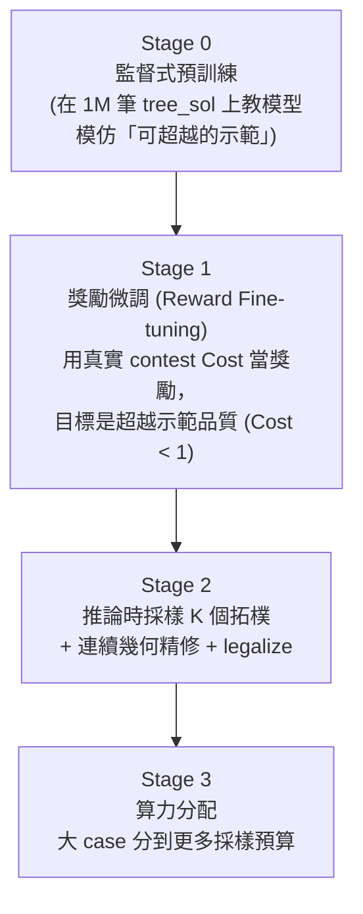
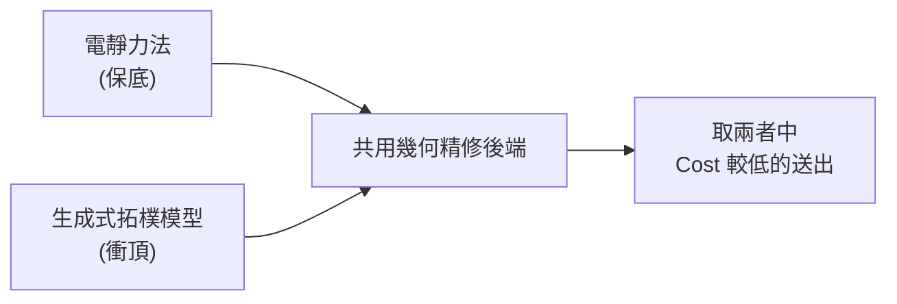

# 8. 奪冠策略總覽與現況路線圖 (Winning Strategy & Roadmap)

> **核心角色**：串起 [[ICCAD_code/1_Data_Loader_and_Wrapper|1]]–[[ICCAD_code/7_Electrostatic_Placer|7]] 全部七篇筆記的總覽——回答「我們現在在哪、為什麼這樣選、下一步是什麼」。完整版在 repo 的 `collaborate/WINNING_STRATEGY.md`。

## 8.1 三條並存路線

| 路線 | 方法 | 現況 |
|---|---|---|
| **A（主力）** | [[ICCAD_code/2_SA_Optimizer_Engine\|B*-tree + Fast-SA]]，C++ 多執行緒多 seed | 穩定成熟，Alpha 已過 |
| **B（ML 輔助）** | [[ICCAD_code/5_ML_Coordinate_Regression\|座標回歸 Warm-start]] | 已訓練 v1/v2/v3，**診斷出 mode collapse 病灶** |
| **C（獨立路線）** | [[ICCAD_code/7_Electrostatic_Placer\|電靜力法]] | **目前分數最佳**（Total 2.966，100% feasible） |

## 8.2 三個關鍵診斷（決定了整個策略方向）

### 診斷一：$e^n$ 加權讓大 case 決定一切
[[ICCAD_code/3_Cost_Function_and_Penalty|總分是 $\sum e^n \times \text{Cost}_n$]]，$n$ 從 21 到 120。一個 120-block case 權重是 21-block 的 $e^{99}{\approx}8{\times}10^{42}$ 倍。**小 case 全部滿分也贏不了大 case 輸一點**。

### 診斷二：純 SA 在大 case 數學上贏不了
$n{=}120$ 的 B\*-tree 拓樸組合數約 $10^{250}$，SA 在時限內的評估次數約 $10^6$——搜到的比例是 $10^{-244}$，等於在太平洋裡憑運氣找一滴特定的水分子。**這不是調參數能解決的問題，是搜尋空間本身的物理限制。**

### 診斷三：座標回歸的 Mode Collapse
[[ICCAD_code/5_ML_Coordinate_Regression|詳見第 5 篇]]——MSE/Smooth-L1 回歸多峰解時，最佳策略是輸出「所有合法解的平均」，而平均出來的座標通常本身就不合法（撞在一起）。

## 8.3 奪冠路線：四階段生成式管線

- **Stage 0**（[[ICCAD_code/6_ML_Generative_BTree|第 6 篇已完成部分]]）：用 1M 筆 `tree_sol` 訓練生成式模型模仿「近似最優但非最優」的示範。
- **Stage 1**（尚未開始）：類比 AlphaGo → AlphaZero——用真實 contest Cost 當獎勵訊號做強化學習微調，目標是**超越**示範品質（訓練資料本身不是最優解，只是「還不錯的起點」）。
- **Stage 2**：推論時不只採樣一個拓樸，採樣 K 個候選，各自用真正的 [[ICCAD_code/4_Packing_and_Evaluation|packer.cpp]] 精修 + legalize，挑 Cost 最低的送出。
- **Stage 3**：善用 $e^n$ 加權——把算力（採樣數 K、精修迭代數）優先分給 n 大的 case。

## 8.4 兩條腿並存策略

不管生成式模型訓練進度如何，[[ICCAD_code/7_Electrostatic_Placer|電靜力法]]隨時能交出一個已驗證分數；生成式模型是用來衝更高名次的上限，兩者不是互斥選擇，是同時保留。

## 8.5 現況時間軸

| 日期 | 里程碑 |
|---|---|
| 2026-04-28 | 決議採用 PARSAC + B*-tree + Fast-SA，分階段加 ML |
| 2026-05-26 | Alpha test 截止日通過 |
| 2026-06-21 | 電靜力法驗證完成，Total 2.966 |
| 2026-06-30 | 進入 Beta→Final 衝刺；發現 `tree_sol` 被舊版 `ml/data.py` 標記 unused 丟棄 |
| 2026-07-01 | 解密 `tree_sol` schema、建立生成式 B\*-tree 模型（[[ICCAD_code/6_ML_Generative_BTree\|第 6 篇]]）、一條龍 pipeline 打通、GPU 環境就緒開始大規模訓練 |

## 8.6 下一步

1. 生成式模型完整訓練（更大規模、更多 epoch）。
2. Soft Block 尺寸預測（接 [[ICCAD_code/5_ML_Coordinate_Regression|第 5 篇]]的 `dim_head`，或新增專門的 head）。
3. Stage 1 獎勵微調（RL against 真實 contest Cost）。
4. Approach A vs C 的正式跑分比較，決定最終送出哪個（或哪個組合）。

---
**回到**：[[ICCAD/ICCAD-Dashboard|ICCAD 儀表板]]
