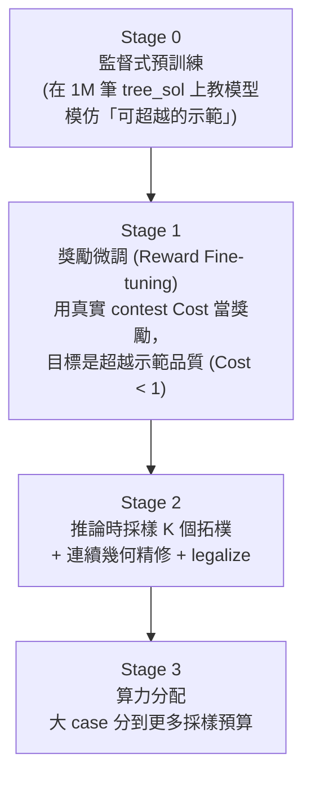
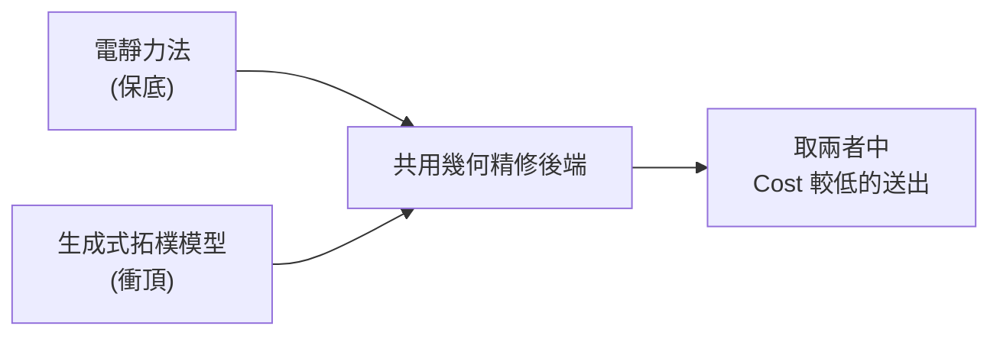

# 8. 奪冠策略總覽與現況路線圖 (Winning Strategy & Roadmap)

> **核心角色**：串起 [[ICCAD_code/1_Data_Loader_and_Wrapper|1]]–[[ICCAD_code/7_Electrostatic_Placer|7]] 全部七篇筆記的總覽——回答「我們現在在哪、為什麼這樣選、下一步是什麼」。完整版在 repo 的 `collaborate/WINNING_STRATEGY.md`。

> [!info] **2026-07-14 現況總覽（先讀這段，下面 §8.1–8.6 是 7/1 寫的舊版策略分析，
> 部分數字/公式已過時，例如「Total = Σe^n」是錯的，正確是 `e^(n/12)`——見
> `CLAUDE.md` gotcha #7）。這段是當晚工作的快速索引，細節都在對應章節。**
>
> **兩條路線的現況**：
> - **生成式 B\*-tree**（`collaborate/ml/`，全自有 pipeline）：**Total Score
>   13.77 → 3.3185（−75.9%），100/100 feasible，已確認到達結構性天花板**——
>   B\*-tree/contour 這個離散打包表示法本身密度就是比連續佈局差（跟 pop 自己
>   驗證 B\*-tree repack 更鬆的結論一致），繼續砸資源投報比很低。完整過程見
>   [[ICCAD_code/6_ML_Generative_BTree|第 6 篇]] §6.6–6.16。
> - **electro+S1**（`collaborate/electro_optimized/`，pop 的電靜力法 + 使用者跟
>   Antigravity/Gemini 3.5 Flash 協作優化）：**electro 原始基準（Neutral RT）
>   2.9007 → 目前約 2.47–2.53（Neutral RT，−13%~−15%），100/100 feasible，
>   MIB 違規已歸零**。**這是目前分數最好的路線**，也是這個晚上主要的優化戰場，
>   見本篇 §8.7–8.18。**注意：`electro_optimized/` 這份程式碼在本文件最後更新時
>   仍在被 Antigravity 即時修改，精確分數是個活靶，尚未收斂到最終穩定版本。**
>
> **本次 session 最重要的三個方法論教訓**（跟具體分數同樣重要，甚至更重要）：
> 1. **Portfolio 而非全面套用**：任何「這招在某個 case 上有效」的修法，疊加到
>    整個驗證集前，都要先做成「A/B 候選、逐 case 用真實 cost 排名選擇」，不能
>    假設全面套用也會有效——本 session 至少 4 次獨立驗證了這個模式（§6.9、
>    §8.12、§8.15）。
> 2. **驗證過的數字只對驗證當下那份程式碼有效**：底層程式碼一旦變動（不管是
>    自己改的還是別人改的），舊的驗證結果就作廢，必須重新驗證，不能延用
>    （§8.16 是自己抓到並修正的活例子）。
> 3. **`iccad2026_evaluate.py --evaluate` 的 Total Score 有 RT 量測雜訊**：
>    RT 是真實牆鐘時間（不是固定值），`RT^0.3` 對變慢無封頂，同一份 100%
>    決定性的程式碼連續跑會有 5-15% 的分數擺動——判斷「這個修法本身有沒有用」
>    要看 Neutral RT（固定 RT=1.0），Contest Grading 留給最終送出前檢查
>    （§8.17，`CLAUDE.md` gotcha #6a-2）。
>
> **下一步待辦**：(1) 等 Antigravity 確認 `electro_optimized/` 穩定版本，用
> Neutral RT 做最終定案驗證；(2) V_boundary（目前最大宗的軟約束違規）還沒被
> 正面攻過，是下一個目標；(3) 跟 pop 討論兩條路線/團隊分工的最終送出策略。

## 8.1 三條並存路線

| 路線 | 方法 | 現況 |
|---|---|---|
| **A（主力）** | [[ICCAD_code/2_SA_Optimizer_Engine\|B*-tree + Fast-SA]]，C++ 多執行緒多 seed | 穩定成熟，Alpha 已過 |
| **B（ML 輔助）** | [[ICCAD_code/5_ML_Coordinate_Regression\|座標回歸 Warm-start]] | 已訓練 v1/v2/v3，**診斷出 mode collapse 病灶** |
| **C（獨立路線，目前主力）** | [[ICCAD_code/7_Electrostatic_Placer\|電靜力法]]（electro_v22） | **目前分數最佳**（中性 Total **1.2252**／真實 0.878–0.895，**100/100 feasible**）。代理分數與 Alpha 第 1 名（0.8789）同量級 |

## 8.2 三個關鍵診斷（決定了整個策略方向）

### 診斷一：$e^{n/12}$ 加權讓大 case 決定一切
> [!info] **訂正（2026-07-01，已核對官方 spec PDF）**：這裡原寫 $e^n$/$e^{99}\approx8\times10^{42}$ 倍是錯的，正確分母是 $n/12$——見上方 §8 開頭的總覽區塊與 [[ICCAD_code/3_Cost_Function_and_Penalty|3_Cost_Function_and_Penalty]] 已訂正版本。

[[ICCAD_code/3_Cost_Function_and_Penalty|總分是 $\sum \lambda_n \times \text{Cost}_n$，$\lambda_n=e^{n/12}/\sum_j e^{j/12}$]]，$n$ 從 21 到 120。一個 120-block case 權重是 21-block 的 $e^{8.25}{\approx}3820$ 倍。**小 case 全部滿分也很難贏過大 case 輸一點**，但沒有到「完全無關緊要」的極端程度。

### 診斷二：純 SA 在大 case 數學上贏不了
$n{=}120$ 的 B\*-tree 拓樸組合數約 $10^{250}$，SA 在時限內的評估次數約 $10^6$——搜到的比例是 $10^{-244}$，等於在太平洋裡憑運氣找一滴特定的水分子。**這不是調參數能解決的問題，是搜尋空間本身的物理限制。**

### 診斷三：座標回歸的 Mode Collapse
[[ICCAD_code/5_ML_Coordinate_Regression|詳見第 5 篇]]——MSE/Smooth-L1 回歸多峰解時，最佳策略是輸出「所有合法解的平均」，而平均出來的座標通常本身就不合法（撞在一起）。

## 8.3 奪冠路線：四階段生成式管線

```mermaid
graph TD
    A["Stage 0<br>監督式預訓練<br>(在 1M 筆 tree_sol 上教模型<br>模仿「可超越的示範」)"] --> B["Stage 1<br>獎勵微調 (Reward Fine-tuning)<br>用真實 contest Cost 當獎勵，<br>目標是超越示範品質 (Cost < 1)"]
    B --> C["Stage 2<br>推論時採樣 K 個拓樸<br>+ 連續幾何精修 + legalize"]
    C --> D["Stage 3<br>算力分配<br>大 case 分到更多採樣預算"]
```

- **Stage 0**（[[ICCAD_code/6_ML_Generative_BTree|第 6 篇已完成部分]]）：用 1M 筆 `tree_sol` 訓練生成式模型模仿「近似最優但非最優」的示範。
- **Stage 1**（尚未開始）：類比 AlphaGo → AlphaZero——用真實 contest Cost 當獎勵訊號做強化學習微調，目標是**超越**示範品質（訓練資料本身不是最優解，只是「還不錯的起點」）。
- **Stage 2**：推論時不只採樣一個拓樸，採樣 K 個候選，各自用真正的 [[ICCAD_code/4_Packing_and_Evaluation|packer.cpp]] 精修 + legalize，挑 Cost 最低的送出。
- **Stage 3**：善用 $e^{n/12}$ 加權——把算力（採樣數 K、精修迭代數）優先分給 n 大的 case。

## 8.4 兩條腿並存策略

```mermaid
graph LR
    A["電靜力法<br>(保底)"] --> C["共用幾何精修後端"]
    B["生成式拓樸模型<br>(衝頂)"] --> C
    C --> D["取兩者中<br>Cost 較低的送出"]
```

不管生成式模型訓練進度如何，[[ICCAD_code/7_Electrostatic_Placer|電靜力法]]隨時能交出一個已驗證分數；生成式模型是用來衝更高名次的上限，兩者不是互斥選擇，是同時保留。

## 8.5 現況時間軸

| 日期 | 里程碑 |
|---|---|
| 2026-04-28 | 決議採用 PARSAC + B*-tree + Fast-SA，分階段加 ML |
| 2026-05-26 | Alpha test 截止日通過 |
| 2026-06-21 | 電靜力法驗證完成，Total 2.966 |
| 2026-06-30 | 進入 Beta→Final 衝刺；發現 `tree_sol` 被舊版 `ml/data.py` 標記 unused 丟棄 |
| 2026-07-01 | 解密 `tree_sol` schema、建立生成式 B\*-tree 模型（[[ICCAD_code/6_ML_Generative_BTree\|第 6 篇]]）、一條龍 pipeline 打通、GPU 環境就緒開始大規模訓練 |
| 2026-07-29 | 隊友的 slice_pack 路線經三方獨立驗證屬實，成本結構翻轉；發現 R 因子（runtime）長期被忽略，真正計分應以真實 Total Score 為主 |
| 2026-08-02 | electro_v19 融合版定案：slice_pack + MIB anchor 兩段式機制 + Dirichlet 調和延拓初始化 + LP 位移候選，中性 1.3776／真實 0.9801，100/100 feasible |
| 2026-08-04～06 | 依序驗證 L-BFGS 打磨、Per-RMAP、ADMM 邊界一致性三個更大方向（皆負面，見「共用梯度預算耦合」發現）；合法化階段長寬比彈性（`legalize_qinfer_reshape`）過程中揪出一個 WSL-only 的浮點精度 bug 並修復，全 100 案驗證：中性分數改善 −2.1%（本 session 最佳），但真實 Total Score 幾乎打平（0.9801→0.9816），機制維持預設關閉 |
| 2026-08-11 | **RT/預設值調校 campaign + v20 定案為主力**：重新量測發現 `PLACE_COMPACT_ITERS`（400→150）、`REPAIR_ROUNDS`（3→2）兩組舊預設是調過頭，不是取捨；發現邊界對偶上升早就驗證正面卻只存在 `electro_v20` 程式碼裡（`electro_v19` 完全沒有這段，設旗標無聲失效），promote v20 為主力並開啟；把 8/4 停用的 `legalize_qinfer_reshape` 移植到 v20 跟對偶上升疊加重測，同批次背靠背驗證 Neutral -2.6%、REAL 不降反微升，一併設為預設。另用參數掃描否決 9 個方向，其中 `ELECTRO_TARGET_UTIL` 確認是乾淨的 Q/P 對撞盤（填越滿 area_gap 越好但 V_grouping 越差，淨值全部比預設差）。全 100 案：中性 1.3612→**1.3260**、真實 1.0005→**0.9987**。詳見 `docs/superpowers/2026-08-11-rt-and-default-retuning-campaign.md`（repo 內） |

## 8.6 研究日誌索引

完整的逐次實驗記錄（每次改動的動機、做法、驗證結果）已搬到獨立的月份日誌，
不再塞在這篇策略總覽裡：

- [[ICCAD_code/8x_Research_Log/2026-07_Research_Log|2026-07 研究日誌]]
- [[ICCAD_code/8x_Research_Log/2026-08_Research_Log|2026-08 研究日誌]]

策略本身如果之後有結構性調整，回來更新上面 §8.1-8.5；單次實驗的過程與數字
記錄在對應月份的日誌檔案裡。
