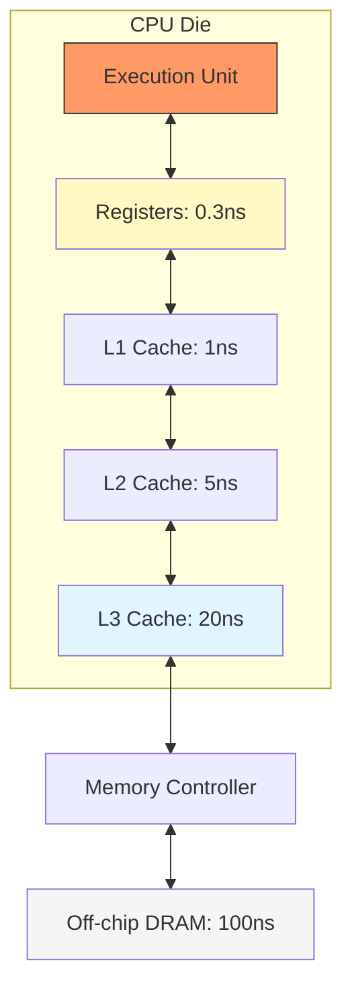

# 記憶體階層 (Memory Hierarchy) 深度分析：時序與物理限制

在計算機架構中，記憶體階層的設計本質上是在 **容量 (Capacity)**、**成本 (Cost)** 與 **效能 (Latency)** 之間進行極致的權衡（Trade-off）。作為 VLSI 設計者，我們必須理解數據表背後的物理真相。

## 1. 記憶體階層與延遲數據表 (Latency & Specs)

| 階層 (Level) | 典型容量 | 存取延遲 (Cycles) | 實體位置 | 實作技術 |
| :--- | :--- | :--- | :--- | :--- |
| **[[Registers]]** | < 5 KB | < 1 cycle (0.3ns) | 執行單元內部 (EU) | Flip-Flops / Multi-port RF |
| **[[L1_Cache]]** | 32 - 128 KB | ~4 cycles (1ns) | 核心私有 (Core Private) | High-Performance 6T [[SRAM]] |
| **[[L2_Cache]]** | 256KB - 2MB | 10 - 20 cycles | 核心私有/簇共享 | High-Density [[SRAM]] |
| **[[L3_Cache]]** | 4MB - 64MB+ | 40 - 100 cycles | 晶片內共享 (LLC) | Area-Efficient SRAM / eDRAM |
| **[[Main_Memory]]** | 8GB - 128GB+ | 200 - 800 cycles | 晶片外 (Off-chip) | DDR4 / DDR5 [[DRAM]] |
| **[[NVMe_SSD]]** | 500GB - 4TB | ~100,000+ cycles | 匯流排連接 (PCIe) | NAND [[Flash]] |

---

## 2. 深度分析：為什麼延遲會隨階層指數增長？

### 2.1 物理限制一：信號傳播延遲 (Interconnect Delay)
在晶片設計中，信號傳輸速度受限於線路的 **RC 延遲** ($Delay = 0.69 \times R \times C$)。
- **Registers** 就在運算單元旁邊，線路極短，延遲可忽略。
- **L3 Cache** 分布在晶片的邊緣或中心區域，信號需要跨過數公釐的長線。在 5GHz 的頻率下，光速在矽片上也只能跑 6 公分。考慮到門電路延遲，跨晶片信號傳輸往往需要多個時鐘週期。

### 2.2 物理限制二：解碼與位址搜尋 (Decoding Logic)
存取記憶體前必須先進行 **位址解碼 (Decoding)** 與 **標籤比對 (Tag Matching)**。
- 容量越大，解碼電路的扇出 (Fan-out) 越大，邏輯層數加深，導致延遲上升。
- **[[L1_Cache]]** 追求極致速度，通常採用直接映射（Direct-Mapped），延遲極低。
- **[[L3_Cache]]** 為了減少缺失率（Miss Rate），採用高關聯度（High Associativity），標籤比對的複雜度大幅增加。

---

## 3. VLSI 實作技術解析

### 3.1 6T SRAM vs. DRAM
- **[[SRAM]] (6-Transistor)**：
    - **優點**：速度快（純邏輯電路）、無需刷新。
    - **缺點**：面積大（一個位元需要 6 個電晶體）。用於快取。
- **[[DRAM]] (1-Transistor 1-Capacitor)**：
    - **優點**：密度極高（1T1C）。
    - **缺點**：電容會漏電，必須每隔幾毫秒 **刷新 (Refresh)**，存取時需開啟行 (Row Open)，延遲巨大。

### 3.2 晶片外通信 (Off-chip Communication)
當資料離開晶片進入 [[Main_Memory]] 時，必須經過 **I/O Pads** 與 PCB 走線。
- **物理挑戰**：PCB 線路的阻抗不匹配、信號反射與串擾 (Crosstalk) 限制了傳輸頻率。
- **傳輸延遲**：光速在 PCB 上約為 15cm/ns，10 公分的走線就會造成約 0.6ns 的往返延遲，這還不包含記憶體控制器與協定開銷。

---

## 4. 專家視角：記憶體牆 (Memory Wall)

> [!warning] 核心危機
> 過去 30 年，CPU 頻率提升了 1000 倍，但 DRAM 的延遲僅縮減了不到 10 倍。這導致處理器大部份時間都在「等待」資料，這就是著名的 **記憶體牆 (Memory Wall)** 問題。

> [!tip] 解決之道：CIM (Compute-In-Memory)
> 這正是我們研究 **[[Macro|CIM Macro]]** 的動機：直接在記憶體內部完成計算，徹底消除大部份的數據搬運延遲與功耗。

---
**相關連結：**
- [[Latency & Throughput|⚡ 延遲與吞吐量對照]]
- [[Macro|🧠 CIM Macro 架構]]
- [[DCS/TMS320C6000/核心架構與Pipeline|🏗️ DSP 管線延遲解析]]
